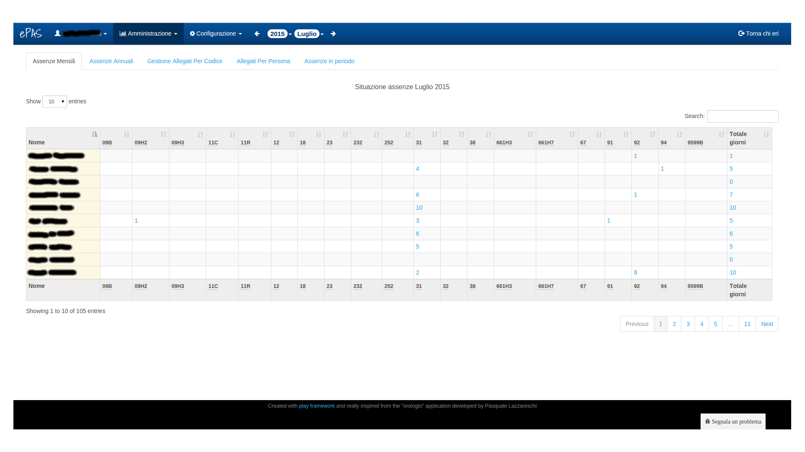
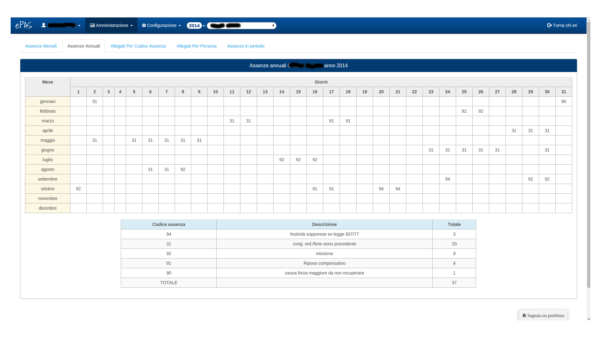
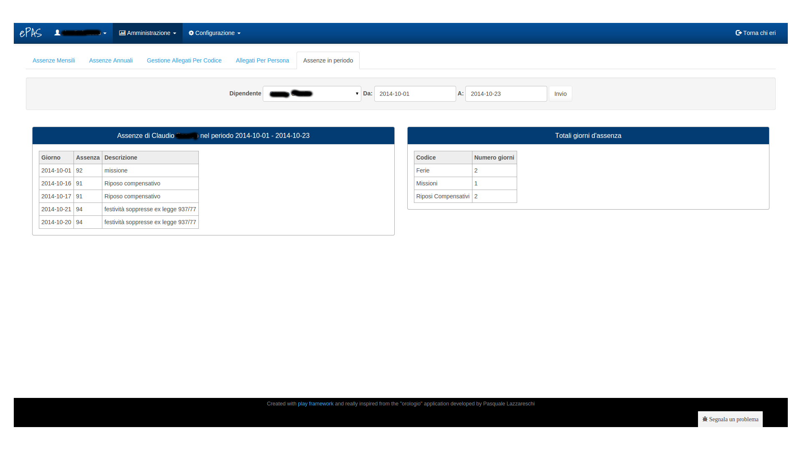

Assenze
=======

Il sistema ePAS permette all'amministratore di poter verificare le assenze di tutto il personale attraverso vari livelli di granularità.
In particolare, dal menu :menuselection:`Amministrazione --> Assenze`, accediamo alla schermata seguente:

   
   Schermata assenze mensili
   
In questa pagina è possibile controllare la tipologia delle assenze, raggruppate per codice, in un determinato mese.
La tabella, così come avviene nella tabella della lista del personale, è soggetta a dimensionamento, infatti in alto a sinistra è presente un bottone che consente di decidere quanti elementi della lista visualizzare
(di default impostato a 10, è possibile comunque scegliere 25, 50 o tutti gli elementi).
Sulla destra della tabella è inoltre presente un campo testuale per la ricerca puntuale dei dipendenti. Qui è possibile scrivere il nome o il cognome del dipendente di cui si intende verificare la situazione di assenze nel mese così da poterlo 
visualizzare senza tutti gli altri.
In basso, sotto alla tabella, è possibile vedere il numero di pagine in cui è stata suddivisa la lista di persone, che cambia naturalmente in base a quanti elementi vengono selezionati in visualizzazione dalla form descritta in precedenza.
E' possibile ordinare la tabella per ciascuno dei campi presenti. Di default la tabella è ordinata in ordine alfabetico del personale, ma ciò non toglie che, per esigenze personali, cliccando sull'intestazione della colonna, si decida di visualizzare la lista 
in ordine ascendente o discendente rispetto a uno specifico campo (ad esempio in figura si può selezionare l'ordine discendente dei codici di assenza "31" così da vedere chi nel mese ne ha presi di più).

Passando il mouse sopra il codice di assenza presente nell'intestazione della tabella, è possible anche vedere la descrizione del codice in questione.
Inoltre, cliccando sul numero corrispondente al quantitativo di assenze fatte per quel codice, verrà visualizzato un prospetto nel quale veriricare i giorni precisi del mese in cui quella persona ha usufruito di quel codice di assenza.
Nella parte superiore della pagina si trovano anche i menu a tendina relativi a mese e anno. Selezionando il mese e l'anno desiderati si potranno verificare le situazioni di assenze mensili relative a quel periodo temporale.

Assenze annuali
---------------
 
Cliccando poi sulla tab "Assenze annuali" si accede alla seguente schermata:

   
   Schermata assenze annuali
   
In questa sezione è possibile controllare la situazione delle assenze annuali relativa a una persona. Come nella pagina delle assenze mensili, dal menu a tendina in alto è possibile selezionare l'anno di cui si intende verificare le assenze e la persona di cui si vuol conoscere la situazione.
Per ogni giorno dell'anno è riportato l'eventuale codice di assenza. Una tabella riassuntiva al di sotto del tabellone, riporta la descrizione del codice utilizzato oltre a un totale di giorni in cui si è usufruito di quel codice e al totale delle assenze effettuate nel corso dell'anno selezionato.

Gestione allegati per codice
----------------------------

La tab seguente è relativa agli allegati raggruppati per codice.
Cliccando sulla voce di menu "Gestione allegati per codice" si visualizza la seguente schermata:

.. figure:: _static/images/allegatiCodice.png
   :scale: 40
   :align: center
   
   Schermata allegati raggruppati per codice
   
   
In questa sezione è possibile verificare per quali codici di assenza sono stati inseriti degli allegati in formato pdf. 
Cliccando sulla busta colorata di blu sarà possibile scaricare l'allegato relativo al codice situato di fianco.

Gestione allegati per persona
-----------------------------

Cliccando sulla tab "Gestione allegati per persona" si accede alla visualizzazione degli eventuali file allegati alle assenze relativi a ogni singola persona.

.. figure:: _static/images/allegatiPersona.png
   :scale: 40
   :align: center
   
   Schermata allegati raggruppati per persona
   
In questa pagina è possibile selezionare, in alto, mese anno e persona di cui si intendono controllare eventuali allegati.
Il sistema caricherà la lista di tutti gli allegati disponibili per i parametri richiesti e, cliccando sulla figura a forma di fermacarte di fianco alla data per cui è stato inserito l'allegato, sarà possibile scaricarli sul proprio pc.

Assenze in periodo
------------------

L'ultima sezione navigabile è quella relativa alle assenze in periodo. Cliccando sull'ultima tab verrà caricata la seguente schermata:

   
   Schermata assenze in periodo
   
Selezionando il dipendente e il periodo temporale per cui si vogliono verificare le assenze e premendo su "invio", verranno visualizate le tabelle relative a:
   * la lista dei codici di assenza con relative date e descrizioni a sinistra della pagina
   * un consuntivo raggruppato per tipologia di assenza (ferie, missione, malattia ecc...) sulla destra della pagina con totale dei giorni per quella tipologia
   
 

