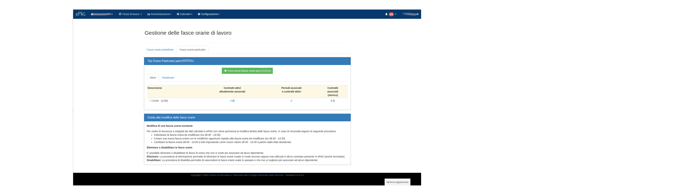

Gestione delle fasce orarie di lavoro
=====================================

In questa schermata è possibile definire le fasce orarie di lavoro.
Questa funzionalità ha una doppia applicazione:

	* definire una fascia di presenza obbligatoria per quei dipendenti che necessitano di essere presenti in determinati momenti della giornata
	* definire una fascia di presenza entro la quale svolgere la propria attività lavorativa che sovrascriva l'orario di lavoro previsto per la sede di appartenenza
	

   
   Schermata di gestione delle fasce orarie
   
Cliccando su **Fasce orarie particolari** si accede alla pagina in cui vengono riepilogate le eventuali fasce orarie
già definite per la propria sede di appartenenza. Cliccando quindi sul bottone verde *Crea nuova fascia oraria*
si apre una nuova pagina in cui specificare l'orario di inizio (nel formato hh:mm), l'orario di fine (nel formato hh:mm)
e una descrizione della fascia che si sta definendo.
Cliccando su **Crea** la fascia verrà definita e sarà visibile nella sezione *Fasce orarie particolari*.