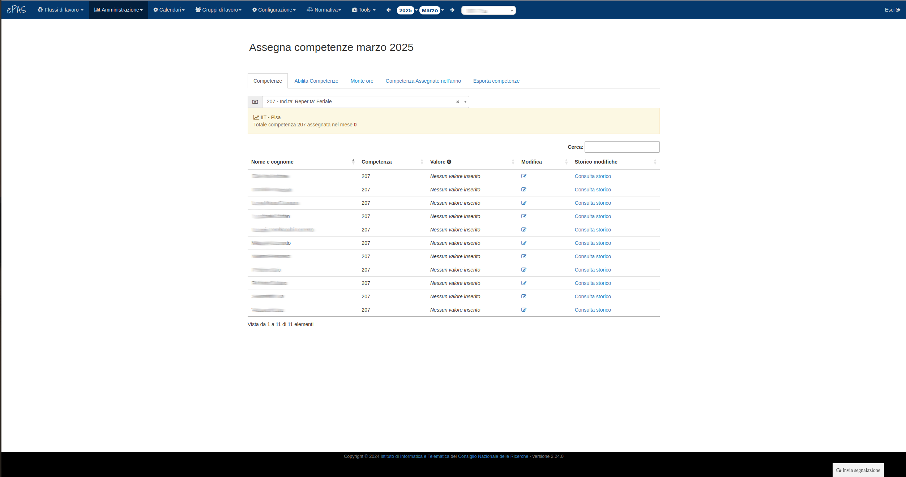

Gestione Competenze
===================

Il sistema ePAS consente all'amministratore di gestire le competenze assegnabili a ciascuna persona afferente all'istituto.
Selezionando dal menu :menuselection:`Amministrazione --> Competenze`, verrà visualizzata la seguente schermata:

   
   Schermata principale delle competenze
   
Le competenze, come si evince dall'immagine, sono consultabili (e modificabili) per ogni persona in un certo anno e in un certo mese (è sufficiente nel caso andare a selezionare anno e mese dal menu a tendina in alto).
La schermata principale presenta tre panelli:

   * il panello relativo all'assegnamento delle competenze (a sinistra nell'immagine), in cui troviamo il codice competenza che si vuole assegnare (selezionabile dal menu a tendina), la lista dei nominativi a cui è stata assegnata quella competenza suddivisi in pagine di 10 elementi ciascuna, e un box in cui poter ricercare dipendenti per nome o cognome.
   * il pannello relativo al riepilogo delle ore di straordinario pagate (a destra e in alto nell'immagine) nel mese in questione, nell'anno in corso e il totale del monte ore usabile per gli straordinari assegnato all'istituto.
   * il pannello relativo alle note per una corretta compilazione dei quantitativi orari/giornalieri delle competenze

Come nel caso dei parametri (v. :doc:`Gestione parametri </parameters>` ), troviamo al di sopra dei pannelli un menu a tendina che specifica per quale sede intendiamo assegnare le competenze. Naturalmente, sulla base dei privilegi che l'amministratore ha assegnati (v. :doc:`Gestione sedi e amministratori </seat>`), sarà possibile modificare o meno le competenze per i dipendenti afferenti alla propria sede o a quelle eventuali distaccate che fanno comunque parte del proprio istituto.

Abilita competenze
------------------

Nella tab "Abilita competenze" troviamo la lista del personale afferente all'istituto selezionato con di fianco tutte le eventuali competenze assegnate a ciascun dipendente, contrassegnate con una spunta.

   
   Schermata relativa al riepilogo delle competenze assegnate
   
Come nelle precedenti due schermate di riepilogo e assegnamento di competenze, anche in questo caso è possibile ricercare un dipendente per nome o cognome scrivendolo nell'apposito riquadro in alto a sinistra.
Per modificare le competenze o assegnarne di nuove, è sufficiente cliccare sul nominativo a cui si intende applicare la modifica.
Si aprirà una pagina di questo tipo:

   
   Finestra di modifica competenze
   
Selezionando le competenze che si intende aggiungere al dipendente e premendo su "Ok", la pagina precedente verrà ricaricata con i simboli di spunta in presenza delle competenze che sono state assegnate al dipendente.

Configurazione monte ore
------------------------

La tab successiva è relativa alla configurazione del monte ore per gli straordinari

.. figure:: _static/images/monteOre.png
   :scale: 40
   :align: center
   
   Schermata relativa al monte ore per straordinari
   
In questa schermata vengono riepilogate le aggiunte successive di ore per gli straordinari utilizzabili all'interno dell'istituto (listate per data di aggiunta).
In più è possibile specificare eventuali ulteriori ore di straordinario da aggiungere (precedendo la quantità da inserire con il segno "+") o da togliere (precedendo la quantità da togliere con il segno "-") rispetto al totale a cui ci troviamo. 

Esporta competenze
------------------

La tab successiva che si incontra è quella relativa all'esportazione delle competenze. 
In particolare è possibile esportare la situazione delle competenze assegnate a tutti i dipendenti in un determinato anno in formato csv

.. figure:: _static/images/esportaCompetenze.png
   :scale: 40
   :align: center
   
   Schermata per l'esportazione delle competenze   
   

Competenze nell'anno
--------------------

L'ultima tab è quella relativa alle competenze nell'anno, in particolare in questa tabella sono riportate tutte le competenze assegnate nell'anno. 
I risultati sono filtrabili solo per i tempi determinati o per tutti i dipendenti e per ciascuna delle sedi su cui l'amministratore ha diritto di visualizzazione.

   
   Schermata relativa alle competenze nell'anno
   

