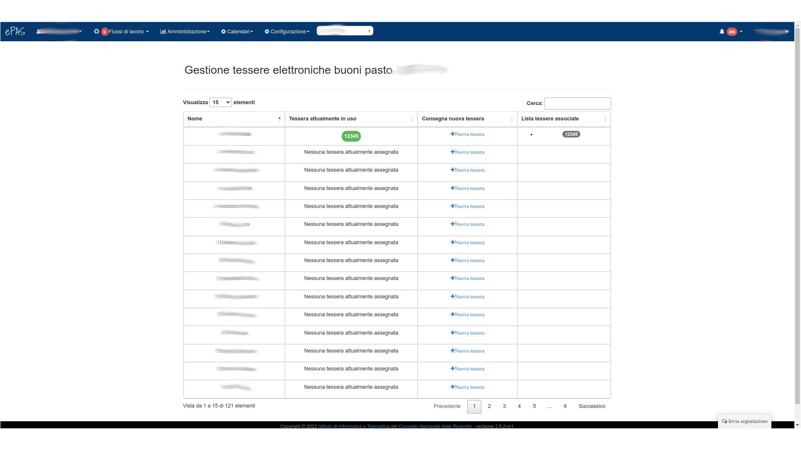
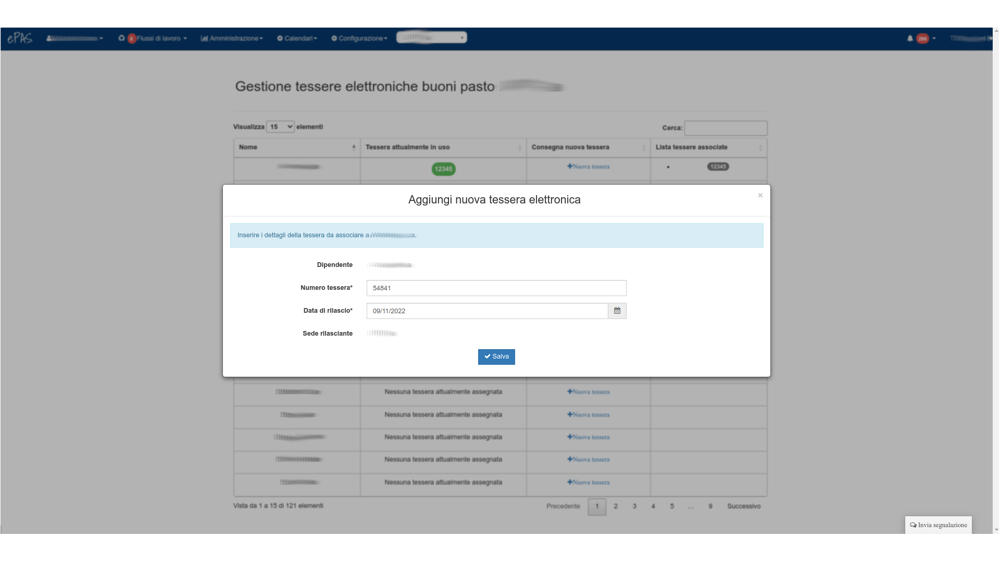

Gestione tessere per buoni pasto elettronici
============================================

Con la recente adozione dei buoni pasto elettronici, il sistema ePAS si è dotato di una funzionalità dedicata alla gestione
delle tessere dei buoni pasto elettronici nei casi di quelle sedi che hanno adottato i buoni pasto elettronici per i propri 
dipendenti.
Nello specifico, nella configurazione della propria sede: `Configurazione --> Configurazione sedi`, il parametro *Tipologia buoni pasto*
indica se devono essere usati i buoni pasto cartacei o elettronici. Se impostato su *Elettronici*, ePAS consentirà all'amministratore
di gestire la parte relativa ai buoni pasto con la modalità elettronica, in caso contrario, sarà mantenuta l'interfaccia per 
l'inserimento dei blocchetti dei buoni cartacei.
Attraverso questa funzionalità, l'amministratore del personale può assegnare una tessera ad ogni singolo dipendente di modo
da poter tenere traccia di quanti e quali buoni sono stati caricati su di essa e, di conseguenza, assegnati al dipendente (ed 
in particolare al suo contratto).

Dal menu :menuselection:`Amministrazione --> Gestione card buoni pasto elettronici` si arriva in questa schermata:

   
   Schermata di riepilogo tessere associate ai dipendenti della sede
   
Qui per ogni dipendente è possibile assegnare una nuova tessera: 

   
   Schermata di assegnamento nuova tessera al dipendente
   

In particolare il sistema prevede che ciascun dipendente si porti dietro la tessera passando da una sede all'altra in caso di 
trasferimento o assegnazione temporanea.
Nel caso il dipendente debba quindi dover cambiare la propria tessera, in ottemperanza alle regole di distribuzione di tessere e 
buoni pasto elettronici della sede in cui va a lavorare, qui l'amministratore può assegnargli una nuova tessera che sostituirà la 
precedente.
Nello specifico, la precedente viene fatta "scadere" e sarà visibile nella colonna "Lista tessere associate" e come data di fine 
validità viene impostato il giorno precedente al giorno di inizio validità della nuova tessera appena rilasciata.
