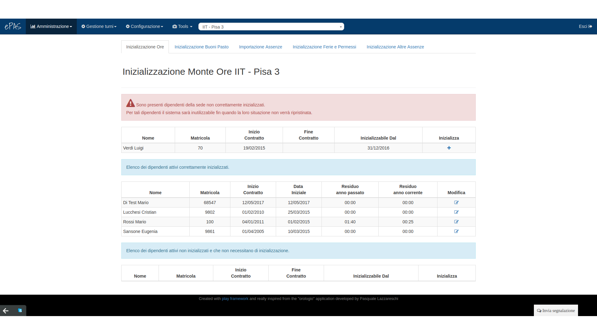
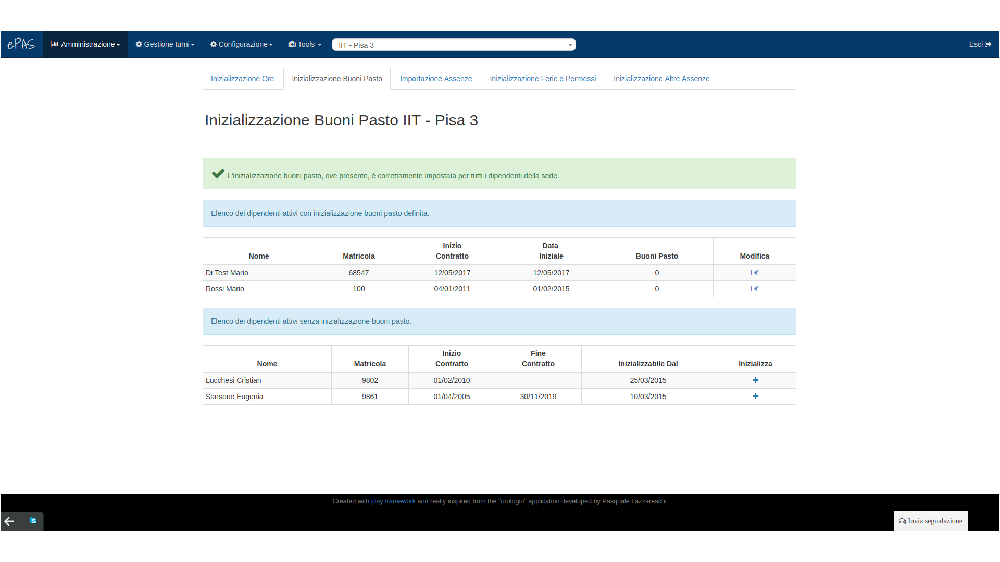
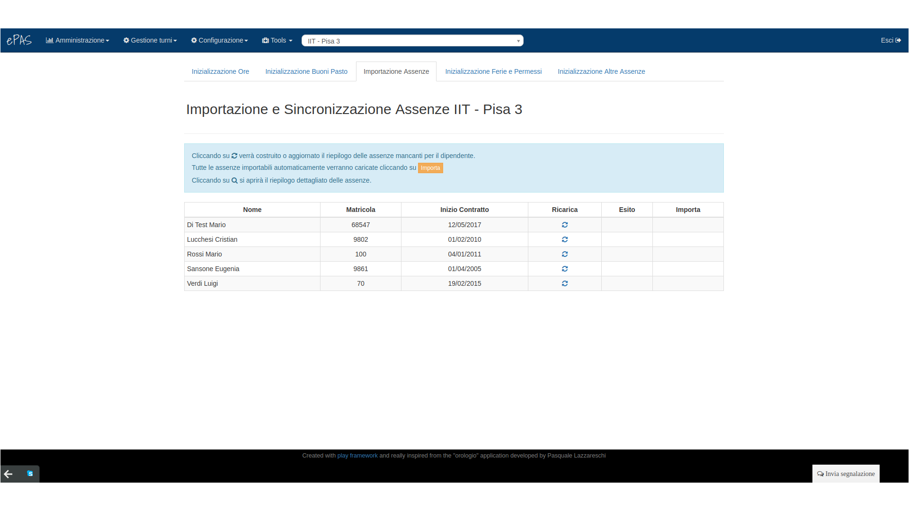
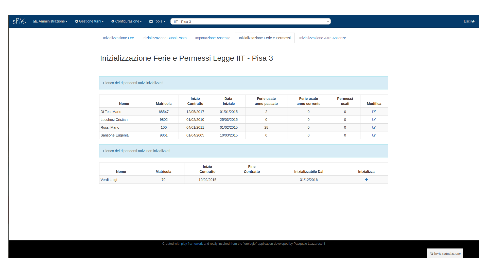
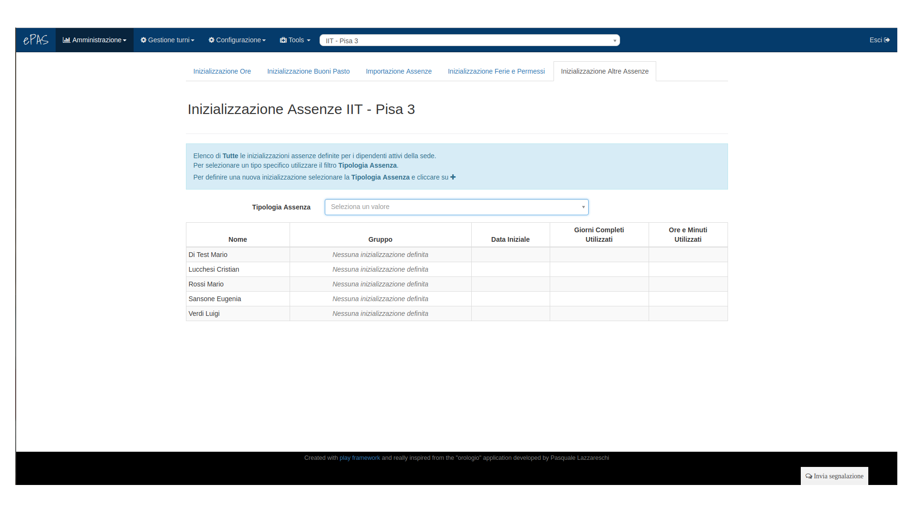

Inizializzazioni
================

Inizializzazione monte ore
--------------------------

Per poter correttamente utilizzare il sistema ePAS è necessario procedere con l'inizializzazione
delle principali entità che il sistema deve gestire: residui orari, buoni pasto, assenze. 
Per fare questo è sufficiente andare su :menuselection:`Amministrazione --> Dati iniziali`.
Si aprirà la seguente schermata:

   Schermata home inizializzazione

In questa parte è possibile impostare il residuo orario relativo al monte ore anno passato (se
disponibile) e al monte ore anno corrente cliccando sul “+” in corrispondenza di ciascuna persona.
Nella finestra che si apre, sarà importante specificare inoltre la data a cui vorremo impostare
l'inizializzazione; tale data determina infatti quale sarà il limite temporale da cui ePAS dovrà
iniziare a far partire i conteggi sulla base delle timbrature rilevate.

*Esempio*: se inseriamo come data di inizializzazione il 31/12/2017 significa che i dati che stiamo
inserendo sono relativi a quel giorno specifico, ovvero al 31/12/2017 la situazione oraria del
dipendente che stiamo inizializzando è appunto quella che stiamo inserendo. Ciò significa che ePAS
inizierà i propri conteggi sulla base delle timbrature a partire dal 01/01/2018.

Inizializzazione buoni pasto
----------------------------

   Schermata inizializzazione buoni pasto

In questa schermata, raggingibile cliccando in alto alla voce *Inizializzazione Buoni Pasto*, è
possibile inizializzare il valore di buoni pasto **residui** a una certa data (di solito si tende a
uniformare le date di inizializzazione di modo da farle coincidere con l’inizio “ufficiale”
dell'utilizzo del sistema ePAS) Anche in questo caso, cliccando sul “+” in corrispondenza di
ciascun dipendente si aprirà una schermata in cui occorrerà impostare la data di inizializzazione
e il valore dei buoni pasto residui a quella data.

Importazione assenze da Attestati
---------------------------------

**ATTENZIONE QUESTA FUNZIONALITÀ È DISPONIBILE SOLO PER IL CNR.**

   Schermata importazione assenze da Attestati

Nella terza scheda, *Importazione assenze*, è possibile fare in modo che ePAS comunichi con
Attestati e scarichi, per i dipendenti presenti nella lista, le assenze pregresse consumate
dal dipendente nel corso degli anni passati. Per poter effettuare questo allineamento tra ePAS
e Attestati occorre, per ciascun dipendente, cliccare sul bottone presente nella colonna
“**Ricarica**”. 
Il sistema si collegherà con Attestati e, una volta terminato lo scaricamento, compariranno
nella colonna accanto alcune icone:

  * una lente di ingrandimento che, cliccata, permetterà di visualizzare il riepilogo delle
    assenze che verranno importate da Attestati
  * un'icona di download verde che specifica che ci sono assenze che verrebbero importate
    senza problemi
  * un'icona di download marrone che specifica che ci sono assenze che necessitano di dati da
    aggiungere su ePAS per poter essere importate (sono i casi delle assenze di congedo parentale,
    ad esempio, che necessitano che vengano inseriti su ePAS i figli del dipendente)

Inoltre, nell’ultima colonna, sarà disponibile un tasto arancione denominato “*Importa*” che,
premuto, scaricherà effettivamente le assenze su ePAS e permetterà l’allineamento tra i due
sistemi.

Inizializzazione ferie e permessi
---------------------------------

   Schermata inizializzazione ferie e permessi

Nella quarta scheda, *Inizializzazione ferie e permessi*, è possibile definire un’inizializzazione
per i codici di assenza di ferie (codici 31 e 32) e permessi (codice 94).
Questa schermata, in fase di inizializzazione del sistema per la sede per il **CNR**, è fortemente
sconsigliata, poichè i dati relativi alle assenze vengono interamente reperiti dalla piattaforma
Attestati. 

Per il CNR questa schermata può, al contrario, essere utilizzata quando si dovessero verificare
dei disallineamenti tra i quantitativi presenti su ePAS e quelli presenti su Attestati. 
Dal momento che Attestati è il “Master” delle informazioni su assenze, competenze e quant’altro,
attraverso questa schermata è possibile riallineare i due sistemi.

Il procedimento è del tutto analogo a quello effettuato per l’inizializzazione oraria: cliccando
sul bottone “*modifica*” in corrispondenza della persona di cui si vogliono inizializzare le ferie,
comparirà una finestra in cui inserire la data a cui si vuole inizializzare le ferie e i permessi,
i giorni di ferie dell’anno passato utilizzati, i giorni di ferie dell’anno corrente utilizzati e
i permessi dell’anno corrente utilizzati.

Inizializzazione altre assenze
------------------------------

   Schermata inizializzazione di altri tipi di assenza

L’ultima scheda è relativa all’inizializzazione di altre tipologie di assenza. Si può selezionare
la tipologia cliccando sul menu a tendina a centro pagina, comparirà nell’ultima colonna il bottone
“+” se non è presente una precedente inizializzazione. A questo punto e, come nel caso delle ferie
e dei permessi, cliccando sul bottone, sarà possibile specificare la data di inizializzazione e le
eventuali quantità (in giorni, ore e minuti...) a seconda della tipologia di assenza che si intende
inizializzare. Nella finestra è comunque presente una sorta di mini tutorial che guiderà l’utente
per una corretta inizializzazione.

