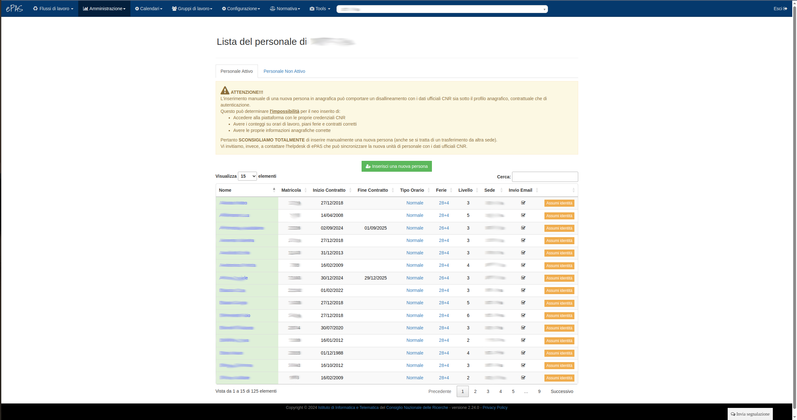
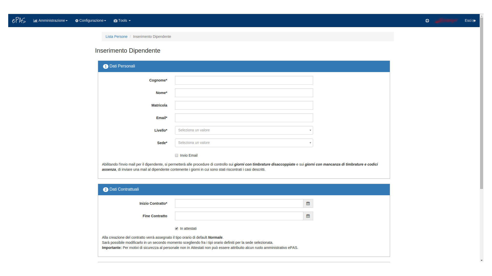
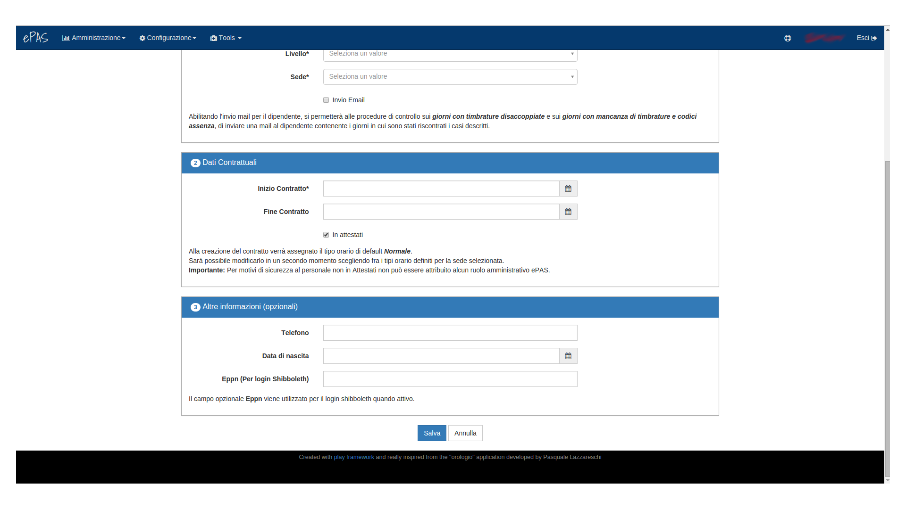
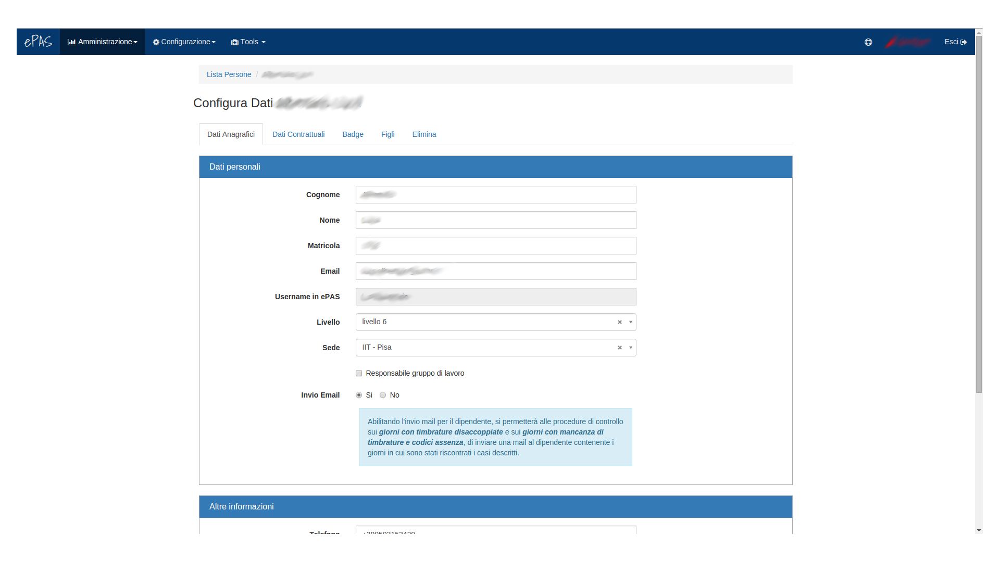
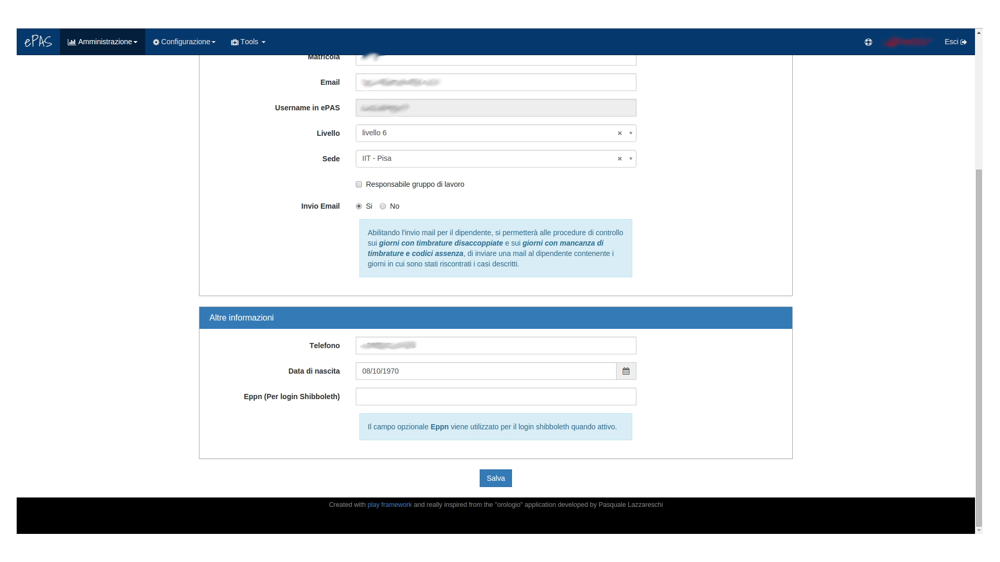

Gestione e inserimento Personale
================================
La prima funzionalità che si incontra analizzando il sistema in modalità amministratore riguarda la possibilità di inserire, modificare e, più in generale, gestire il personale.
Dal menu :menuselection:`Amministrazione --> Lista Persone` è possibile aprire l'interfaccia di consultazione delle persone presenti in anagrafica.

   Schermata visualizzazione lista personale
   
In primo luogo si può notare come esistano due liste distine per il personale:
   * La *Lista del personale attivo* contiene la lista di tutte le persone contrattualizzate e strutturate nella sede 
   * La *Lista del personale non attivo* che contiene la lista di tutte le persone che in passato sono state contrattualizzate ma che al momento risultano non presenti nella lista del personale da inviare ad **Attestati**.
   
   
Entrambe le liste presentano gli stessi campi, ovvero:
   * il nome e il cognome del dipendente (che per privacy sono stati oscurati così come la matricola), 
   * la matricola, 
   * il numero del badge,
   * le date di inizio e fine lavoro (la fine non è presente quando il contratto è a tempo indeterminato), 
   * il tipo di orario di lavoro assegnato alla persona,
   * il piano ferie attualmente disponibile per la persona, 
   * il livello di contratto, 
   * se la persona ha selezionata la possibilità di avere la timbratura automatica (v. **Decisioni implementative** dal menu *Documentazioni*),
   * la mail di riferimento per le comunicazioni, 
   * gli eventuali altri contatti (passando sopra con il mouse si apre una finestra con elencati i numeri utili),
   * l'inizializzazione, ovvero nel caso il dipendente provenga da altro istituto e si porti dietro una situazione definita in termini di ferie, residui orari e buoni pasto, cliccando qui è possibile inserirla, datandola, e il sistema la terrà presente per i calcoli,
   * l'invio mail, ovvero se per il dipendente è stata selezionata la possibilità di ricevere mail informative circa la propria situazione di mancate timbrature, mancate assenze o timbrature disaccoppiate che rendono non veritiero il calcolo dei residui,
   * eventuali note

Naturalmente, per quanto concerne la lista del personale non attivo, la situazione visualizzata è limitata ai soli campi nome e cognome, matricola e mail.

Per entrambe le liste è presente la possibilità, in alto a sinistra appena sotto il titolo della lista, di selezionare quanti elementi far visualizzare (10, 25, 50 o tutti).
Inoltre, è presente una form di ricerca testuale nella parte in alto a destra delle tabelle che permette la ricerca puntuale di elementi sulla base del nome o del cognome.
Le tabelle, infine, sono entrambe ordinabili per campo, nel senso che è possibile specificare l'ordinamento delle righe (inizialmente per ordine alfabetico) a seconda del campo più di interesse (numero di matricola, data di inizio lavoro ecc...).

Inserimento persona
-------------------

Nel caso si intenda inserire una nuova persona in anagrafica sarà per prima cosa necessario cliccare sul link in alto a sinistra nella pagina: "*Inserisci una nuova persona*".

La pagina che si aprirà sarà come quella presentata nelle figure seguenti:

   Schermata modifica persona (top)
   

   Schermata modifica persona (bottom)
   
In queste due schermate sono presenti i campi da compilare (in grassetto quelli obbligatori) per poter inserire una persona in anagrafica.
Tutti i campi sono decisamente esplicativi, quelli particolari presentano una breve descrizione che ne esplica il funzionamento.
Inoltre, nella parte finale della schermata, dove occorre definire lo username con cui tale dipendente potrà loggarsi su epas, è presente un campo autogenerante che popola lo username di default con i valori *nome* e *cognome* del dipendente separati dal "**.**".
Naturalmente questo valore è modificabile.

Modifica persona
----------------

In caso si vogliano modificare i dati di una certa persona la schermata che potremo visualizzare sarà di questo tipo

   Schermata modifica persona (top)
   

   Schermata modifica persona (bottom)

In ogni pannello (titolato) sono contenute informazioni referenti ad esso, rendendo così più intuitivo dove andare a cercare l'informazione specifica che si richiede o che si intende modificare.
Nel pannello relativo ai dati personali, è possibile trovare alcune informazioni aggiuntive rispetto alla precedente versione.
Difatti, esiste la possibilità di specificare se la persona in questione è Responsabile di un gruppo di lavoro (e in tal caso può usufruire della possibilità di vedere le timbrature delle persone che afferiscono al proprio gruppo e la loro presenza giornaliera v. :menuselection:`Amministrazione --> Timbrature`);
è possibile inoltre specificare se la persona può/non può ricevere le mail per le informazioni circa la propria situazione di timbrature e assenze (invio email).
E' stato aggiunto inoltre un pannello relativo alle *altre informazioni*, contenente anche il campo in cui specificare l'eventuale **eppn** ovvero il campo utilizzato dalla piattaforma *Shibboleth* (v. **Decisioni implementative** dal menu *Documentazioni*).
Nel caso ad esempio del pannello relativo alle informazioni sulla "presenza default", è possibile specificare se il dipendente può godere dell'autocertificazione per la presenza a lavoro (orario giornaliero fissato al quantitativo orario giornaliero che per contratto il dipendente deve effettuare) oppure no.
Cliccando sul tasto "Modifica", sarà possibile andare a modificare tale informazione seguendo i semplici passi che vengono spiegati nella finestra che si aprirà e che sarà di questo tipo:

.. figure:: _static/images/modificaTipologiaTimbratura.png
   :scale: 40
   :align: center
   
   Schermata di modifica tipologia timbratura
   
Selezionando la tipologia di timbratura dal menu a tendina (timbratura manuale / timbratura automatica) e specificando il periodo per cui si vuole applicare tale modifica (leggendo accuratamente le istruzioni riportate nella finestra), il sistema calcolerà le nuove impostazioni che saranno da subito visibili dal menu Timbrature.

Nel caso del pannello relativo alle informazioni contrattuali, la logica rimane più o meno la stessa, ma le informazioni evidenziate sono maggiori.
In tale pannello si possono trovare:

   * informazioni sul tipo di orario di lavoro associato alla persona;
   * informazioni sui contratti associati alla persona nel corso degli anni;
   * se per il contratto in questione, la persona era presente negli attestati di presenza (v. :menuselection:`Amministrazione --> Invio attestati`);
   * la possibilità di inserire dati di inizializzazione nel caso la tale persona arrivi ad anno in corso in istituto proveniente da altri istituti CNR

Per quanto concerne le informazioni relative all'orario di lavoro, cliccando su "modifica" nella colonna relativa appunto all'orario di lavoro, si aprirà un pannello simile al precedente per la modifica della timbratura manuale/automatica:

.. figure:: _static/images/modificaOrarioLavoro.png
   :scale: 40
   :align: center
   
   Schermata di modifica orario di lavoro
   
La finestra che si apre, permette all'amministratore di:
   * suddividere il periodo specificato nelle colonne, in due periodi distinti specificando la data in cui far terminare il primo e da cui far partire il secondo;
   * cambiare la tipologia di orario di lavoro per il periodo specificaro nelle colonne
   * eliminare il periodo specificato nelle colonne
   
Ciascuna delle precedenti opzioni comporta un ricalcolo delle informazioni personali del dipendente da parte di ePAS sulla base della selezione effettuata.
Come evidente in figura, è presente una breve guida nella finestra che accompagna l'amministratore nei passi da effettuare a seconda dell'operazione richiesta.

Per quanto riguarda invece le informazioni relative al contratto, cliccando nella colonna "modifica date" in corrispondenza della riga relativa al contratto che si intende modificare, si aprirà una finestra del tutto analoga a quella vista in precedenza:

.. figure:: _static/images/modificaContratto.png
   :scale: 40
   :align: center
   
   Schermata di modifica contratto
   
In questo caso è possibile andare a modificare le date del contratto selezionato, inserire un'eventuale data di terminazione del contratto in essere (i casi vengono specificati nell'informativa presente nella finestra).

Appena sotto questo box contenente informazioni contrattuali, è presente il link per poter creare un nuovo contratto da zero. Cliccandolo, si aprirà una finestra nella quale sarà possibile inserire le date del nuovo contratto associato alla persona (lasciando in bianco la data di fine, si avrà un contratto a tempo indeterminato), l'orario di lavoro da associare a quel contratto da scegliere tra quelli proposti nel menu a tendina e il checkbox per sapere se la persona deve essere inserita nella lista del personale da considerare per l'invio delle informazioni a Roma negli attestati di presenza.

Inserimento figli dipendente
----------------------------

Nella schermata top della modifica del personale si può notare che è presente un'ulteriore scheda: la possibilità di inserire per il dipendente in questione, dei figli in anagrafica. Di modo da poter far verificare al sistema la possibilità per quel dipendente di usufruire di particolari permessi per l'astensione dal lavoro.
La scheda si chiama "Gestione figli di...", cliccandoci verrà proposta una form di riepilogo con la possibilità di inserire ulteriori figli per il dipendente così come in figura:

.. figure:: _static/images/gestioneFigli.png
   :scale: 40
   :align: center
   
   Schermata di riepilogo dei figli del dipendente
   
Cliccando quindi sul bottone "Inserisci nuovo figlio", si aprirà una schermata in cui potranno essere riempiti i campi relativi a nome, cognome e data di nascita, così come illustrato nella schermata seguente:

.. figure:: _static/images/inserisciFiglio.png
   :scale: 40
   :align: center
   
   Schermata di inserimento figli del dipendente

   

   
