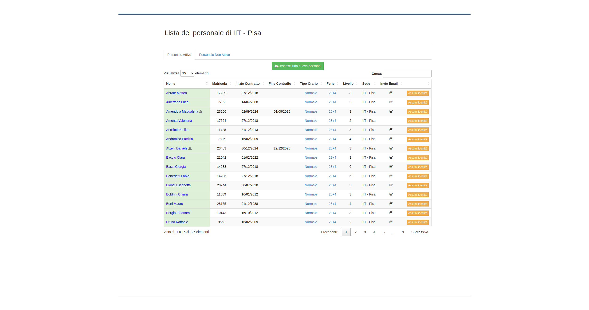

Gestione e inserimento Personale
================================
La prima funzionalità che si incontra analizzando il sistema in modalità amministratore riguarda
la possibilità di inserire, modificare e, più in generale, gestire il personale.
Dal menu :menuselection:`Amministrazione --> Lista Persone` è possibile aprire l'interfaccia di
consultazione delle persone presenti in anagrafica.

   Schermata visualizzazione lista personale
   
In primo luogo si può notare come esistano due liste distine per il personale:
   * La *Lista del personale attivo* contiene la lista di tutte le persone contrattualizzate e 
     strutturate nella sede 
   * La *Lista del personale non attivo* che contiene la lista di tutte le persone che in passato
     sono state contrattualizzate ma che al momento risultano non presenti nella lista del personale da inviare ad **Attestati**.

Entrambe le liste presentano gli stessi campi, ovvero:
   * il nome e il cognome del dipendente (per privacy sono stati oscurati così come la matricola) 
   * la matricola
   * il numero del badge
   * le date di inizio e fine lavoro (la fine non è presente quando il contratto è a tempo 
     indeterminato)
   * il tipo di orario di lavoro assegnato alla persona
   * il piano ferie attualmente disponibile per la persona 
   * il livello di contratto
   * la sede di lavoro
   * l'invio mail, ovvero se per il dipendente è stata selezionata la possibilità di ricevere mail
     informative circa la propria situazione di mancate timbrature, mancate assenze o timbrature
     disaccoppiate che rendono non veritiero il calcolo dei residui

Naturalmente, per quanto concerne la lista del personale non attivo, la situazione visualizzata è
limitata ai soli campi nome e cognome, matricola e mail.

Per entrambe le liste è presente la possibilità, in alto a sinistra appena sotto il titolo della
lista, di selezionare quanti elementi far visualizzare (10, 25, 50 o tutti).
Inoltre, è presente una form di ricerca testuale nella parte in alto a destra delle tabelle che
permette la ricerca puntuale di elementi sulla base del nome o del cognome.
Le tabelle, infine, sono entrambe ordinabili per campo, nel senso che è possibile specificare
l'ordinamento delle righe (inizialmente per ordine alfabetico) a seconda del campo più di interesse
(numero di matricola, data di inizio lavoro ecc...).

Nella parte alta della pagina è presente un disclaimer contenente l'informazione relativa al fatto che
l'inserimento manuale dei dipendenti (senza passare quindi dalla sincronizzazione con i dati SIPER),
può comportare problemi nell'inserimento delle corrette informazioni anagrafiche e contrattuali del
nuovo dipendente oltre che provocare problemi nella login del nuovo dipendente sulla piattaforma ePAS.

Inserimento persona
-------------------

Nel caso si intenda comunque procedere con l'inserimento di una nuova persona in anagrafica sarà per prima cosa necessario
cliccare sul link in alto a sinistra nella pagina: "*Inserisci una nuova persona*".

La pagina che si aprirà sarà come quella presentata nelle figure seguenti:

.. figure:: _static/images/inseriscimentoPersona.png
   :scale: 40
   :align: center

   Schermata inserimento nuova persona
   
In questa schermata sono presenti i campi da compilare (asteriscati quelli obbligatori) per
poter inserire una persona in anagrafica.
Tutti i campi sono decisamente esplicativi, quelli particolari presentano una breve descrizione
che ne esplica il funzionamento.
Tra questi, una menzione particolare per il campo *Inquadramento* che contiene la tipologia di contratto
da assegnare al dipendente.
Può assumere tre diversi valori:

* Dipendente strutturato TD o TI
* Interinale
* Non strutturato (co.co.co., assegnisti, borsisti, ecc...)

Modifica persona
----------------

In caso si vogliano modificare i dati di una certa persona la schermata che potremo visualizzare
sarà di questo tipo

.. figure:: _static/images/modificaPersona.png
   :scale: 40
   :align: center

   Schermata modifica persona
   
Si può notare in alto la barra con le schede che separano la gestione di tutte le componenti
relative al dipendente stesso:
 
  * Dati anagrafici (quella aperta in avvio) 
  * Dati contrattuali 
  * Configurazione personale
  * Gruppi
  * Badge 
  * Figli 
  * Elimina

Dati Anagrafici
---------------

In ogni pannello (titolato) sono contenute informazioni referenti ad esso, rendendo così più
intuitivo dove andare a cercare l'informazione specifica che si richiede o che si intende 
modificare.
Nel pannello relativo ai dati personali, è possibile trovare alcune informazioni aggiuntive
rispetto alla precedente versione.
Difatti, esiste la possibilità di specificare se la persona in questione è Responsabile di un
gruppo di lavoro (e in tal caso può usufruire della possibilità di vedere le timbrature delle
persone che afferiscono al proprio gruppo e la loro presenza giornaliera 
v. :menuselection:`Amministrazione --> Timbrature`);
è possibile inoltre specificare se la persona può/non può ricevere le mail per le informazioni
circa la propria situazione di timbrature e assenze (invio email).
E' stato aggiunto inoltre un pannello relativo alle *altre informazioni*, contenente anche il campo
in cui specificare l'eventuale **eppn** ovvero il campo utilizzato dalla piattaforma *Shibboleth*
(v. **Decisioni implementative** dal menu *Documentazioni*).

Dati contrattuali
-----------------

Nella tab “*Dati contrattuali*” è presente tutto quanto riguarda la gestione contrattuale del
dipendente selezionato.

   
   Schermata di riepilogo contrattuale

Nel pannello superiore è presente il riepologo relativo al contratto attuale, mentre nel pannello
sottostante sono elencati tutti i contratti che ha avuto il dipendente con la possibilità di
gestirli attraverso il tasto “*Gestisci*”.

Cliccando sul tasto “*Gestisci*” in corrispondenza del contratto che si intende gestire si aprirà
una finestra di questo tipo:

   
   Schermata di modifica date contrattuali

Come si può notare nella parte alta sopra il pannello è presente una tab list contenente ogni
informazione specifica relativa al contratto adeguatamente separata:

  * Date (attualmente visualizzata)
  * Tipo orario
  * Presenza automatica
  * Elimina

Tipo orario
-----------

La tab tipo orario, invece, contiene le informazioni all’orario di lavoro associato al contratto
in essere. Nel pannello in alto è presente la configurazione attuale dell’orario di lavoro
associato al contratto. Mentre nel pannello in basso è possibile specificare da quale data a quale
data il dipendente utilizza un certo orario di lavoro (normale, maternità, 50%...)

   
   Schermata di modifica tipo orario
   
Orario di lavoro personale
--------------------------

In questa tab è possibile specificare per il dipendente un proprio orario di lavoro che non tenga
conto, anzi letteralmente sovrascriva, l'orario di lavoro stabilito per la propria sede di lavoro 
(v.: :menuselection:`Configurazione --> Configurazione sedi --> Parametri periodici`).
E' una funzionalità da utilizzare, ad esempio, per casi di unità di personale che devono entrare a lavoro
in orari precedenti l'apertura della struttura (es.: orario della struttura 7.00-20.00 e il dipendente deve entrare alle 6.30).

   
   Schermata di specifica orario di lavoro personale
   
Per poter utilizzarla occorre prima definire le fasce orarie (v. :doc:`Fasce orarie di lavoro <timeSlot>`)
e successivamente selezionarla dal menu a tendina alla voce *Fascia oraria* insieme alle date di inizio e fine di 
utilizzo di quella specifica fascia oraria.
Cliccando su **Applica** verrà proposto un riepilogo di quanto accadrà con la modifica e infine cliccando 
su **Conferma** verrà applicato l'orario specifico per il dipendente.

Fascia oraria obbligatoria
--------------------------

Questa sezione è dedicata a quelle situazioni in cui un dipendente deve stare forzatamente in istituto in specifiche
fasce orarie (probabilmente dovute a specifiche situazioni contrattuali).
E' una funzionalità da utilizzare, ad esempio, per casi di unità di personale che devono stare a lavoro in particolari
fasce orarie (es.: 10.00 - 12.00 di presenza obbligatoria) e che può essere "derogata" grazie ai Permessi Personali
(per info relative a questa parte è sempre consigliata la consultazione dell'ufficio UGRU).

   
   Schermata di specifica fascia di presenza obbligatoria

Per poter utilizzarla occorre prima definire le fasce orarie (v. :doc:`Fasce orarie di lavoro <timeSlot>`)
e successivamente selezionarla dal menu a tendina alla voce *Fascia oraria* insieme alle date di inizio e fine di 
utilizzo di quella specifica fascia oraria.
Cliccando su **Applica** verrà proposto un riepilogo di quanto accadrà con la modifica e infine cliccando 
su **Conferma** verrà applicato l'orario specifico per il dipendente.
   
Piani Ferie
-----------

La tab Piani ferie permette all'amministratore del personale di modificare il piano ferie associato al dipendente.
E' il caso, ad esempio, dell'attribuzione di un piano ferie specifico in presenza di un orario di lavoro di tipo
part time verticale.
Per poter procedere alla modifica del piano ferie occorre semplicemente specificare da quale data a quale data
(campi Data inizio e Data fine) occorre che il piano ferie venga applicato, quale piano ferie si intende applicare 
(selezionandolo da menu a tendina presente nel campo Piano ferie) e cliccare sul bottone Applica.
Il sistema proporrà quindi un riepilogo con il risultato dell'applicazione del piano ferie per il periodo specificato
relazionandolo ai periodi con piani ferie già esistenti.
Premendo quindi sul tasto Conferma, il piano verrà applicato e i calcoli sulle ferie maturate e godibili automaticamente
fatti dal sistema.

.. figure:: _static/images/pianiFerie.png
   :scale: 40
   :align: center
   
   Schermata di modifica del piano ferie

Presenza automatica
-------------------

La tab di presenza automatica consente all’amministratore di specificare se il dipendente può
godere dell’autocertificazione per la presenza a lavoro (orario giornaliero fissato al quantitativo
orario giornaliero che per contratto il dipendente deve effettuare) oppure no.
Nel pannello in alto è presente la configurazione attuale, mentre in quello in basso è possibile
specificare date di inizio e fine di una nuova configurazione con timbratura automatica oppure no.

   
   Schermata di modifica tipologia timbratura

Selezionando la tipologia di timbratura dal menu a tendina
(timbratura manuale / timbratura automatica) e specificando il periodo per cui si vuole applicare
tale modifica (leggendo accuratamente le istruzioni riportate nella finestra), il sistema
calcolerà le nuove impostazioni che saranno da subito visibili dal menu Timbrature.

Elimina contratto
-----------------

La tab di eliminazione contratto consente di eliminare sia il contratto sia tutte le informazioni
accessorie ad esso collegate ed elencate in precedenza.

   
   Schermata di eliminazione contratto

Configurazione personale
------------------------

In questa sezione è possibile specificare quali possano essere le azioni che il dipendente selezionato può compiere in
autonomia poichè preventivamente autorizzato.

   
   Schermata contenente la lista di parametri di configurazione personale
   
Come si può notare nella figura qui sopra, sono presenti vari parametri che consentono al dipendente di poter inserire
in autonomia determinati tipi di codici di assenza o di effettuare in autonomia azioni relative al proprio orario di lavoro.

Di particolare interesse sono i parametri relativi al telelavoro che, ad esempio grazie ad una delle ultime modifiche rilasciate,
possono consentire al personale di I-III livello di vedere riconosciuti i propri orari inseriti in telelavoro.

Il parametro in questione è *Timbrature in telelavoro abilitate anche per orario di lavoro*. Cliccando su quel parametro
sarà possibile consentire al dipendente di far sì che gli orari inseriti nella form di telelavoro (per cui si rimanda
alla apposita sezione in questa documentazione) vengano anche inseriti sul proprio cartellino mensile, andando così a determinare
per ogni giorno il proprio residuo orario giornaliero.

Badge
-----

La tab di gestione dei badge associati ai dipendenti prevede una schermata in cui vengono elencati
tutti i badge che sono stati assegnati alla persona e su quale gruppo (e di conseguenza lettore
badge) hanno diritto di poter essere utilizzati. E’ possibile, per l’amministratore del personale,
eliminare i badge presenti nella lista cliccando sul tasto “*Elimina*” in corrispondenza del badge
che si intende eliminare.

   
   Schermata di visualizzazione badge associati al dipendente

E’ inoltre possibile inserire un nuovo badge per il dipendente in questione cliccando in alto sul
bottone “*Nuovo badge per <nome cognome dipendente>*”.

   
   Form di inserimento nuovo badge per il dipendente

In questa form si devono specificare il numero del badge che si intende associare, e il 
*gruppo badge* sul quale afferire il badge stesso.
Per una più dettagliata spiegazione sul significato di *gruppo badge*, consultare la documentazione
per **Amministratore tecnico**.

Inserimento figli dipendente
----------------------------

La tab di gestione dei figli del dipendente è molto importante poichè consente di avere dei
riscontri circa la possibilità di utilizzo di alcuni codici di assenza (malattia figlio ecc...). 
In questa schermata viene evidenziata la lista di figli che ha un dipendente e fornita la
possibilità di inserirne altri tramite il bottone “*Inserisci figlio*“.

   
   Schermata di riepilogo dei figli del dipendente

   
   Schermata di inserimento figlio in anagrafica

Specificando nome, cognome e data di nascita, viene salvato il figlio del dipendente in anagrafica.

Elimina persona
---------------

L’ultima tab presente è quella che consente l’eliminazione della persona dall’anagrafica del
personale. Premendo su “*Elimina*” il dipendente viene cancellato e con esso tutte le informazioni
ad esso relative (contratti, piani ferie, residui ecc...).

   
   Schermata di eliminazione dipendente
