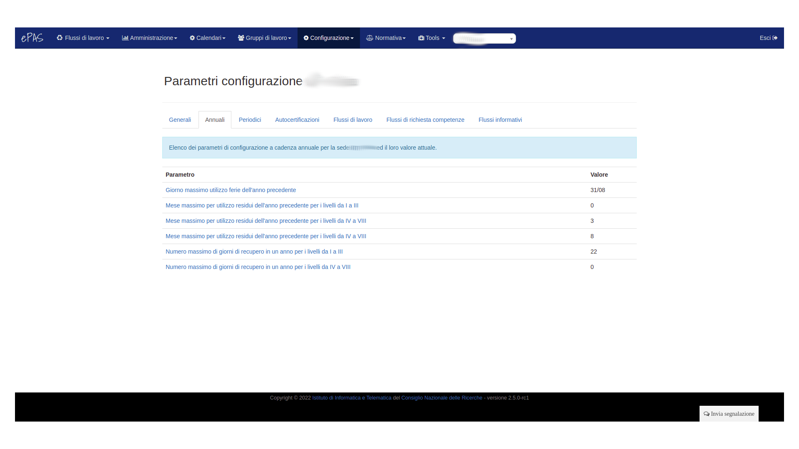
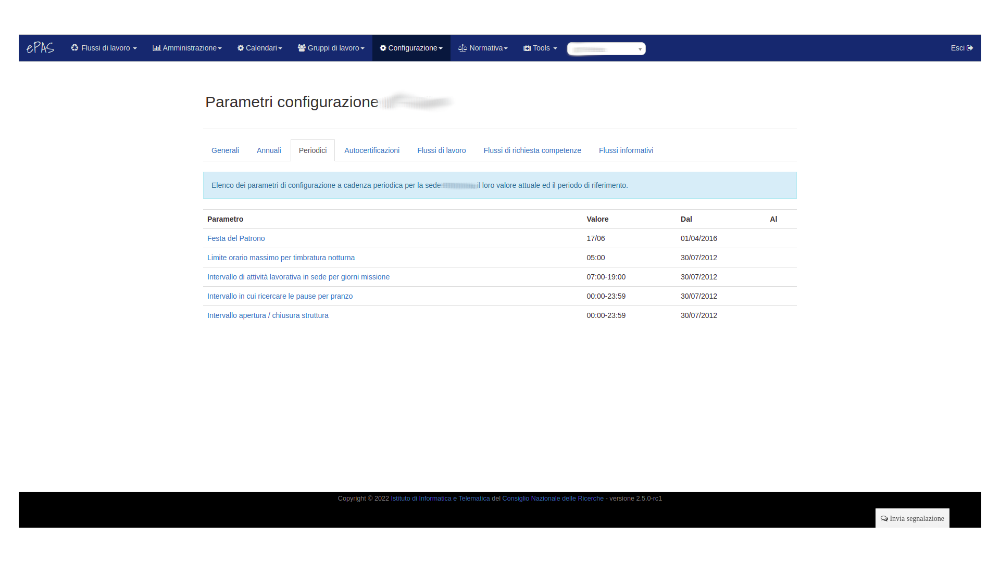
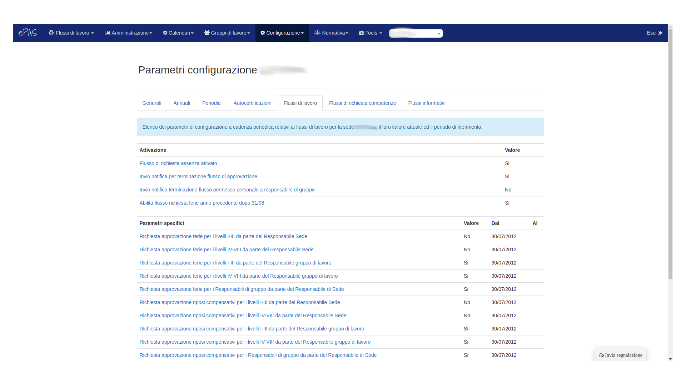
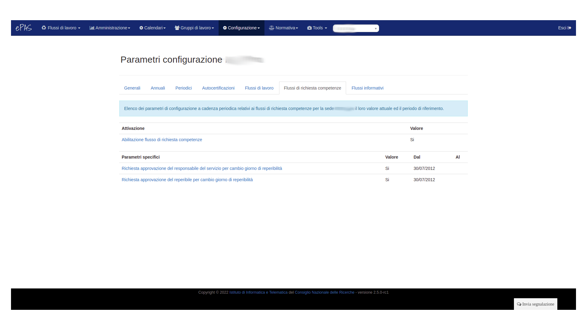
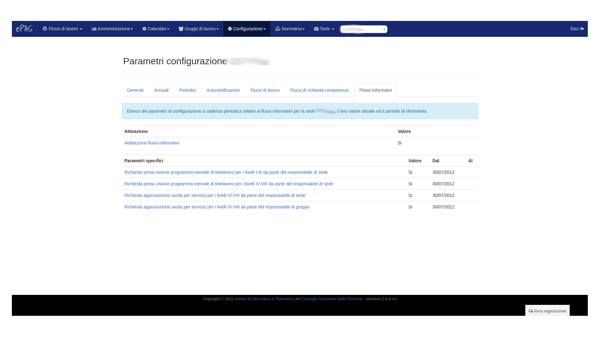

Gestione parametri
==================

Un aspetto importante per la gestione del sistema ePAS è il corretto utilizzo dei parametri.
Dal menu :menuselection:`Configurazione --> Parametri` accediamo alla schermata della gestione dei
parametri.
Esistono due tipologie di parametri da configurare:

   * I parametri generali
   * I parametri annuali
   
Parametri generali
------------------

Nella pagina relativa ai parametri generali possiamo modificare tutti quei valori che, si suppone,
siano validi per sempre come, ad esempio:

   * il giorno della festa del patrono
   * i parametri relativi alla connessione con il server della sede centrale che controlla gli 
     attestati (di cui si parla nella apposita sezione)
   * il numero di colonne da visualizzare per la pagina delle timbrature
   
.. figure:: _static/images/parametriGenerali.png
   :scale: 40
   :align: center
   
   Schermata parametri generali
   
Tutti i parametri sono visualizzati per sede di appartenenza. 
È infatti possibile, cambiando il valore sopra i vari pannelli, dove si vede scritto *Sede*,
passare alla visualizzazione dei parametri relativi alle altre sedi associate all'istituto.
Ovviamente, i parametri sono modificabili **se e solo se** si hanno diritti di amministrazione
totali sulla sede.

Parametri annuali
-----------------

Anche i parametri annuali, come per quelli generali, sono associati alla sede di appartenenza e,
come per i precedenti, è possibile la modifica **se e solo se** si hanno diritti di amministrazione
totali sulla sede.
Nella pagina relativa ai parametri annuali è possibile trovare tutti quei valori che si suppone
possano essere modificati nel tempo e che, per comodità, si assume possano avere valenza quantomeno
annuale.
Tra gli altri troviamo:

   * Il giorno dell'anno entro cui usufruire delle ferie relative all'anno precedente
   * Il limite massimo per l'utilizzo delle ore residue dell'anno precedente per i livelli 1-3
     (ricercatori/ tecnologi)
   * Il limite massimo per l'utilizzo delle ore residue dell'anno precedente per i livelli 4-8
     (tecnici / amministrativi)
   * Il numero massimo di giorni di riposo compensativo per i livelli 1-3 (ricercatori/ tecnologi)
   * Il numero massimo di giorni di riposo compensativo per i livelli 4-8 
     (tecnici / amministrativi)
   * Il limite orario massimo per la timbratura notturna (utile per i casi in cui ci siano
     timbrature a cavallo della mezzanotte che debbano essere "spezzate" per i calcoli temporali
     tra giorno precedente e giorno attuale)
   

   
   Schermata parametri annuali
   
Parametri periodici
-------------------

In questa sezione è possibile trovare tutti i parametri a cadenza periodica che possono essere configurati per la propria
sede di lavoro.

   
   Schermata parametri periodici
   
Di particolare interesse sono i tre intervalli orari presenti che riguardano:

   * apertura-chiusura della sede, 
   * pausa pranzo
   * attività lavorativa durante i giorni di missione. 

Tramite la corretta configurazione di questi intervalli, a seconda delle esigenze
della propria sede di lavoro, verranno effettuati dal sistema i calcoli relativi a:

   * entrate e uscite dal luogo di lavoro omettendo eventuale tempo trascorso in sede prima dell'apertura o dopo la chiusura
   * ricerca di uscite e entrate per pausa pranzo nell'intervallo definito per il pranzo
   * comparazione degli orari delle missioni (orarie e giornaliere) di modo da poter inserire il miglior codice d'assenza per ciascun giorno di missione che la piattaforma Missioni invia ad ePAS. 
   
N.B.: per questa parte si rimanda alla documentazione presente su questa pagina relativa all'integrazione ePAS-Missioni 

Autocertificazioni
------------------

Flussi di lavoro
----------------

In questa sezione è possibile definire la configurazione per consentire la gestione interna ad ePAS delle richieste da 
parte dei dipendenti di:

   * ferie
   * riposi compensativi
   * permessi personali
   * ferie dopo il 31/8
   
In particolare è possibile specificare quale ruolo abbia il diritto di approvare le richieste effettuate dai dipendenti.
Per una spiegazione più dettagliata relativa al significato di questi parametri, consultare la sezione presente in questa
documentazione *Documentazione utilizzo flussi*.

   
   Schermata parametri per i flussi di richiesta assenza

Flussi di richiesta competenze
------------------------------

In questa sezione è possibile definire la configurazione per consentire la gestione interna ad ePAS delle richieste da 
parte dei dipendenti di:

   * cambio giorno di reperibilità
   
In particolare è possibile specificare quale ruolo abbia il diritto di approvare le richieste effettuate dai dipendenti.
Per una spiegazione più dettagliata relativa al significato di questi parametri, consultare la sezione presente in questa
documentazione *Documentazione utilizzo flussi*.

   
   Schermata parametri per i flussi di richiesta competenza

Flussi informativi
------------------

In questa sezione è possibile definire la configurazione per consentire la gestione interna ad ePAS delle richieste da 
parte dei dipendenti di:

   * richiesta uscita di servizio
   * richiesta validazione orario svolto in telelavoro
   
In particolare è possibile specificare quale ruolo abbia il diritto di approvare le richieste effettuate dai dipendenti.
Per una spiegazione più dettagliata relativa al significato di questi parametri, consultare la sezione presente in questa
documentazione *Documentazione utilizzo flussi*.

   
   Schermata parametri per i flussi informativi
