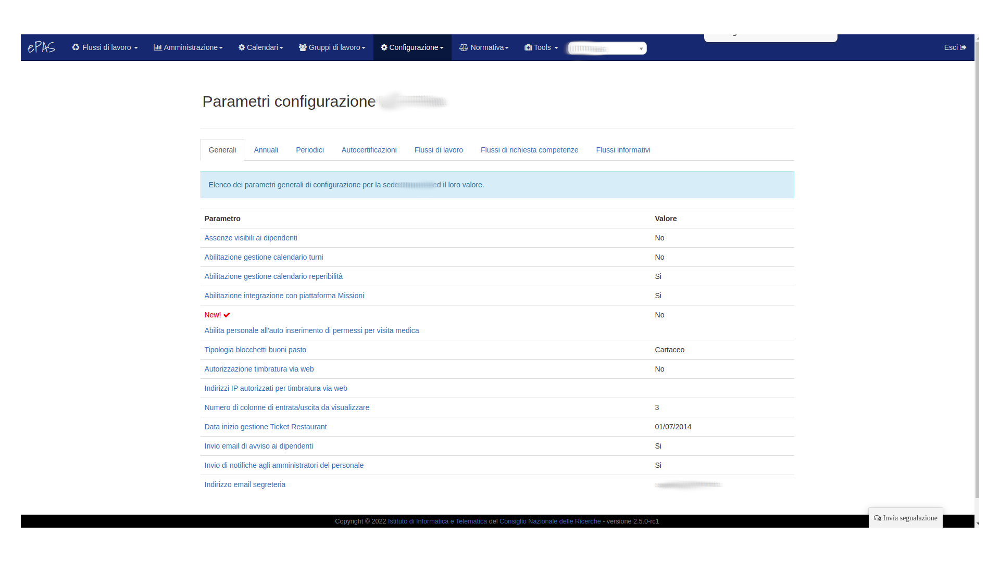

Gestione parametri
==================

Un aspetto importante per la gestione del sistema ePAS è il corretto utilizzo dei parametri.
Dal menu :menuselection:`Configurazione --> Parametri` accediamo alla schermata della gestione dei parametri
Esistono due tipologie di parametri da configurare:

   * I parametri generali
   * I parametri annuali
   
Parametri generali
------------------

Nella pagina relativa ai parametri generali possiamo modificare tutti quei valori che, si suppone, siano validi per sempre come, ad esempio:

   * il giorno della festa del patrono
   * i parametri relativi alla connessione con il server della sede centrale che controlla gli attestati (di cui si parla nella apposita sezione)
   * il numero di colonne da visualizzare per la pagina delle timbrature
   

   
   Schermata parametri generali
   
Tutti i parametri sono visualizzati per sede di appartenenza. E' infatti possibile, cambiando il valore sopra i vari pannelli, dove si vede scritto *Sede*, passare alla visualizzazione dei parametri relativi alle altre sedi associate all'istituto.
Ovviamente, i parametri sono modificabili **se e solo se** si hanno diritti di amministrazione totali sulla sede.

Parametri annuali
-----------------

Anche i parametri annuali, come per quelli generali, sono associati alla sede di appartenenza e, come per i precedenti, è possibile la modifica **se e solo se** si hanno diritti di amministrazione totali sulla sede.
Nella pagina relativa ai parametri annuali è possibile trovare tutti quei valori che si suppone possano essere modificati nel tempo e che, per comodità, si assume possano avere valenza quantomeno annuale.
Tra gli altri troviamo:

   * Il giorno dell'anno entro cui usufruire delle ferie relative all'anno precedente
   * Il limite massimo per l'utilizzo delle ore residue dell'anno precedente per i livelli 1-3 (tecnologi)
   * Il limite massimo per l'utilizzo delle ore residue dell'anno precedente per i livelli 4-8 (tecnici)
   * Il numero massimo di giorni di riposo compensativo per i livelli 1-3 (tecnologi)
   * Il numero massimo di giorni di riposo compensativo per i livelli 4-8 (tecnici)
   * Il limite orario massimo per la timbratura notturna (utile per i casi in cui ci siano timbrature a cavallo della mezzanotte che debbano essere "spezzate" per i calcoli temporali tra giorno precedente e giorno attuale)
   

   
   Schermata parametri annuali 