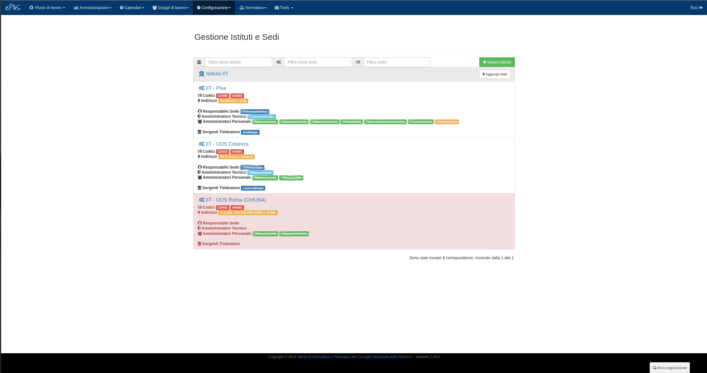

Gestione Sedi e amministratori
==============================

All'interno di questa funzionalità è possibile specificare nomi e caratteristiche delle sedi di cui il proprio istituto di appartenenza dispone, oltre che delle persone che saranno insignite dei diritti di amministrazione per poter gestire il programma e il personale.
Gli amministratori potranno essere designati sia completi (con diritto di modifica) o in sola lettura, quindi con la possibilità di visualizzare le situazioni mensili del personale senza però poterle modificare.
Dal menu :menuselection:`Configurazione --> Sedi e amministratori` l'amministratore si troverà di fronte la seguente schermata:

   
   Schermata sedi e amministratori
   
In particolare si può notare come l'istituto in questione presenti due sedi distinte. Chi detiene diritti di amministrazione sulla sede, può modificare i parametri relativi alle informazione di ubicazione della sede stessa cliccando sul nome.
Per ognuna delle sedi presenti, vengono visualizzati gli account corrispondenti ai lettori badge da cui timbrano i dipendenti (sottolineati in verde) e presenti sia a livello di istituto che, più specificatamente, sulle sedi a cui sono effettivamente associati.

   
   Modifica informazioni della sede  

Come si evince dalla schermata delle sedi e amministratori, è possibile associare ad ognuna delle sedi, se si hanno diritti di amministrazione, eventuali altri amministratori. 
Sarà sufficiente cliccare sul link che permette l'aggiunta di utenti amministratori e scegliere la persona dalla lista.

E' inoltre possibile, come si può notare dall'immagine ad inizio pagina, inserire delle tipologie di account di sistema.
Epas offre la possibilità di definire, tramite questa schermata, account di sistema quali **BadgeReader** e **RestClient**.
I primi devono essere associati con username e password ai client che si occupano di scaricare su epas le timbrature prese dai lettori badge dai quali i dipendenti comunmente timbrano.
I secondi, invece, sono account di tipo *rest* che servono per chiamare i metodi rest che Epas mette a disposizione di eventuali applicazioni che intendono interagire con Epas stesso (v. Documentazioni -> Documentazione servizi rest).
