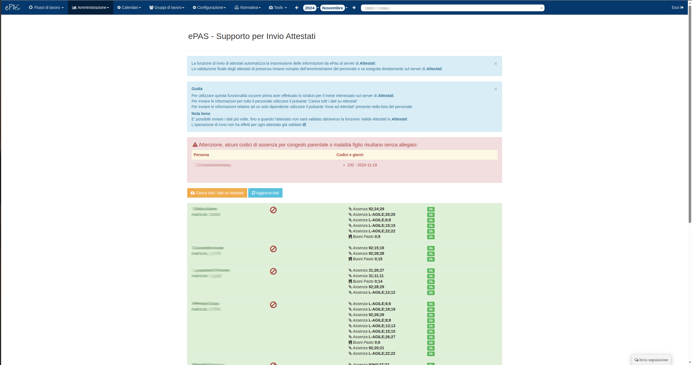

Invio attestati di presenza
===========================

Il sistema ePAS consente all'amministratore di interfacciarsi con le funzionalità di sottomissione
di assenze e competenze presenti sul sito *https://attestati.cnr.it/*
Dal menu :menuselection:`Amministrazione --> Invio attestati`, l'amministratore si troverà di
fronte a questa schermata:

   
   Schermata home invio attestati
   
A questo livello è possibile selezionare, dal menu a tendina in alto, il mese e l'anno di cui si intende sottomettere, alla sede
centrale, assenze e competenze del personale (di default il sistema seleziona il mese precedente al
mese attuale).
   
Fondamentale per poter procedere con l'invio dei dati mensili è aver effettuato **lo stralcio** dei dati della propria sede
sul sistema centrale all'indirizzo *https://attestati.cnr.it/attestati*

Le credenziali per l'accesso al sistema della sede centrale sono quelle relative agli account
**SIPER** in dotazione a ciascun dipendente del personale amministrativo.

In questa schermata è possibile trovare, sopra la lista del personale per cui inviare le informazioni mensili, un riepilogo di quelli
che possono essere gli eventuali problemi riscontrati dal sistema. Gli eventuali problemi possono essere del tipo:

* mancanza di allegati per codici che necessitano di allegato (es.: codici per congedo parentale)
* mancanza di approvazione del calendario di reperibilità e/o turno in caso di servizio definito (v. :doc:`Gestione servizi <services>`)

   
Per ogni dipendente attivo nell'anno e mese selezionati viene proposta una riga di base colorata di giallo dove del dipendente
vengono riportati:

* codici di assenza e date di utilizzo
* quantità di codici di competenza
* quantità di buoni pasto maturati nel mese
* eventuali ore di formazione inserite nel mese

Su questa riga sono poi presenti un bottone bianco sotto al nome che consente l'invio esclusivo per quel dipendente delle informazioni mensili (che vedremo più avanti) e 
il simbolo di una nuvola con una freccia rivolta verso l'alto che simboleggia il fatto che i dati sono pronti per essere inviati al sistema di Attestati.

Tra la lista dei dipendenti e le informazioni di riepilogo su eventuali problemi troviamo i due pulsanti per la gestione dell'invio dati:

* Carica tutti i dati su Attestati (color arancione)
* Aggiorna dati (color azzurro)

Premendo il primo bottone si effettua un caricamento massivo delle informazioni di ciascun dipendente Attestati. 

Il caricamento può comportare un esito positivo e, in questo caso, la riga del dipendente si colora di **verde** e compare il simbolo della spunta 
(sempre di colore verde) di fianco al nome del dipendente. Inoltre a fianco di ciascun dato inviato compare la scritta (sempre in verde) "*Ok*".

Qualora qualcosa non venisse correttamente recepito da Attestati, la riga di quel dipendente rimarrà di colore **giallo** e, di fianco all'elemento 
che ha riscontrato un errore nel caricamento, comparirà la scritta "*Non inviato*" oltre a un Triangolo rosso rovesciato. 
Passando il mouse sopra quel triangolo apparirà un messaggio che niente altro è che **la risposta che Attestati invia ad ePAS con la causa della
mancata ricezione di quel tipo di dato**.

Leggendo attentamente la risposta è quindi possibile capire se il problema della mancata ricezione di quel dato sia da imputare ad Attestati (e quindi
occorrerà rivolgersi all'helpdesk di Attestati per risolvere il problema) o se è possibile risolvere la situazione lavorando sul cartellino del dipendente.
Ecco che in questo caso ci viene in soccorso il secondo bottone, quello di *Aggiorna dati*

Dopo aver infatti modificato il cartellino del dipendente (nel caso Attestati ci dica, ad esempio, che occorre cambiare un certo codice di assenza con un altro),
occorre premere il bottone di *Aggiorna dati* per consentire alla procedura di invio dati ad Attestati di recepire le modifiche effettuate sul cartellino, mostrarle
e renderle disponibili per un nuovo invio.
A questo punto, è possibile premere il bottone bianco di *Invio dati ad Attestati* presente sotto al nome del dipendente in questione per inviare singolarmente 
i suoi dati senza dover reinviare tutti i dati di tutti i dipendenti. 

Una volta che l'attestato di presenza verrà poi successivamente validato, tutte le righe di tutti i dipendenti presenteranno, al posto della spunta verde di fianco 
al nome, il simbolo del divieto di color rosso che significa che qualunque modifica effettuata su ePAS ai dati di quei dipendenti per quell'anno/mese non sarà
più inviabile ad Attestati.