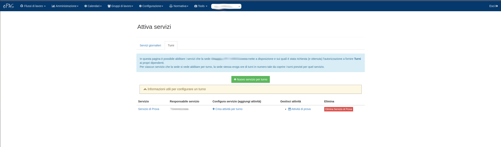

Gestione servizi
================

I servizi di turno e reperibilità sono attività fondamentali per la gestione del personale. 
Attraverso questa funzionalità possono essere poi definiti i calendari per gestire al meglio le attività e per consentire l'inserimento dei giusti valori
di competenza di turno e di reperibilità per le persone abilitate (v. :doc:`Gestione Competenze <competences>` ) attraverso un processo automatizzato che verrà
trattato nella sezione relativa alla gestione dei calendari. 
In questa sezione trattiamo come devono essere definiti i servizi e quali sono le condizioni fondamentali per l'attribuzione corretta del personale.

Dal menu :menuselection:`Configurazione --> gestione servizi`, l'amministratore potrà trovarsi
di fronte una schermata come questa:

   
   Pagina di configurazione servizi
   
Come si può notare, in alto si trovano due schede: la prima (quella in cui ci troviamo) relativa alla definizione di un nuovo servizio giornaliero 
(la Reperibilità) e l'altra relativa alla definizione di un nuovo servizio di turno.

Reperibilità
------------

Cliccando sul bottone verde presente al centro della pagina si definisce un nuovo servizio di reperibilità.

   
   Finestra di creazione reperibilità
   
In questa finestra occorre definire il nome del servizio attraverso il campo *descrizione*, selezionare la tipologia di competenza mensile
 (per il CNR è la reperibilità), selezionare dal menu a tendina il *responsabile del servizio*, ovvero colui il quale a fine mese dovrà validare il calendario
 della reperibilità (completando, di fatto, il flusso che inserisce le quantità di giorni di reperibilità feriale e festiva nelle competenze dei dipendenti
 abilitati alla reperibilità) e selezionare (questo però è un campo opzionale) uno o più gestori del calendario della reperibilità.

Una volta definito il tutto, ciò che si ottiene è quanto evidenziato dalla schermata sottostante:

   
   Servizio creato

A questo punto occorre associare le persone al servizio appena definito.
La prima cosa da fare in questo caso è assegnare la competenza di reperibilità feriale e/o festiva ai dipendenti che vogliamo associare al servizio.
Per come farlo si rimanda a v. :doc:`Gestione Competenze <competences>`.
Una volta associate le competenze, occorre assegnare i reperibili al servizio.
Per farlo è sufficiente cliccare sul link **Gestisci** presente nella colonna *Gestisci persone* presente nella tabella riepilogativa dei servizi di reperibilità. 
Una volta cliccato apparirà la seguente schermata:

   
   Associazione delle persone al servizio
   
Cliccando sul bottone verde si procede all'associazione delle persone al servizio attraverso la seguente finestra:

   
   Associazione dipendente al servizio

Dal menu a tendina selezionare la persona da inserire nel servizio e, nel campo "*data inizio*" specificare la data da cui far partire l'associazione. 
Il nostro consiglio è di inserire come data il primo giorno del mese (es.: 01/03/2025).
Cliccare infine su *Aggiungi*.

Una volta terminata la procedura di associazione delle persone al servizio, il risultato sarà il seguente:

   
   Lista reperibili associati al servizio
   
In questa tabella vengono riportati i nomi dei reperibili associati, la data di inizio della loro attività sul servizio, l'eventuale data di fine associazione
al servizio che può essere popolata attraverso il pulsante *Termina partecipazione* che consente di specificare quando la persona deve interrompere la propria
associazione al servizio di reperibilità.  

A questo punto il servizio è definito e sarà quindi possibile procedere alla schedulazione delle persone sul calendario mensile dell'attività ().

Turni
-----

Selezionando la voce *Turni* nel menu della homepage della sezione Gestione Servizi, si procede alla creazione del servizio di turno.
Analogamente a quanto descritto sopra per il servizio di reperibilità, anche per il servizio di turno, cliccando sul bottone verde si procede a specificare 
il nome dell'attività, a selezionare il *responsabile del servizio* che, come nel caso della reperibilità, alla fine di ogni mese dovrà approvare le giornate 
di turno effettuate nel calendario procedendo quindi alla definizione della corretta quantità di ore di turno da inserire nelle competenze dei dipendenti
abilitati al turno e presenti nel calendario, e a selezionare eventuali *Gestori di turno*, ovvero coloro che possono definire il calendario dei turni ma che 
non hanno diritto di approvazione mensile delle giornate del servizio.

   
   Finestra di creazione turno
   
Una volta definite tutte queste informazioni, comparirà sulla pagina il nuovo servizio.
Oltre a questo, appena sotto al bottone verde, comparirà un banner di colore giallo denominato *Informazioni utili per configurare un turno*. Cliccandoci si espanderà 
e consentirà di avere una panoramica sulle operazioni da fare. 

A questo punto la procedura di definzione del servizio di turno si discosta da quella precedentemente descritta per la reperibilità.
Infatti, una volta definito il servizio, occorre definire la o le attività su cui inserire i dipendenti all'interno del servizio di turno.
Per farlo, è necessario cliccare sulla voce *+ crea attività per turno*.

   
   Seleziona timetable da associare all'attività
   
Dalla schermata qui sopra occorre selezionare la timetable da associare all'attività, ovvero gli orari che il nostro turno deve coprire.
Una volta scelto l'orario, premendo sul pulsante *Avanti* si procede alla definizione dell'attività e delle tolleranze sugli orari di ingresso/uscita.

   
   Definisci le caratteristiche dell'attività

In questa schermata si determina il nome dell'attività all'interno del servizio, le si attribuisce una descrizione, dopodiché si specifica se occorre
prevedere disparità di personale tra gli slot di turno, ovvero se tra slot di mattina e slot di pomeriggio ci può essere una unità di differenza.
Per fare un esempio pratico: **se vogliamo che non ci sia disparità** vogliamo che una persona sia in turno la mattina e una il pomeriggio; 
**se invece vogliamo disparità**, vogliamo che possa esserci una persona al mattimo e due al pomeriggio o viceversa.

Occorre specificare quindi le tolleranze minime e massime su ingresso e uscita: questo determina quale sia la tolleranza entro la quale il turno 
viene comunque pagato per intero (tolleranza minima) e la tolleranza entro la quale il turno viene pagato decurtato di un'ora (tolleranza massima). 
**L'ingresso oltre la tolleranza massima comporta il mancato pagamento del turno per quel giorno**.

   
   Riepilogo delle caratteristiche dell'attività
   
Una volta quindi riepilogati i dati sull'attività, premendo il tasto *Crea*, viene creata effettivamente l'attività.

A questo punto è necessario assegnare le persone all'attività così da poterle ritrovare sul calendario di turno e schedularle negli slot di mattina e pomeriggio
dei vari giorni del mese.
Per poterlo fare, dalla schermata sottostante, vediamo che è comparsa l'attività appena definita nel nostro servizio di turno. 

   
   Riepilogo attività sul servizio
   
Cliccando sul link *Nome dell'attività* in corrispondenza della colonna **Gestisci attività** comparirà, come nel caso del servizio di reperibilità, la schermata per
assegnare le persone all'attività. Anche in questo caso, si ricorda che è necessario preventivamente aver assegnato la competenza di turno ai dipendenti
che intendiamo assegnare all'attività. Per farlo v. :doc:`Gestione Competenze <competences>`.

   
   Schermata per associare le persone al servizio di turno
   
Una volta cliccato sul nome dell'attività ci troveremo davanti questa schermata, nella quale compare in prima vista la possibilità di associare le persone
all'attività di turno. Nella parte alta si notano anche le altre schede *Attività*, *Orario turno* e *Elimina* che contengono, rispettivamente:
* le informazioni sull'attività
* le informazioni sugli orari di inizio e fine degli slot di turno
* la possibilità di eliminare l'attività (fattibile solo se non sono ancora state calendarizzate persone sull'attività)
 
Cliccando invece sul bottone verde per associare le persone all'attività, otterremo la seguente schermata che ricalca quella per l'associazione delle persone
al servizio di reperibilità:

   
   Scheda per associare la persona al servizio di turno
   
Dal menu a tendina accanto al campo *Persona* si seleziona la persona da associare all'attività, nel campo *data inizio* si specifica la data da cui la persona
inizia a fare parte dell'attività, mentre il campo *Jolly* serve a specificare se il dipendente è un turnista cosiddetto "*tappabuchi*" tra più attività (Jolly)
oppure se è un titolare del servizio di turno (no Jolly).

Una volta definiti i turnisti, la schermata riepilogativa delle persone associate all'attività comparirà come segue:

   
   I turnisti associati all'attività
   
In questa tabella vengono riportati i nomi dei turnisti associati, la data di inizio della loro attività sul servizio, l'eventuale data di fine associazione
al servizio che può essere popolata attraverso il pulsante *Termina partecipazione* che consente di specificare quando la persona deve interrompere la propria
associazione al servizio di reperibilità.  

A questo punto il servizio è definito e sarà quindi possibile procedere alla schedulazione delle persone sul calendario mensile dell'attività ().

