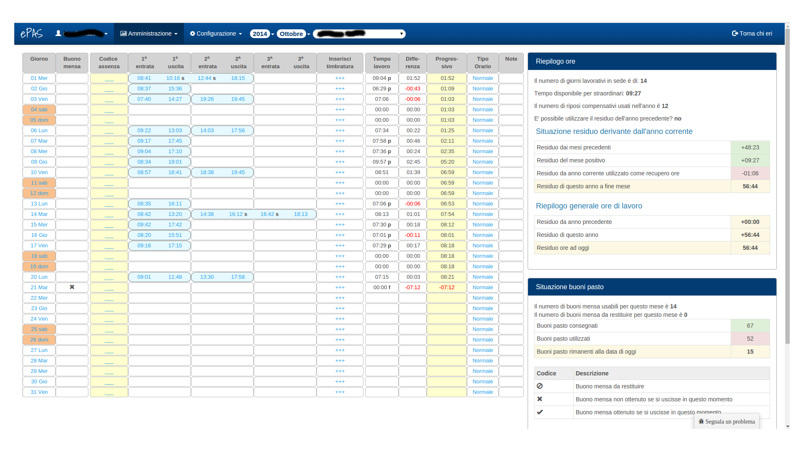
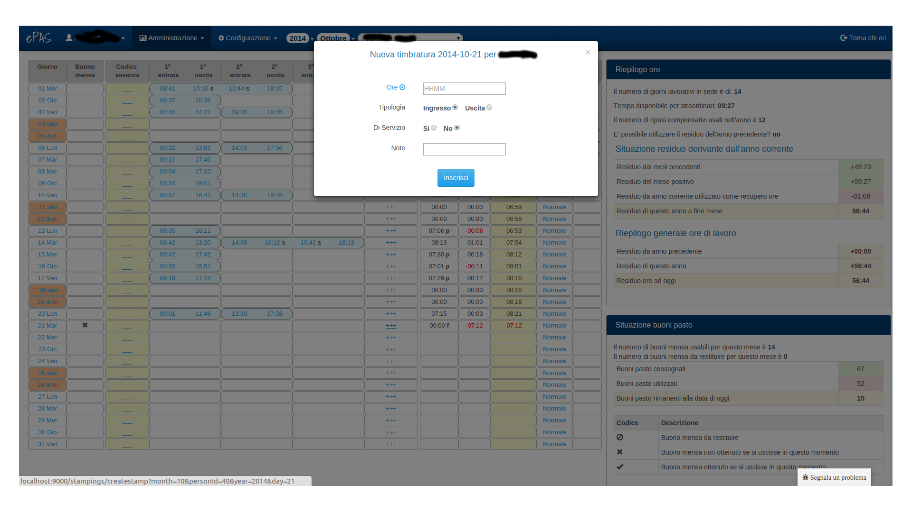
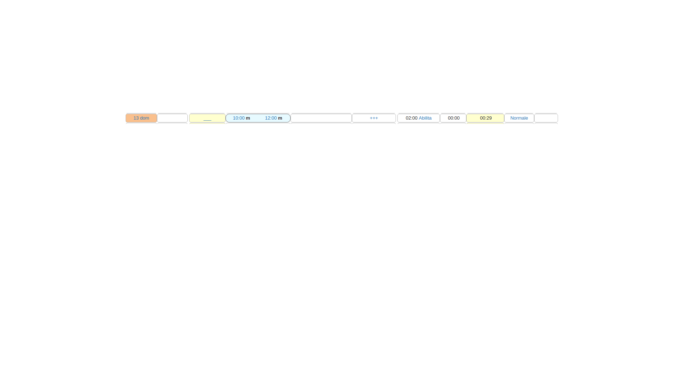

Gestione Timbrature
===================

Per l'amministratore è possibile controllare la situazione giornaliera/mensile di ogni dipendente afferente all'istituto.
Dalla schermata :menuselection:`Amministrazione --> Timbrature`, è possibile verificare la situazione di ciascun dipendente (selezionabile dal menu a tendina che compare in alto di fianco a mese e anno da consultare anch'essi selzionabili).

   
   Schermata delle timbrature mensili

Nella pagina compaiono, oltre alle timbrature effettuate dal dipendente, tutta una serie di ulteriori informazioni ad esempio, cliccando sul giorno interessato, è possibile vedere riassunta in tabella la situazione relativa alle modifiche effettuate su quel giorno in termini di inserimento di assenze e timbrature con tanto di responsabile di tali modifiche.

La colonna "*Buono mensa*" riporta un'eventuale "x" nel caso in cui per quel giorno il dipendente non abbia raggiunto il quantitativo di ore sufficienti a ottenere il buono pasto.

La colonna "*Codice assenza*" riporta l'eventuale codice d'assenza utilizzato dal dipendente per il giorno in questione. E' modificabile dall'amministratore cliccando sulla riga del giorno in cui si vuol inserire il codice di assenza. Comparirà una schermata di questo tipo:
 
.. figure:: _static/images/inserimentoAssenza.png
   :scale: 40
   :align: center
   
   Schermata di inserimento assenza
   
Nel campo "*codice*" è possibile scrivere il codice di assenza che si intende assegnare al dipendente. In alternativa, selezionandolo da uno dei due menu a tendina sulla destra, il codice verrà automaticamente inserito nel campo.
La sezione "*fino a*", se cliccata, genera un calendario che permette all'amministratore di specificare fino a quale giorno si intende inserire il codice d'assenza per il dipendente (caso d'uso è l'inserimento di giorni di ferie consecutivi).
E' possibile inoltre allegare all'assenza un file pdf contenente il modulo cartaceo relativo all'assenza stessa, è il caso questo di richiesta di giorni di ferie o di malattia, selezionandolo a partire dal campo "allegato"
Nella parte bassa della finestra, sono specificate alcune regole di comportamento per quanto riguarda codici di assenza speciali (FER).

Le colonne contenenti le timbrature mettono in ordine temporale e di tipo (ingresso/uscita) le timbrature effettuate dal dipendente. Cliccando su ognuna di esse è possibile modificarla temporalmente (``solo se sotto richiesta esplicita di un responsabile o del direttore``), modificarne la tipologia (da ingresso a uscita o viceversa), modificarne la causale (timbratura di servizio o no) o eliminarla (``anche qui previa autorizzazione di responsabile o direttore``).

.. figure:: _static/images/modificaTimbratura.png
   :scale: 40
   :align: center
   
   Schermata di modifica timbratura
   
La colonna "*inserisci timbratura*" permette all'amministratore di inserire una timbratura manualmente. Cliccando sui tre simboli '+' in corrispondenza del giorno in cui si intende apportare la modifica, si aprirà una finestra con le informazioni da dover specificare:
 
   * ore e minuti da poter inserire nel formato HHMM (quindi tipo: 0934)
   * specificare se si tratta di un ingresso o di un'uscita
   * specificare se si tratta o meno di una timbratura di servizio
   * aggiungere o meno eventuali note alla timbratura

   
   Schermata di inserimento timbratura
   
Le colonne, "*Tempo lavoro*", "*Differenza*", "*Progressivo*", sono quelle che concorrono alla formazione del residuo mensile orario per il dipendente.
In particolare nella colonna "*Tempo lavoro*" troviamo quante ore effettive di lavoro sono state effettuate dal dipendente in un certo giorno, calcolate sulla base di quanto tempo è trascorso tra le timbrature di ingresso e uscita effettuate.
Nel caso ci trovassimo di fronte a un tempo di lavoro calcolato su giorno festivo (v. :doc:`Presenza festiva </holidayPresence>`), così come da figura:

   
   Schermata di abilitazione orario nel festivo
   
sarà sufficiente per l'amministratore cliccare sulla scritta "*Abilita*" così da abilitare il tempo di lavoro per quel giorno.
   
Nella colonna "*Differenza*" troviamo invece la quantità oraria di differenza (positiva o negativa) rispetto a quante ore il dipendente deve lavorare in quel giorno.
La colonna "*Progressivo*", infine, contiene la somma algebrica di tutte le differenze giornaliere accumulatesi fino al giorno in cui stiamo appunto guardando il progressivo.
Le ultime due colonne "*Orario di lavoro*" e "*Note*" contengono rispettivamente il tipo di orario di lavoro assegnato al dipendente e le eventuali note riguardanti le timbrature del dipendente giorno per giorno.

Nella parte destra della pagina si possono notare alcuni pannelli, partendo dall'alto c'è il "*Riepilogo ore*" che contiene un prospetto nel quale si possono notare:
   * i giorni trascorsi a lavoro;
   * il tempo disponibile per gli straordinari (calcolato sulla base della somma di tutte le differenze orarie **POSITIVE** del mese in corso meno le eventuali ore di residuo negative accumulate fino a quel mese;
   * il numero di riposi compensativi usati nell'anno (utile per i tecnologi che devono limitare l'utilizzo di giorni di riposo compensativo);
   * la possibilità di usufruire o meno delle ore di residuo derivate dall'anno precedente (parametro impostabile in configurazione);
   * lo schema contenente la ripartizione delle ore di residuo accumulate fino a quel mese per l'anno in corso
   * lo schema contenente la ripartizione delle ore di residuo calcolate sull'anno in corso e sull'eventuale anno passato (se ancora disponibili nel mese che si sta consultando).
   
Il secondo pannello che si incontra è quello relativo alla situazione dei buoni pasto dove si possono distinguere:
   * i buoni pasto maturati;
   * i buoni pasto eventualmente da restituire;
   * il prospetto contenente la situazione dei buoni pasto consegnati e utilizzati dal dipendente (l'assegnazione dei buoni si effettua nella pagina: "Gestione buoni pasto");
   * la legenda che spiega la simbologia presente nella colonna "Buono mensa"
   
Il terzo pannello che si incontra è inizialmente chiuso ed è relativo alla simbologia associata alle timbrature 

Infine il quarto e ultimo pannello, anch'esso inizialmente chiuso, è relativo alle eventuali assenze effettuate nel mese dal dipendente e contiene codice, descrizione e numero giorni di assenza per quel codice per ogni assenza effettuata. 

