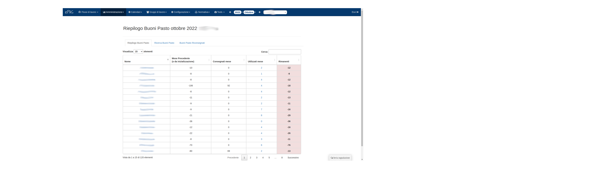
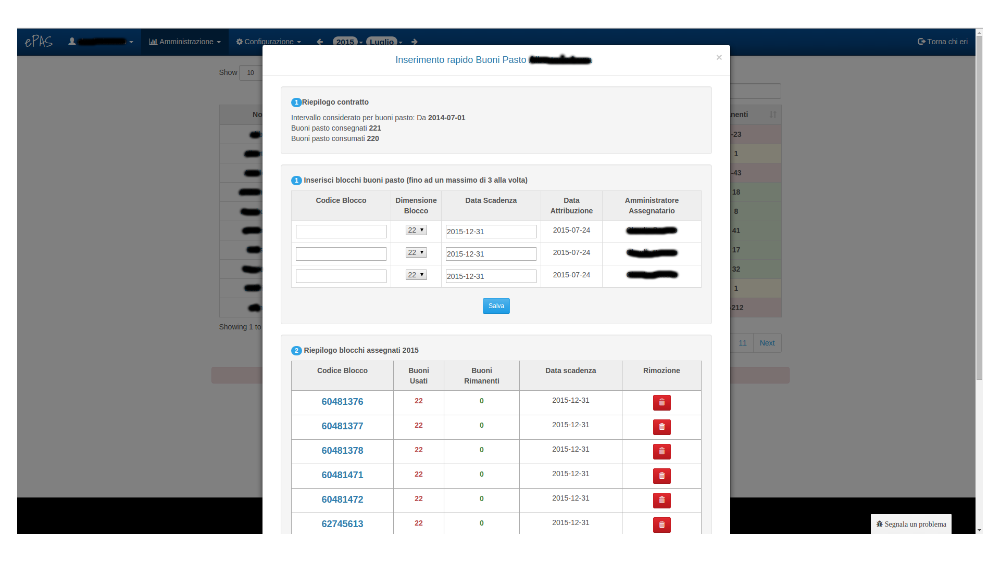

Gestione buoni pasto
====================

Il sistema ePAS permette all'amministratore di poter gestire i buoni pasto da attribuire a ciascun dipendente.
Dal menu :menuselection:`Amministrazione --> Gestione buoni pasto` si arriva in questa schermata:

   
   Schermata di riepilogo buoni pasto

Come si può notare, la strutturazione della tabella ricalca quella della lista persone.
Vengono, di default, visualizzate 10 persone ma dalla form in alto a sinistra è possibile specificare la visualizzazione di 25, 50 o di tutte le persone.
E' possibile la ricerca di una specifica persona usufruendo del riquadro di ricerca a destra in alto, scrivendo il nome o il cognome della persona che si sta cercando.
E' possibile l'ordinamento degli elementi su ciascuno dei campi della tabella, è sufficiente cliccare sull'intestazione della colonna per ordinare in modo discendente o ascendente su quello specifico campo.

Per ogni persona vengono visualizzati i buoni rimanenti dal mese precedente, quelli consegnati nel mese, quelli usati nel mese e i rimanenti.

Cliccando sulla persona, si aprirà la form di inserimento dei ticket:

   
   Schermata di assegnamento buoni pasto

In questa schermata vengono visualizzati:
   * i dati contrattuali con la data da cui si parte a considerare il conteggio per i buoni (solitamente l'inizio del mese selezionato) con i riepiloghi dei quantitativi di buoni assegnati e consumati
   * la schermata di inserimento dei blocchetti di buoni pasto (tre alla volta, in cui specificare il codice del blocco, il numero di buoni, la data di attribuzione che è quella in cui si sta usando la form e il nome dell'amministratore che li ha assegnati).
   * il riepilogo dei blocchi assegnati nell'anno in corso, con la possibilità di rimuoverli
   * il riepilogo dei blocchi assegnati nell'anno passato, con la possibilità di rimuoverli

