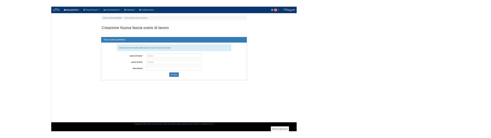

Fasce orarie di lavoro
======================

Questa nuova sezione presente in v.: :menuselection:`Configurazione --> Fasce orarie di lavoro`è stata ideata 
per poter venire incontro alle particolari esigenze di unità di personale che sono vincolate ad orari di lavoro 
specifici e diversi rispetto a quanto previsto dalla propria sede di afferenza.
In particolare in questa sezione è possibile definire sia le fasce di *presenza obbligatoria*, ovvero quelle fasce
orarie in cui il dipendente DEVE essere presente in istituto (es.: 10.00-12.00), sia le *fasce di lavoro particolari*, 
ovvero l'intervallo orario di lavoro per un dipendente che può essere diverso da quello stabilito a livello di sede 
(v.: :menuselection:`Configurazione --> Configurazione sedi --> Parametri periodici`).
Per le definizioni e i casi d'uso in cui si applicano queste nuove funzionalità rimandiamo alla specifica sezione
della documentazione: (v. :doc:`Gestione e inserimento personale <managePerson>` sezioni relative a Orario di lavoro
personale e Fascia di presenza obbligatoria).

.. figure:: _static/images/fasceOrarie.png
   :scale: 40
   :align: center

   Schermata fasce orarie della sede
   
Nella schermata viene presentato un riepilogo delle fasce attualmente presenti all'interno della sede 
(Fasce orarie particolari), nella parte bassa della finestra si trova invece una "Guida alla modifica" da seguire nel 
caso occorresse appunto definirne una.
Cliccando sul bottone verde presente in mezzo alla pagina si accede alla schermata di creazione di una nuova fascia oraria:

   Creazione di una nuova fascia oraria
   
Qui sarà sufficiente specificare l'orario di inizio, l'orario di fine e la descrizione da applicare alla fascia 
(bene sempre usare nomi significativi che evochino il motivo della creazione della stessa).
Cliccando su Crea la fascia verrà appunto creata e sarà disponibile nella lista della fasce presenti nella sede. 
