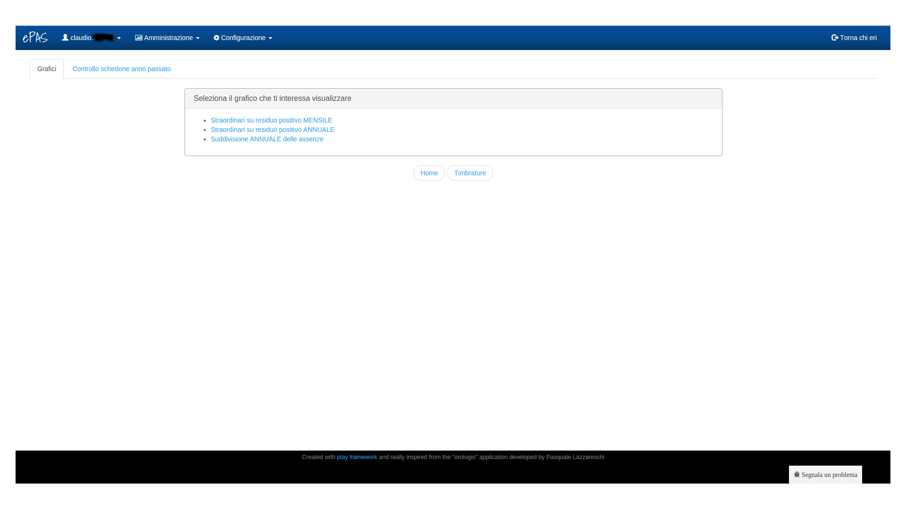
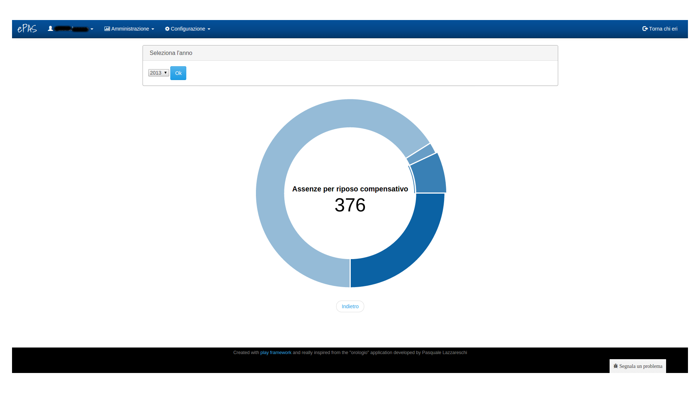
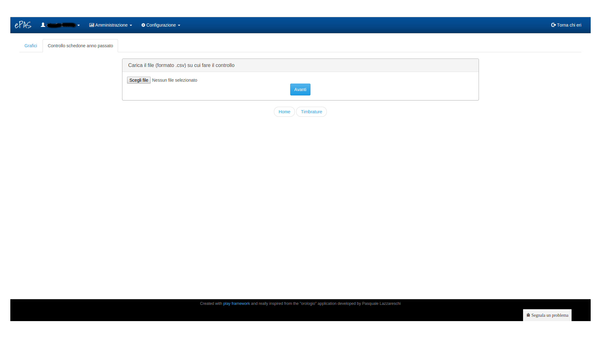

Utilità
=======

Dal menu :menuselection:`Amministrazione --> Utility` è possibile accedere alla seguente schermata:

   
   Schermata di utilità

In particolare in questa pagina sono presenti alcuni tool che permettono un utilizzo più dettagliato di ePAS

Grafici
-------

In questa tab, sono stati implementati alcuni grafici che visualizzano:

   * Il computo degli straordinari assegnati a fronte della totalità di residuo positivo **mensile** accumulato da tutti i dipendenti
   * Il computo degli straordinari assegnati a fronte della totalità di residuo positivo **annuale** accumulato da tutti i dipendenti
   * La suddivisione per tipologia delle assenze fatte da tutti i dipendenti

Ad esempio, selezionando il grafico che illustra la suddivisione per tipologia delle assenze, comparirà una schermata in cui viene richiesto l'anno per il quale effettuare il calcolo.
Una volta selezionato l'anno dal menu a tendina e premuto "ok", verrà visualizzata la seguente torta:

   
   Suddivisione assenze nell'anno
 
Passando il mouse sopra ciascuna delle "fette" in cui è suddivisa la torta è possibile controllare a quale tipologia di assenza appartenga e il quantitativo utilizzato da tutti i dipendenti per l'anno richiesto.

Controllo schedone anno passato
-------------------------------

La sede centrale invia periodicamente (una volta l'anno) ai vari istituti lo "schedone", ovvero il resoconto di tutte le assenze che i vari dipendenti dell'istituto in questione hanno effettutato nel corso dell'anno passato, così da poter verificare eventuali incongruenze con quanto archiviato su ePAS e prendere le dovute contromisure.

   
   Schermata controllo schedone
   
Caricando il file che la sede centrale ha inviato (andandolo a scegliere dal file system attraverso il bottone "scegli file") e premendo "Avanti", il sistema ePAS verificherà eventuali incongruenze tra quanto ha incamerato e quanto presente nello schedone generando il seguente report:

.. figure:: _static/images/resocontoSchedone.png
   :scale: 40
   :align: center
   
   Schermata di resoconto
   
In questa schermata è possibile verificare la lista di tutte le assenze che per qualche motivo non collimano con quanto presente nello schedone. 
Si possono vedere infatti:

   * la matricola del dipendente
   * il nome e il cognome
   * la data dell'assenza
   * il codice di assenza utilizzato
   * l'eventualità che una certa persona sia o non sia più presente in anagrafica mentre non sia o sia presente nello schedone
   * la motivazione relativa all'incongruenza riscontrata
   * l'eventuale codice di assenza rilevato in anagrafica che risulta essere diverso da quello rilevato nello schedone
   

