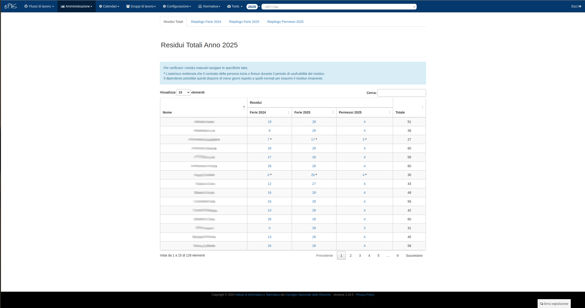

Gestione Ferie e Permessi
=========================

Il sistema ePAS fornisce all'amministratore anche una schermata in cui poter visualizzare la situazione relativa a ferie e permessi di ciascun dipendente.
Dal menu :menuselection:`Amministrazione --> Ferie e permessi` è possibile visualizzare la seguente schermata:

   
   Schermata situazione ferie e permessi
   
Come nella schermata relativa alla lista persone (v. :doc:`Gestione e inserimento personale </managePerson>` ), anche in questo caso possiamo notare come vengano listati di default 10 dipendenti.
Grazie alla form in alto a sinistra è comunque possibile specificare quanti elementi visualizzare.
Anche qui è usabile la form di ricerca per visualizzare esclusivamente il dipendente richiesto scrivendone il nome o il cognome nel riquadro in alto a destra rispetto alla tabella principale.
Come descritto per la lista persone, anche in questo caso si possono ordinare gli elementi cliccando sulla voce specifica che si intende utilizzare.
Di default l'ordinamento viene fatto per nome e cognome, ma cliccando sull'intestazione di una colonna specifica è possibile ordinare in modo discendente o ascendente rispetto ad essa.

All'interno della tabella, si possono distinguere differenti voci:

   * le ferie fatte l'anno precedente
   * le ferie fatte l'anno corrente
   * i **permessi legge fatti**
   * le ferie residue dell'anno passato (contrassegnate da una "x" rossa se non più disponibili secondo quanto specificato in configurazione (v. :doc:`Gestione parametri </parameters>`)
   * le ferie residue dell'anno in corso totali
   * le ferie residue dell'anno in corso maturate
   * i permessi residui totali 
   * i permessi residui maturati
   * i **limiti** eventuali per l'utilizzo dei residui per l'anno in corso
   
Cliccando poi sui numeri relativi a ciascun nominativo, in corrispondenza delle colonne di ferie fatte dell'anno passato e dell'anno corrente e dei permessi legge fatti, verrà visualizzata una finestra che conterrà la lista dei giorni relativi all'anno passato o all'anno in corso contenente i giorni specifici in cui si è usufruito di un codice di ferie.

