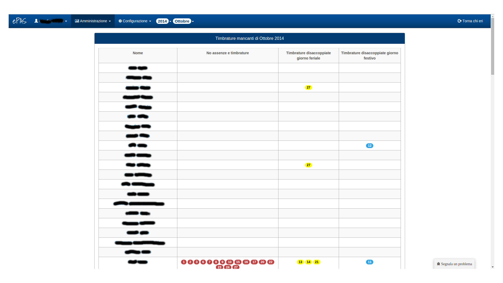
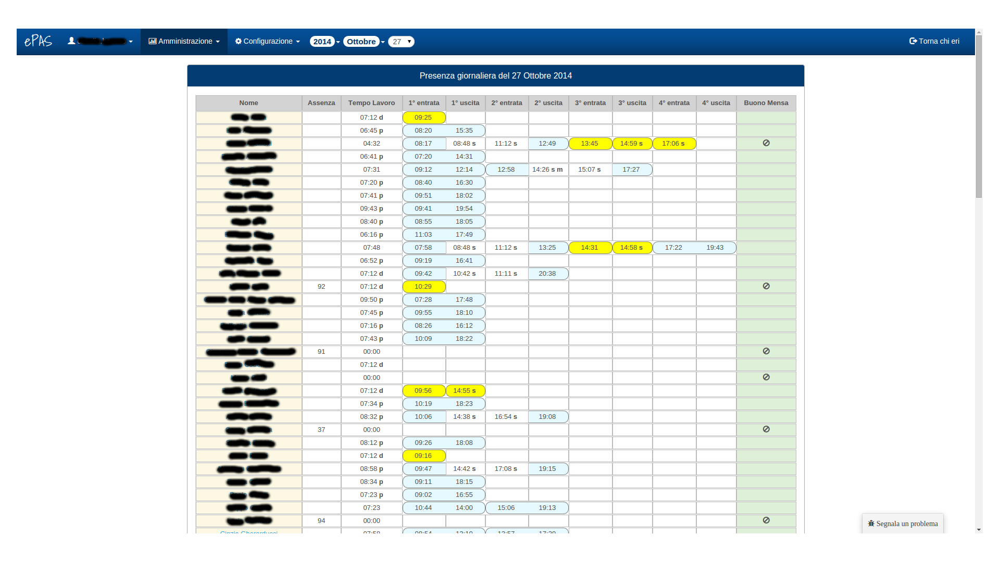
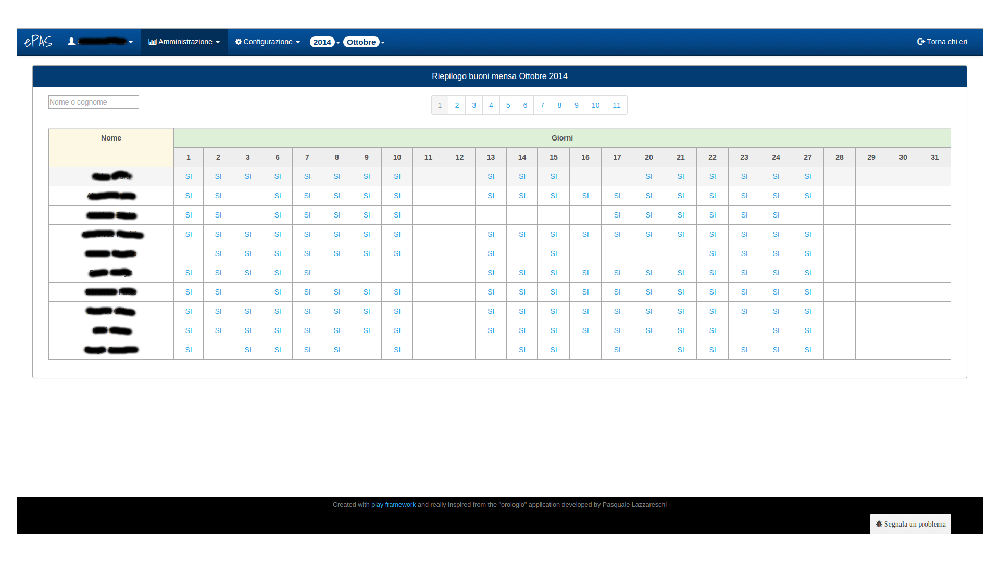
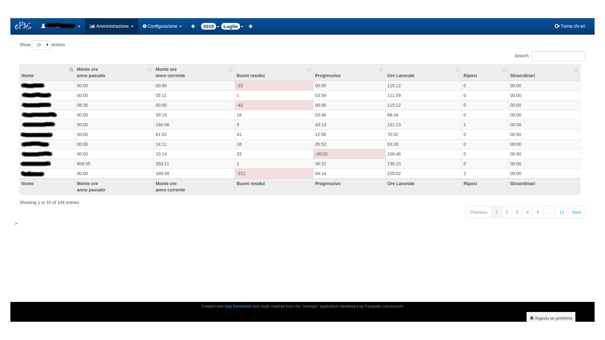

Schermate di riepilogo
======================

.. _Timbrature mancanti:

Timbrature mancanti
-------------------

Il sistema ePAS consente all'amministratore di avere a disposizione delle schermate riepilogative relative a vari argomenti.
Dal menu :menuselection:`Amministrazione --> Timbrature mancanti` si aprirà la seguente finestra:

   
   Schermata di timbrature mancanti
   
In alto, dalla barra di menu, è possibile selezionare mese e anno per cui interessa vedere la situazione di timbrature mancanti.

In finestra è possibile vedere, oltre alla lista del personale afferente alla sede, una serie di colonne che identificano:
   * i giorni in cui non sono presenti, per la persona, nè timbrature nè codici di assenza
   * i giorni in cui sono presenti timbrature disaccoppiate (ovvero esiste una timbratura di ingresso, ma manca la corrispondente timbratura di uscita o viceversa) nei giorni feriali
   * i giorni in cui sono presenti timbrature disaccoppiate per i giorni festivi

I giorni vengono colorati diversamente per far risaltare la gravità dell'"infrazione", dal rosso per quando non si hanno nè timbrature nè codici di assenza, passando per il giallo quando non si ha una timbratura di ingresso o una di uscita nei giorni lavorativi, per arrivare all'azzurro quando queste mancanze avvengono nei giorni festivi.
Cliccando poi sul nome, l'amministratore verrà reindirizzato alla pagina di gestione timbrature relativa al mese e all'anno selezionati dal menu in alto.

Più in generale questa pagina agisce insieme a un cosiddetto "job", ovvero un programma che controlla giorno dopo giorno questo genere di situazioni e invia, al dipendente interessato, una mail contenente la propria situazione relativa alle varie infrazioni che può avere commesso con la raccomandazione di contattare il proprio ufficio del personale per sistemare la propria situazione mensile di timbrature.
La possibilità di inviare mail ai dipendenti è configurabile da parte dell'amministratore, per farlo è sufficiente andare a modificare i parametri relativi a ciascun dipendente nell'apposita pagina (v. :doc:`Gestione e inserimento personale </managePerson>`).

Presenza giornaliera
--------------------

Dal menu :menuselection:`Amministrazione --> Presenza giornaliera`, si aprirà la seguente finestra:

   
   Schermata di presenza giornaliera
   
In questa pagina è possibile verificare, per ciascun dipendente, la propria situazione giornaliera in termini di timbrature, tempo di lavoro, eventuale assenza e possibilità di ricevere il buono pasto (v. :doc:`Gestione e inserimento orari di lavoro </workingTimeType>`).
In alto, sulla parte relativa al menu, è possibile selezionare mese, anno e giorno di cui si intende vedere la situazione di presenza giornaliera.
Per ogni dipendente è riportata la lista delle eventuali timbrature:

   * accoppiate in termini di ingresso/uscita e evidenziate da un contorno celeste se sono entrambe presenti
   * uniche se evidenziate da un contorno giallo se risulta presente una sola timbratura (v. :ref:`Timbrature mancanti`)

Le timbrature e i tempi di lavoro possono essere accompagnati da dei simboli (v. :doc:`Gestione timbrature </stampings>` nella sezione relativa ai pannelli delle note) così come la colonna relativa ai buoni pasto che presenta la stessa legenda riscontrabile in :doc:`Gestione timbrature </stampings>` nel pannello relativo ai buoni mensa.
Come per le :ref:`Timbrature mancanti`, anche in questo caso cliccando sul nome è possibile accedere alla schermata relativa alla situazione delle timbrature mensili della persona selezionata.

Riepilogo buoni mensa
---------------------

Dal menu :menuselection:`Amministrazione --> Riepilogo buoni mensa`, si aprirà la seguente finestra:

   
   Schermata di riepilogo assegnazione buoni pasto

In questa pagina è possibile verificare, per ciascun dipendente, i giorni del mese in cui ha avuto diritto al buono pasto grazie al quantitativo di orario lavorato.
Selezionando dalla barra del menu in alto il mese e l'anno di interesse, verrà visualizzata la situazione di ciascun dipendente relativa ai buoni pasto guadagnati.
I dipendenti, come in molte altre schermate viste in precedenza, vengono suddivisi in pagine di 10 elementi ciascuna per rendere più leggibile e intuitivo il significato della pagina.
E' possibile inoltre digitare il nome o il cognome del dipendente che interessa visualizzare nell'apposito spazio in alto a sinistra per poter controllare solo la situazione di quella persona.
 
Riepilogo mensile
-----------------

Dal menu :menuselection:`Amministrazione --> Riepilogo mensile`, si aprirà la seguente finestra:

   
   Schermata di riepilogo mensile

In questa pagina è possibile avere un riepilogo della situazione di ciascun dipendente in termini di quantitativi di assenze, presenze, orario lavorato, buoni mensa guadagnati ecc...

Come nelle pagine precedenti, dalla barra di menu in alto si possono selezionare mese e anno di cui interessa verificare la situazione.
All'interno del pannello viene conteggiato il numero di giorni lavorativi contati fino al momento della visualizzazione
Come nel caso evidenziato in :doc:`Gestione e modifica del personale </managePerson>`, la tabella contiene paginati in liste di 10 elementi, i dipendenti afferenti alla sede di cui si è amministratori.
E' però possibile, tramite l'opzione presente in alto a sinistra nella pagina, selezionare il quantitativo di persone visibile: 10, 25, 50 o tutte.
E' altresì possibile specificare il nome o il cognome della persona specifica che interessa, tramite la form a destra sopra la tabella, così da circoscrivere la ricerca alla situazione della singola persona.
Sempre come nel caso della lista persone, è possibile ordinare gli elementi in tabella sul campo che più interessa (attualmente i dipendenti vengono ordinati per cognome).

Per ciascuno di essi viene visualizzato:

   * nome e cognome
   * il monte ore dell'anno passato
   * il monte ore dell'anno corrente
   * i buoni mensa residui
   * il progressivo del mese
   * le ore lavorate nel mese
   * i giorni di riposo compensativo fatti nel mese
   * le ore di straordinario pagate
   
Là dove i valori presenti nella cella risultassero negativi, verranno evidenziati dal fondo della cella di colore rosso, così da rendere più evidente la situazione.
Per quanto concerne i valori dell'ultima colonna, quella relativa agli straordinari pagati, i quantitativi saranno disponibili e diversi da zero per coloro i quali hanno lo straordinario tra le competenze assegnate **E** saranno stati assegnati secondo la logica di assegnamento (di solito all'inizio del mese successivo, per gli straordinari relativi a un certo mese. Es.: gli straordinari di ottobre verranno assegnati a inizio novembre) (v. :doc:`Gestione competenze </competences>`).
 