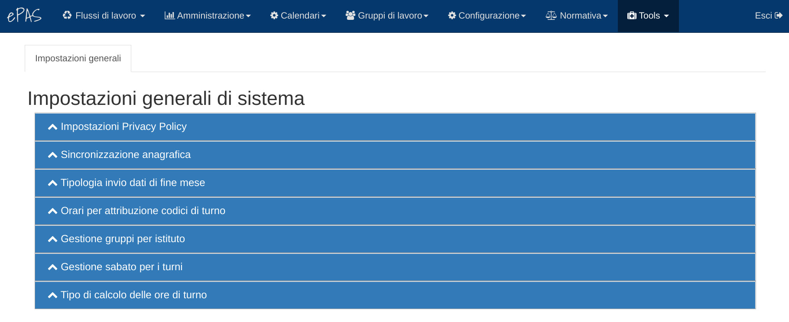
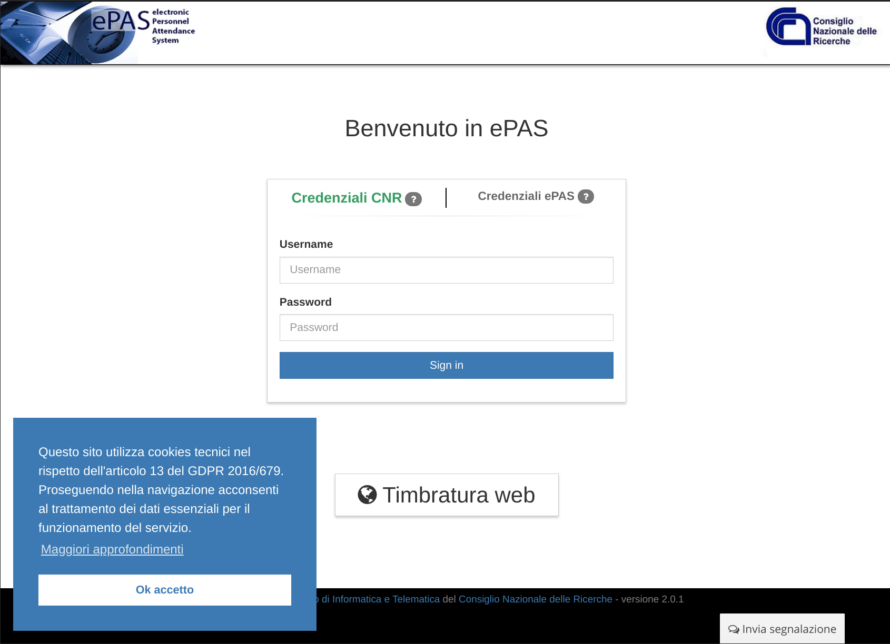
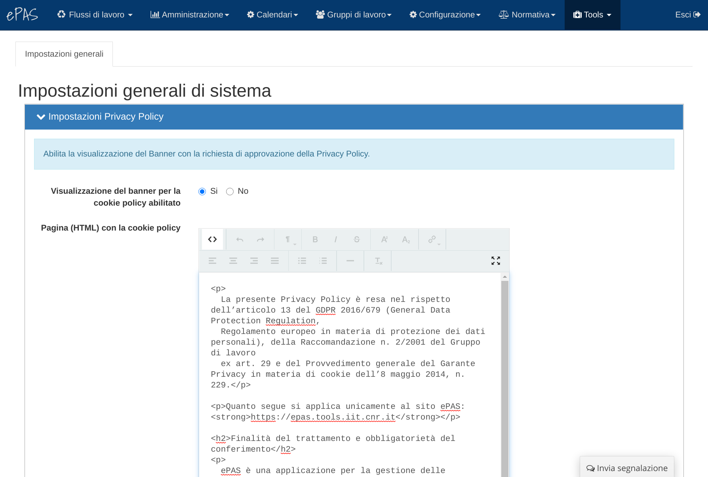

Parametri di configurazione generale del sistema
================================================

Alcuni parametri di configurazione del sistema sono impostabili direttamente tramite l'interfaccia
web di ePAS. Per poter configurazione questi parametri è necessario un utente che abbia il ruolo
di sistema *Admin* oppure *Developer*.
Entrando con un utente con uno dei ruoli di cui sopra si attiverà nel menu una voce **Tools**.

La prima voce del menu *Tools* è **Informazione Applicazione** ed è la voce che permette di
configurare alcune funzionalità del sistema.

   Elenco delle impostazioni generali

Impostazioni Privacy Policy
---------------------------

È possibile abilitare la generazione di un banner che richiede l'autorizzazione al tracciamento
con i cookie tecnici per le attività necessario all'utilizzo dell'applicazione.
Il banner contiene anche un link ad una pagina *Privacy Policy* il cui contenuto può essere
impostato tramite il campo *Pagina (HTML) con la cookie policy*.

   Banner privacy policy con la richiesta di approvazione dell'utente

   Configurazione delle opzioni per la visualizzazione della Privacy Policy
