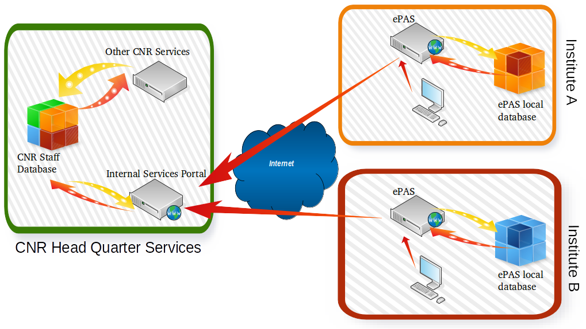

Architettura di Massima
=======================

L'architettura è basata su due tipi di ecosistemi software che interagiscono 
tra di loro, **i sistemi locali all'istituto** ed **il sistema centralizzato
del CNR**.

Il paradigma di gestione dei dati del personale è basato sul concetto di 
anagrafica unica che sta adottando in questi mesi anche il governo italiano, 
le informazioni che sono il comune denominatore di tutte le informazioni 
necessarie ad ogni dipendente sono contenute all’interno dell’anagrafica 
centralizzata, gli istituti possono accedere alle informazioni di propria
competenza e possono integrare localmente tutti i dati che sono solo di 
interesse della sede locale.
 
Lo scopo di questa architettura distribuita è da una parte quella di uniformare
le informazioni ed flussi di lavoro necessari alla sede centrale per il 
corretto e snello svolgimento delle proprie attività amministrative ma allo
stesso tempo di garantire agli istituti una elevata flessibilità di adottare
soluzioni personali ed innovative per la risoluzione di problematiche 
specifiche dell’istituto.

Infine al fine di evitare la duplicazione delle credenziali del personale CNR
è possibile adottare un sistema federato di autenticazione degli utenti basato
sul progetto Idem del GARR. La sede centrale del CNR mette infatti a 
disposizione un proprio Identity Provider tramite il quale sia le applicazioni
della sede centrale che quelle locali possono accedere per effettuare 
’autenticazione dell’utente.
La figura 1 mostra l'architettura del sistema, sulla sinistra è rappresentata
la sede centrale con il suo database del personale ed i suoi servizi, sulla 
estra invece è rappresentato ePAS con i sui dati locali e la sue interazioni 
con il portale servizi interni della sede centrale.

   
   General Architecture Overview