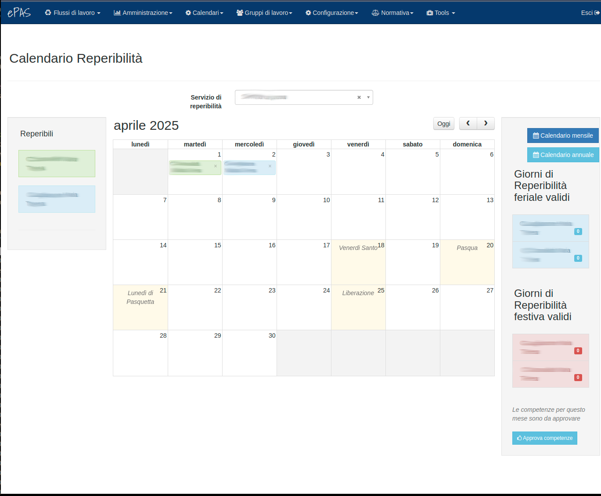
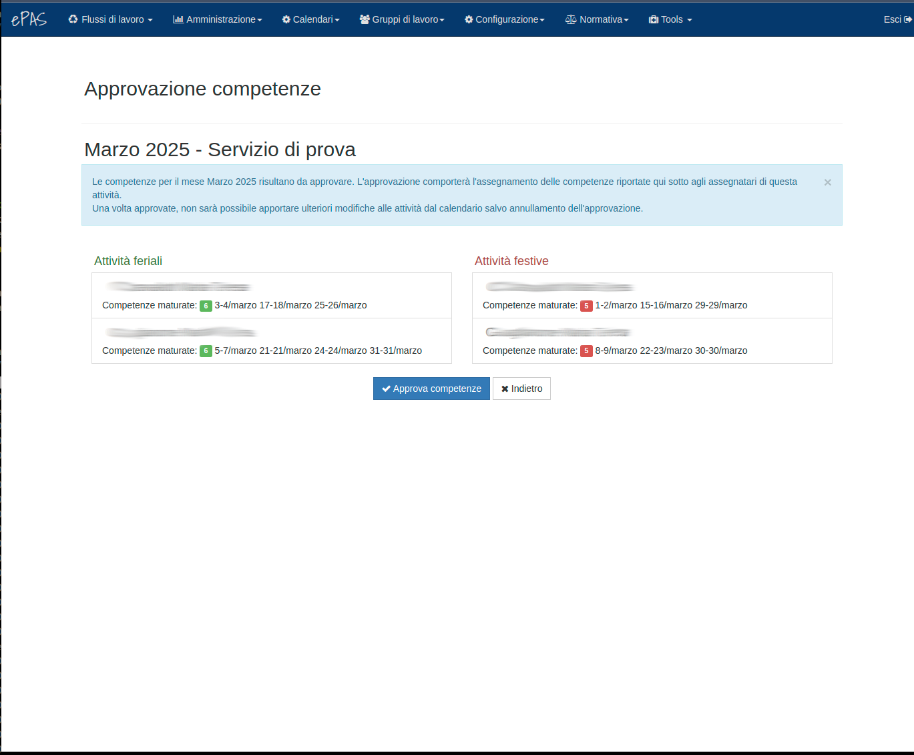

Calendario reperibilità
=======================

In questa sezione vediamo come si presenta un calendario di reperibilità e quali siano le operazioni in esso consentite per poter gestire al meglio
i giorni di reperibilità feriale e festiva all'interno di ogni mese.

Per prima cosa, occorre definire il servizio per il quale i calendari devono essere utilizzati. Vi rimandiamo alla sezione v. :doc:`Gestione servizi <../admin/services>`.
per le informazioni necessarie.

Dal menu :menuselection:`Calendari --> Calendario reperibilità` si ottiene questa schermata:

   
   Calendario reperibilità
   
Sulla parte sinistra della pagina troviamo la lista dei reperibili definiti nella sezione v. :doc:`Gestione servizi <../admin/services>`.

Nella parte centrale è invece presente il calendario del mese. Sopra il calendario compare un menu a tendina per scegliere il servizio di reperibilità di cui 
visualizzare il calendario. Questa cosa può capitare se chi sta visitando la pagina, ha ruoli su più servizi di reperibilità  (gestore del servizio o 
responsabile del servizio).
Nella parte in alto a destra del calendario, invece, compaiono le frecce per spostarsi avanti e indietro nei calendari dei mesi.

Nella parte destra della pagina, infine, troviamo i riepiloghi. In questa sezione si trova il conteggio dei giorni di reperibilità feriale e festiva accumulati
da ciascun reperibile nel corso del mese.
Infine, se a visualizzare il calendario è il responsabile del servizio, comparirà sotto ai riepiloghi il pulsante per l'approvazione del calendario e quindi dei
giorni di reperibilità che saranno inviati alle competenze e saranno resi disponibili per l'invio dell'attestato di presenza.

Inserire un reperibile
----------------------

Per inserire un reperibile sul calendario è sufficiente cliccare col mouse nello spazio a questo dedicato sulla parte sinistra della pagina e trascinarlo, letteralmente,
sul giorno in cui si intende inserire.

   
   Inserimento reperibile
   
L'inserimento di un reperibile comporta contestualmente sia l'inserimento dell'evento con il nome del reperibile sul calendario, sia l'inizio del conteggio del 
riepilogo nell'apposita sezione. Ciò può capitare se il calendario viene ad esempio definito in un giorno a metà del mese e il reperibile inserito in uno dei giorni
appena trascorsi. In questo caso, come si può vedere anche dalla figura sopra, il conteggio dei riepiloghi si aggiornerà.

Eliminazione di un reperibile
-----------------------------

Così come si può inserire un reperibile sul calendario, è altrettanto possibile rimuoverlo dal calendario in caso di modifiche dello stesso.
Per farlo, è sufficiente cliccare sulla "*x*" presente in corrispondenza dell'evento col nome del reperibile da eliminare (si trova nella parte destra dell'evento 
sul giorno). Si aprirà un popup nel quale si chiede di confermare l'eliminazione dell'evento e, in caso di conferma, l'evento verrà rimosso dal calendario.

Definizione calendario
----------------------

Quando il calendario sarà stato completato tra giorni feriali e festivi la situazione sarà la seguente:

   
   Calendario reperibilità completo
   
A questo punto il calendario è completo, i conteggi nei riepiloghi laterali si aggiornano giorno dopo giorno fino allo scavallamento del mese, momento in cui 
il responsabile del servizio può procedere con l'approvazione del calendario.

Approvazione del calendario
---------------------------

Una volta scavallato il mese e quindi calcolati tutti i giorni di reperibilità, sarà possibile per il responsabile approvare il calendario.
Come accennato nel primo paragrafo il responsabile del servizio, entrando nella pagina del calendario, troverà nella parte destra riservata ai riepiloghi il pulsante
di approvazione *Approva competenze*. Cliccando sul pulsante si aprirà la finestra riepilogativa di approvazione di seguito riportata:

   
   Approvazione reperibilità
   
In questa pagina si trova il riepilogo di tutti i giorni di reperibilità feriale e festiva effettuati dai reperibili nel mese da approvare.
Cliccando sul bottone *Approva competenze*, il responsabile approva le quantità di reperibilità feriale e festiva. L'approvazione comporta l'impossibilità, sul calendario,
di fare modifiche sui giorni di reperibilità. Inoltre, i riepiloghi laterali con i giorni di reperibilità feriale e festiva diventano colorati con fondo **giallo**.
E il bottone di approvazione del calendario per il responsabile diventa anch'esso di colore **giallo**.
   
   
