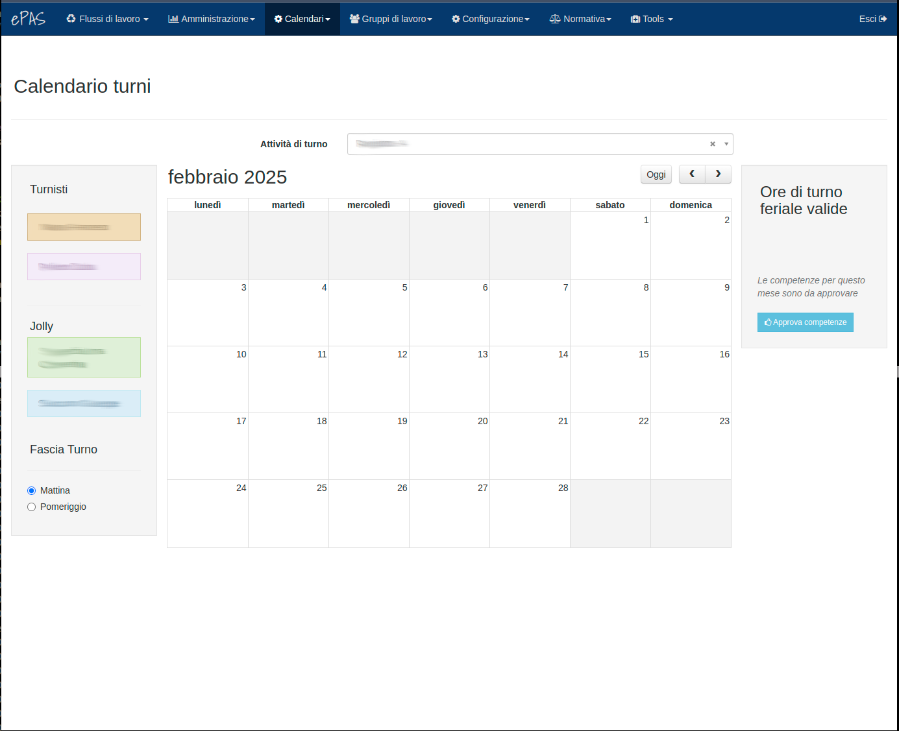

Calendario turni
================

In questa sezione vediamo come si presenta un calendario di turno e quali siano le operazioni in esso consentite per poter gestire al meglio
gli slot di turno all'interno di ogni mese.

Per prima cosa, occorre definire il servizio per il quale i calendari devono essere utilizzati. Vi rimandiamo alla sezione v. :doc:`Gestione servizi <../admin/services>`.
per le informazioni necessarie.

Dal menu :menuselection:`Calendari --> Calendario turni` si ottiene questa schermata:

   
   Calendario turno
   
Sulla parte sinistra della pagina troviamo la lista dei turnisti definiti nella sezione v. :doc:`Gestione servizi <../admin/services>`.

Nella parte centrale è invece presente il calendario del mese. Sopra il calendario compare un menu a tendina per scegliere l'attività di turno di cui 
visualizzare il calendario. Questa cosa può capitare se chi sta visitando la pagina, ha ruoli su più servizi di turno (gestore del servizio o 
responsabile del servizio).
Nella parte in alto a destra del calendario, invece, compaiono le frecce per spostarsi avanti e indietro nei calendari dei mesi.

Nella parte destra della pagina, infine, troviamo i riepiloghi. In questa sezione si trova il conteggio delle ore di turno accumulate da ciascun turnista
 nel corso del mese.
Infine, se a visualizzare il calendario è il responsabile del servizio, comparirà sotto ai riepiloghi il pulsante per l'approvazione del calendario e quindi delle
ore di turno che saranno inviate alle competenze e saranno rese disponibili per l'invio dell'attestato di presenza.