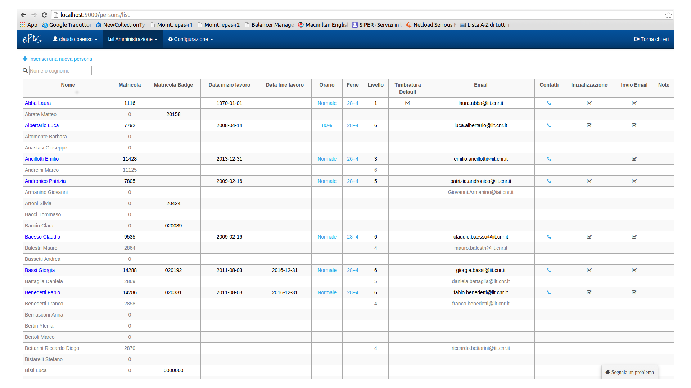
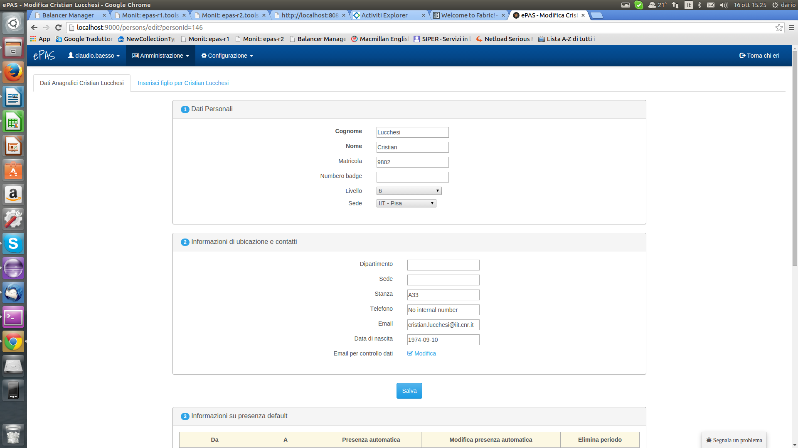
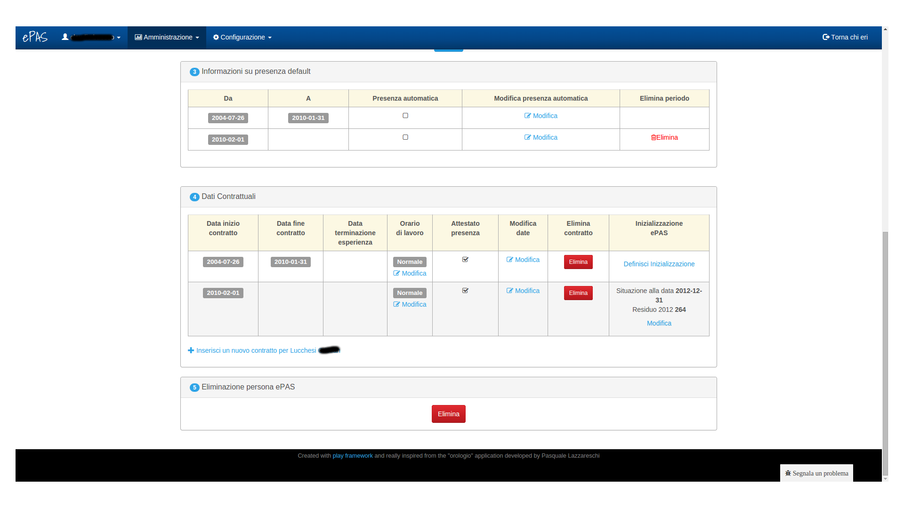

Gestione e inserimento Personale
================================
La prima funzionalità che si incontra analizzando il sistema in modalità amministratore riguarda la possibilità di inserire, modificare e, più in generale, gestire il personale.
Dal menu :menuselection:`Amministrazione --> Lista Persone` è possibile aprire l'interfaccia di consultazione delle persone presenti in anagrafica.

   Schermata visualizzazione lista personale
   
Da questa schermata è possibile evincere quali siano i tipi di dato supportati per ciascun dipendente.
Ogni persona è attualmente modificabile cliccando sul nominativo. 
In tal caso, la schermata che potremo visualizzare sarà di questo tipo

   Schermata modifica persona (top)
   

   Schermata modifica persona (bottom)

In ogni pannello (titolato) sono contenute informazioni referenti ad esso, rendendo così più intuitivo dove andare a cercare l'informazione specifica che si richiede o che si intende modificare.
Nella schermata top della modifica del personale si può notare anche il link ad un'altra schermata: la possibilità di inserire per il dipendente in questione, dei figli in anagrafica. Di modo da poter far verificare al sistema la possibilità per quel dipendente di usufruire di particolari permessi per l'astensione dal lavoro.
Il link si chiama "Inserisci figlio per...", cliccandoci verrà proposta una form di inserimento per l'eventuale figlio del dipendente contenente nome, cognome e data di nascita e, sopra, un link per la visualizzazione di eventuali figli già inseriti.

   

   
