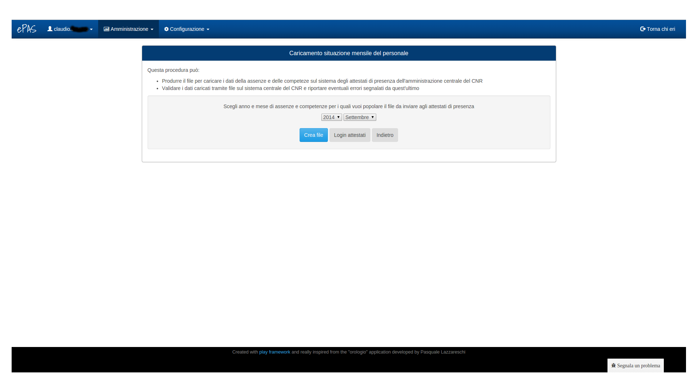
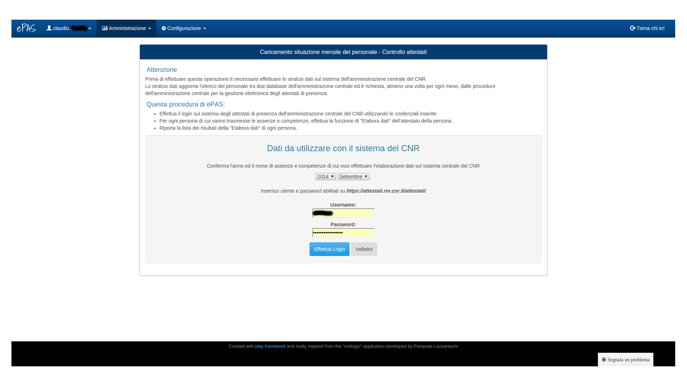
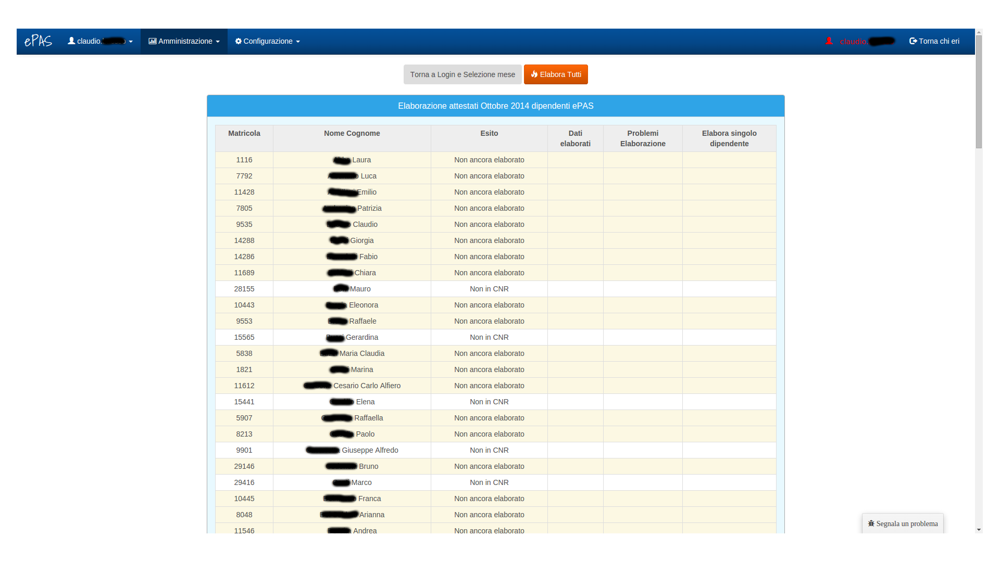
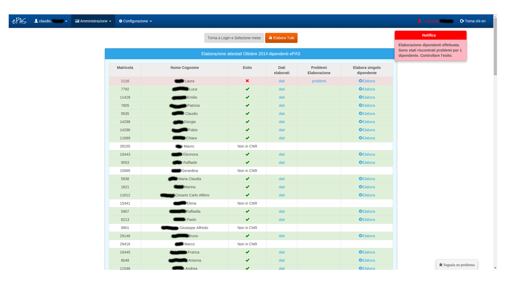
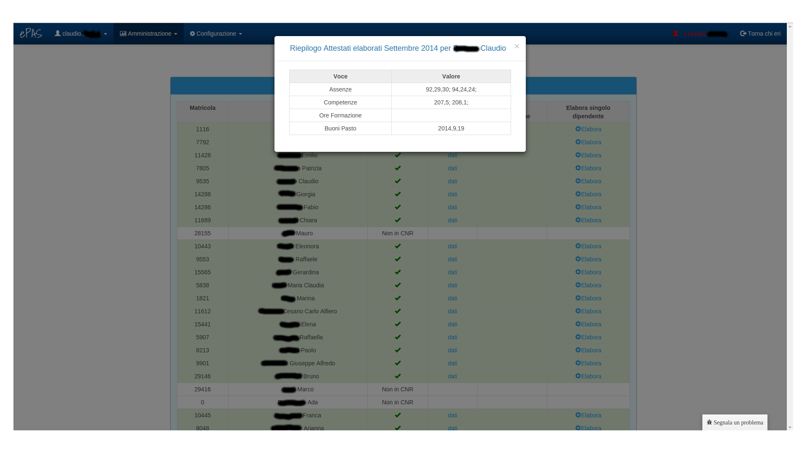
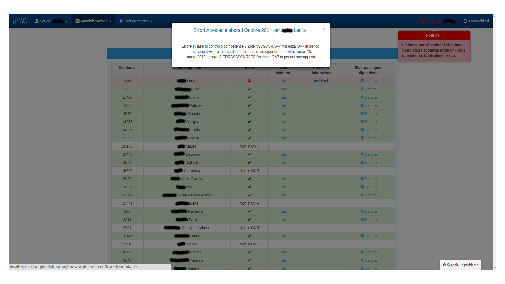

Invio attestati di presenza
===========================

Il sistema ePAS consente all'amministratore di interfacciarsi con le funzionalità di sottomissione di assenze e competenze presenti sul sito *https://attestati.rm.cnr.it/attestati*
Dal menu :menuselection:`Amministrazione --> Invio attestati`, l'amministratore si troverà di fronte a questa schermata:

   
   Schermata home invio attestati
   
A questo livello è possibile selezionare il mese e l'anno di cui si intende sottomettere, alla sede centrale, assenze e competenze del personale (di default il sistema seleziona il mese precedente al mese attuale).
Una volta selezionati i valori che ci interessano è possibile fare la login al sistema cliccando su "login attestati".

Si entrerà a questo punto nell'area di login:

   
   Schermata di login attestati
   
A questo livello viene posta all'attenzione dell'amministratore tutta la procedura da seguire per effettuare un corretto invio degli attestati di presenza, a partire dallo stralcio dei dati fino alla spiegazione punto per punto di quel che farà la procedura di ePAS una volta collegato al sistema centrale all'indirizzo *https://attestati.rm.cnr.it/attestati*

Le credenziali per l'accesso al sistema della sede centrale sono quelle relative agli account **SIPER** in dotazione a ciascun dipendente del personale amministrativo.

Una volta effettuato l'accesso, l'amministratore si troverà di fronte a una schermata di questo tipo:

   
   Schermata prima inizio elaborazione
   
Per ogni dipendente registrato nella lista persone (v. :doc:`Gestione e inserimento personale </managePerson>`), si presenta:
   * la matricola
   * l'esito dell'elaborazione (nel caso un dipendente, dopo la procedura di stralcio, risulti non in CNR o non in lista dipendenti, viene segnalato in questa colonna)
   * i dati elaborati
   * i problemi riscontrati
   * la possibilità di elaborare singolarmente il dipendente
   
Al di sopra del pannello troviamo due bottoni, quello di ritorno al menu iniziale in cui impostare mese e anno per l'elaborazione e il pulsante che permette l'elaborazione di tutta la lista del personale.
Una volta premuto questo pulsante, ePAS inizierà l'elaborazione dei dati relativi a ciascun dipendente e, una volta terminato, apparirà una schermata più o meno come questa:

   
   Schermata di esito elaborazione
   
Per ogni dipendente viene riassunta la situazione al termine dell'elaborazione.
Se la riga si colora di verde, tutto è andato a buon fine, altrimenti se si colora di rosso, ci sono stati errori durante l'elaborazione.
In particolare, è possibile per ciascun dipendente andare a controllare quali sono stati i dati elaborati cliccando in corrispondenza della voce "*dati*" nella colonna Dati elaborati.

Si aprirà una finestra come questa:

      
   Dati di elaborazione
   
Risultano visibili, all'interno della finestra:
   * le assenze, rappresentate attraverso una terna di numeri che sono:
      * il codice di assenza
      * il giorno di inizio utilizzo del codice
      * il giorno di fine utilizzo del codice
   * le competenze, rappresentate da una coppia di valori che sono:
      * il codice di competenza
      * il quantitativo espresso in giorni o ore di utilizzo di quella competenza
   * le ore di formazione
   * i buoni pasto, rappresentati attraverso una terna di valori che sono:
      * l'anno di utilizzo
      * il mese di utilizzo
      * il quantitativo di buoni utilizzati

Nel caso, invece, si fossero verificati dei problemi durante l'elaborazione, sarà possibile andare a controllare cosa non è andato a buon fine cliccando su "*problemi*". Si aprirà una finestra come questa:

   
   Problemi durante elaborazione
   

   

 