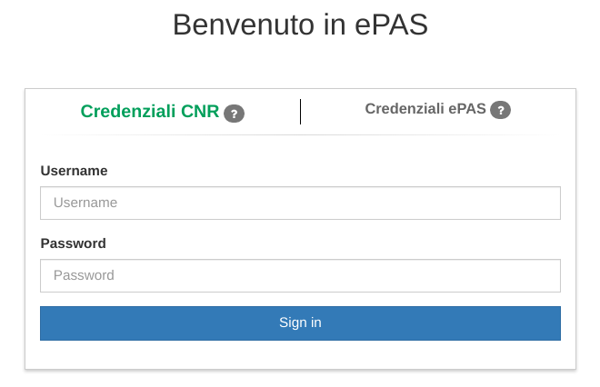

Configurazione autenticazione LDAP
==================================

Molte pubbliche amministrazioni hanno un server LDAP tramite cui sono gestite le credenziali
dei loro dipendenti. Sebbene all'accesso diretto di ePAS al server LDAP sia preferibile utilizzare
un sistema di autenticazione centralizzato che supporti SAML oppure OAuth, ePAS supporta
l'autenticazione di tipo LDAP.

ePAS è già utilizzato in produzione sia da pubbliche amministrazioni che utilizzano
Active Directory di Microsoft che da amministrazioni che utilizzano
`OpenLdap <https://www.openldap.org/>`_.

La configurazione dell'autenticazione LDAP è possibile tramite le variabili di ambiente
presenti nel docker-compose.yml che sono quelle riportate sotto.

.. code-block:: yaml

  #  [...]
   - environment:
  #  [...]
  #### Autenticazione LDAP ####
      #- LDAP_LOGIN=true                       # default: false. Impostare a true per attivare l'autenticazione tramite LDAP
      #- LDAP_URL=${LDAP_URL}                  # url del server LDAP, per esempio ldap://ldap.cnr.it:389
      #- LDAP_STARTTLS=${LDAP_STARTTLS}        # default: false. Se impostato a true attiva la connessione cifrata tramite il protocollo starttls
      ##- LDAP_TIMEOUT=${LDAP_TIMEOUT}          # default: 1000. Time in millisecondi della connessione LDAP.
      #- LDAP_DN_BASE=${LDAP_DN_BASE}          # DN per la ricerca degli utenti su LDAP, per esempio ou=People,dc=iit,dc=cnr,dc=it
      ##- LDAP_LOGIN_RETURN=${LDAP_LOGIN_RETURN} # default: /. Indirizzo relativo di reindirizzamento dopo il login LDAP.
      ##- LDAP_EPPN_ATTRIBUTE_NAME=${LDAP_EPPN_ATTRIBUTE_NAME}  # default: eduPersonPrincipalName. Campo LDAP utilizzato per il mapping con il campo eppn presente in ePAS.      
      ### I due parametri successivi sono da impostare solo nel caso sia necessario effettuare la prima connessione ad LDAP con un utente privilegiato.
      ##- LDAP_BIND_DN=${LDAP_BIND_DN}                                           # Eventuale DN dell'utente LDAP privilegato
      ##- LDAP_BIND_CREDENTIALS=${LDAP_BIND_CREDENTIALS}                         # Eventuale password dell'utente LDAP privilegato
      ##- LDAP_AUTHENTICATE_USER_SEARCH_DN=${LDAP_AUTHENTICATE_USER_SEARCH_DN}   # Da utilizzare solo è presente un LDAP_BIND_DN. L'utente viene cercato su LDAP con 
                                                                                 # l'utente amministratore e poi verificata l'autenticazione facendo una search LDAP 
                                                                                 # con le credenziali utente con contesto uguale a questo parametro. Es. o=cnr,c=it

Per attivare l'autenticazione LDAP è necessario decommentare il parametro *LDAP_LOGIN* ed
impostando così a *true*, oltre naturalmente a configurare i parametri necessari che sono 
sono documentati nell'esempio sopra.

Una volta abilitata l'autenticazione LDAP all'utente verrà mostrata una pagina di login come la
seguente.

   Pagina di login con autenticazione LDAP

L'utente avrà quindi due *tab* a disposizione, una con l'autenticazione di tipo LDAP ed una
con l'autenticazione di tipo locale; l'utente può utilizzare indistintamente uno o l'altro tipo
di autenticazione, naturalmente username e password cambiano in funzione del tipo di autenticazione
utilizzato.

Per l'autenticazione di tipo LDAP lo username da utilizzare corrisponde al *uid* dell'utente su
LDAP. Se si vuole utilizzare un campo LDAP diverso da *uid* è possibile utilizzare la 
variabile d'ambiente LDAP_UNIQUE_IDENTIFIER che di default è appunto *uid*.

Inoltre è possibile chiedere ad ePAS di aggiungere allo username indicato dall'utente e che viene
utilizzato per la ricerca in LDAP un suffisso (per esempio @cnr.it); questo è possibile 
utilizzando la variabile d'ambiente LDAP_UNIQUE_IDENTIFIER_POSTFIX.

Un parametro a cui porre particolare attenzione è *LDAP_EPPN_ATTRIBUTE_NAME*.
Infatti ePAS *ricongiunge* gli utenti autenticati con LDAP con gli utenti interni ad ePAS tramite
la corrispondenza del campo **ePPN** presente nell'anagrafica di ePAS con il campo individuato dal
parametro *LDAP_EPPN_ATTRIBUTE_NAME*.

Gli utenti possono avere quindi anche username diversi tra LDAP e ePAS ma, affinché il sistema in
fase di autenticazione li riconosca come lo stesso utente, devono avere lo stesso valore nel campo
ePPN di ePAS con quello presente in LDAP individuato dal parametro *LDAP_EPPN_ATTRIBUTE_NAME*.