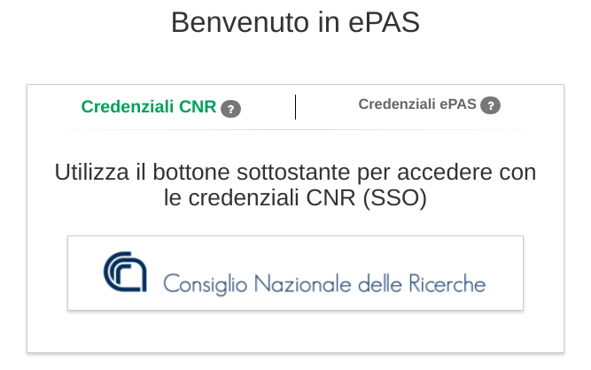

Configurazione autenticazione OIDC
==================================

In ePAS è stata integrata l'autenticazione di tipo Open Id Connect (OIDC) per supportare la
possibilità di utilizzare un Identity Provider OIDC già disponibile nell'amministrazione che 
utilizza ePAS. 

Al momento l'unico tipo di autenticazione di tipo OIDC testata ed utilizzata in produzione
è quella che fa uso di `Keycloak <https://www.keycloak.org/>`_, visto che Keycloak è uno
degli Identity PRovider OIDC opensource più utilizzati ed è anche utiizzato dal CNR come sistema
unificato di Single Sign On tra le varie applicazioni dell'ente.

I parametri necessario per la configurazione dell'autenticazione tramite Keycloak sono documentati
nel docker-compose.yml di esempio:

.. code-block:: yaml

  #  [...]
   - environment:
  #  [...]
      #### Autenticazione OAuth ####
      #- OAUTH_LOGIN=${OAUTH_LOGIN}                       #Opzionale. default: false. Abilita l'autenticazione keycloak.
      #- KEYCLOAK_CONFIG_URI=${KEYCLOAK_CONFIG_URI}       #Opzionale se OAUTH_LOGIN è false, altrimenti obbligatorio. default: file://${application.path}/conf/default-keycloak.json. Di solito è un URL dell'IdP OIDC
      #- KEYCLOAK_CLIENT_ID=${KEYCLOAK_CLIENT_ID}         #Opzionale. default: false.
      #- KEYCLOAK_CLIENT_SECRET=${KEYCLOAK_CLIENT_SECRET} #Opzionale se OAUTH_LOGIN è false, altrimenti obbligatorio.
      #- KEYCLOAK_JWT_FIELD=${KEYCLOAK_JWT_FIELD}         #Opzionale. default: email

Per utilizzare l'autenticazione di tipo OAuth è necessario prima di tutto configurare sul proprio
Identity Provider OIDC un *client OIDC*.
La configurazione del client prevede di specificare almeno le *Valid Redirect URIs*, ovvero le URL
al quale l'IDP è autorizzato a far fare redirect al browser dell'utente in seguito all'autenticazione
avvenuta con successo. 
Per esempio nel caso del CNR la *Valid Redirect URIs* è questa *https://epas.amministrazione.cnr.it/**.

Nel creare il *client OIDC* sarà necessario indicare un nome per il client, invece sarà cura del server
OIDC fornire un *secret* per il client appena creato.
Il nome del client è da impostare tramite la variabile d'ambiente *KEYCLOAK_CLIENT_ID*, mentre il 
secret va impostato nella variabile d'ambiente *KEYCLOAK_CLIENT_SECRET*.

Naturalmente per attivare la possibilità di utilizzare l'autenticazione OIDC in ePAS è necessario
anche impostare a *true* il parametro *OAUTH_LOGIN*.

Un'altro parametro da impostare obbligatoriamente è *KEYCLOAK_CONFIG_URI*.
Ogni server OIDC infatti ha delle proprie configurazioni riguardo l'authorization_endpoint,
token_endpoint, end_session_endpoint, grant_types_supported, response_types_supported, etc.

Su keycloak per esempio queste configurazioni sono disponibili ad un URL pubblico specifico per 
*REALM*. Per esempio all'URL https://idp.mioente.it/auth/realms/testing/.well-known/openid-configuration
troverete la configurazioni riguardanti il REALM *testing* del Keycloak raggiungibile all'indirizzo
idp.mioente.it.

Impostando quindi OAUTH_LOGIN=true viene abilitato nella pagina di login un link per
autenticarsi tramite l'IDP OIDC configurato con i parametri di cui sopra.

   Pagina di login con autenticazione OIDC

Match tra utenti Keycloak e utenti ePAS
------------------------------------------
Una volta autenticati tramite OIDC ePAS riceve un token con le informazioni dell'utente.
Questo token deve contenere anche il campo *email*, di solito nei profili di default associati
ai client OIDC il campo *email* è sempre presente. 
È possibile modificare il campo prelevato dal token (*email*) specificando un altro campo
tramite la variabile di ambiente **KEYCLOAK_JWT_FIELD**.

ePAS *ricongiunge* gli utenti autenticati con OIDC con gli utenti interni ad ePAS tramite
la corrispondenza del campo **ePPN** presente nell'anagrafica di ePAS con il campo *email* presente
nel token OIDC.

Limitazioni autenticazione Keycloak e multi istanza di ePAS
-----------------------------------------------------------

Le limitazioni alla clusterizzazione su più istanza di ePAS quando viene utilizzata l'autenticazione
OIDC non sono più presenti a partire dalla versione 2.7.0. 
I token jwt sono salvati sul database e quindi condivisi tra più eventuali istanze.  

Nelle versioni precedenti alla 2.7.0 i token OIDC venivano mantenuti in cache (non condivisa tra 
più istanze) per cui l'autenticazione OICD funzionava solo su singola istanza di ePAS a meno di non 
utilizzare strumenti tipo sticky session.