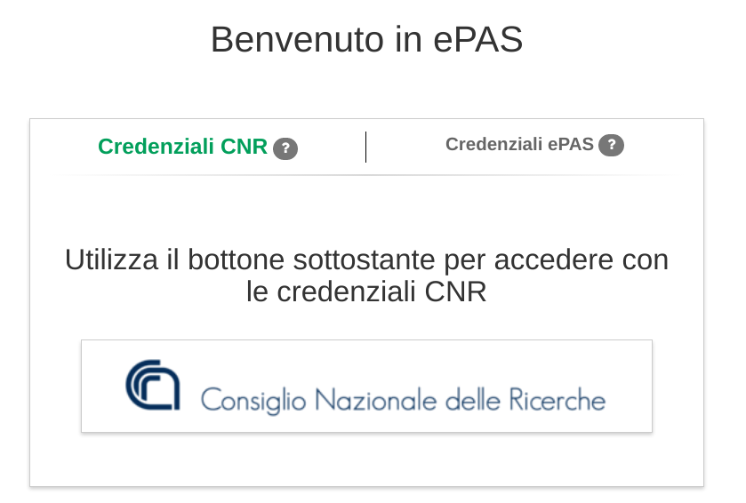

Configurazione autenticazione SAML
==================================

In ePAS è stata integrata l'autenticazione di tipo SAML per supportare la possibilità
di utilizzare un Identity Provider della Federazione `Idem <https://idem.garr.it>`_.

Al momento l'unico tipo di autenticazione di tipo SAML testata ed utilizzata in produzione
è quella che fa uso di `Shibboleth <https://www.shibboleth.net/>`_, visto che Shibboleth è uno
dei più usati Identity Provider della Federazione Idem a cui anche il CNR aderisce.

Per poter utilizzare con ePAS l'autenticazione basata su Shibboleth è necessario innanzitutto
configurare il *Service Provider* che dovrà essere autorizzato dall'identity provider SAML.
La configurazione del *Service Provider* e la sua registrazione come *relaying party* nel IDP
vanno oltre lo scopo di questa documentazione ma è possibile trovare tutte le informazioni
necessarie messe a disposizione dal GARR
su `GitHub <https://github.com/ConsortiumGARR/idem-tutorials/tree/master/idem-fedops/HOWTO-Shibboleth/Service%20Provider>`_.

Una volta effettuata la configurazione del Service Provider è possibile attivare l'autenticazione
shibboleth in ePAS utilizzando una variabile d'ambiente nel docker-compose.yml.

La variabile d'ambiente da impostare a *true* è **EPAS_SHIB_LOGIN**.

.. code-block:: yaml

  #  [...]
   - environment:
  #  [...]
     - EPAS_SHIB_LOGIN=true                      # default: false  -- (true,false)

Impostando quindi EPAS_SHIB_LOGIN=true viene abilitato nella pagina di login un link per
autenticarsi tramite l'IDP configurato nel proprio *Service Provider*.

   Pagina di login con autenticazione SAML
   
Tutta le richieste previste dal protocollo SAML, compreso la verifica degli attributi firmati ed 
inviati dall'IDP, sono gestite tramite il *Service Provider* (che non fa parte di ePAS ma tipicamente
è un modulo di apache2). Alla fine delle richieste ad ePAS arriva, ad un indirizzo predefinito, una
HTTP POST effettuata dal browser nella quale sono presenti le informazioni dell'utente che ha fatto
login sul IDP. 

Le informazioni arrivano tramite delle intestazioni HTTP ed ePAS le estrae dalle
intestazioni e avvia una propria sessione in funzione dell'utente loggato sul IDP.

Nella federazione IDEM è previsto che all'applicazione arrivi (nelle intestazioni HTTP)
obbligatoriamente un campo chiamato **ePPN**; ePAS utilizza questo campo ricevuto dall'IDP per 
riconciliare l'utente dell'IDP con l'utente di ePAS. Il match dell'utente viene effettuato cercando
la persona che ha in ePAS il campo ePPN uguale all'ePPN inviato dal Service Provider.

ePAS fa uso del modulo `play shibboleth <https://www.playframework.com/modules/shibboleth-1.2/home>`_,
alcune funzionalità del modulo non sono mappate sulle variabili presenti nel docker-compose, nel caso
vi sia la necessità, è possibile comunque utilizzarle con poche modifiche al codice di ePAS che
gestisce l'inizializzazione della configurazione impostata tramite Docker.

Logout Shibboleth non supportata
--------------------------------

Il logout centralizzato tramite Shibboleth al momento non è supportato.
Una volta effettuato il login tramite l'IDP Shibboleth viene infatti impostata nel browser una 
variabile di sessione, che non è eliminabile se non chiudendo e riaprendo il browser.

Per questo se in ePAS utilizzate l'autenticazione Shibboleth e fate logout su ePAS non state
facendo anche logout sul server Shibboleth, quindi cliccando nuovamente sul pulsante di
autenticazione tramite Shibboleth verrete automaticamente autenticati in ePAS perché la sessione
Shibboleth è sempre attiva e quindi non vi verrano chieste nuovamente le vostre credenziali.

Questo comportamento ha determinato la nostra decisione di non utilizzare l'autenticazione 
Shibboleth nella timbratura via WEB, perché utenti diversi si avvicendano sullo stesso browser
senza chiuderlo dopo il logout e l'utente successivo si sarebbe ritrovato già autenticato con
l'utente non corretto.