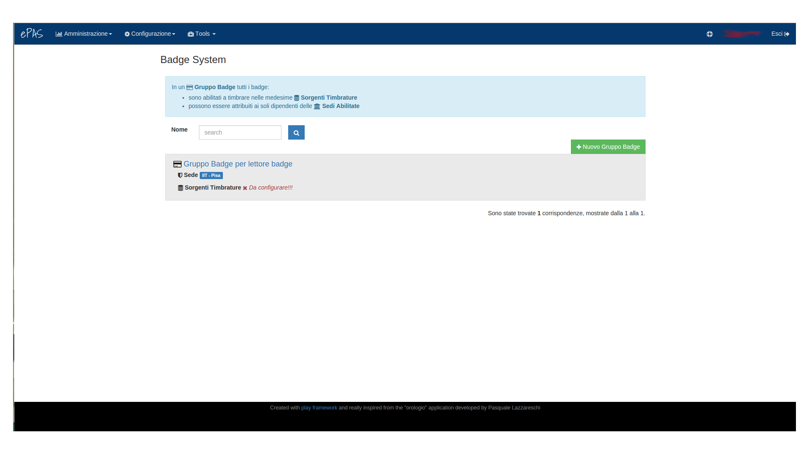
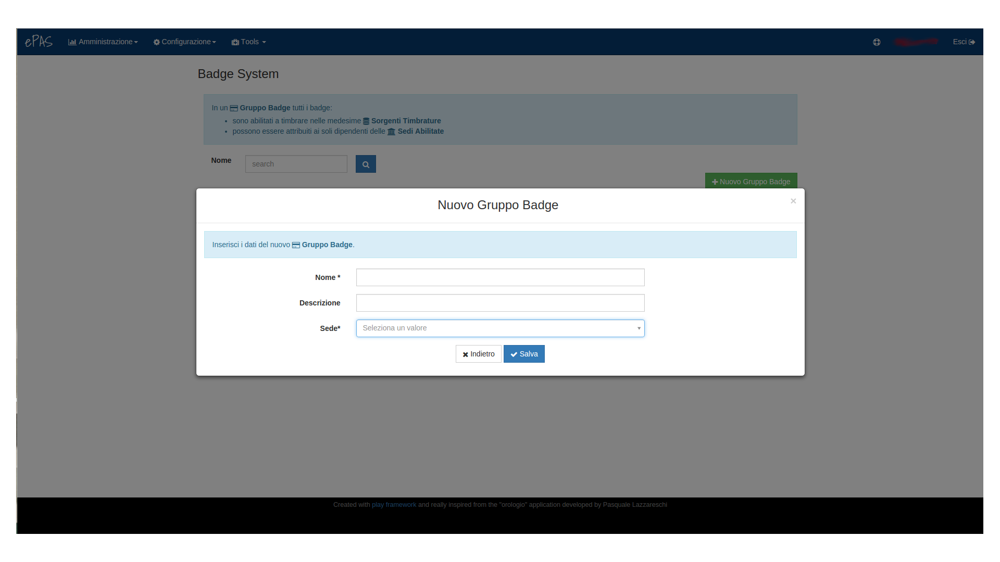
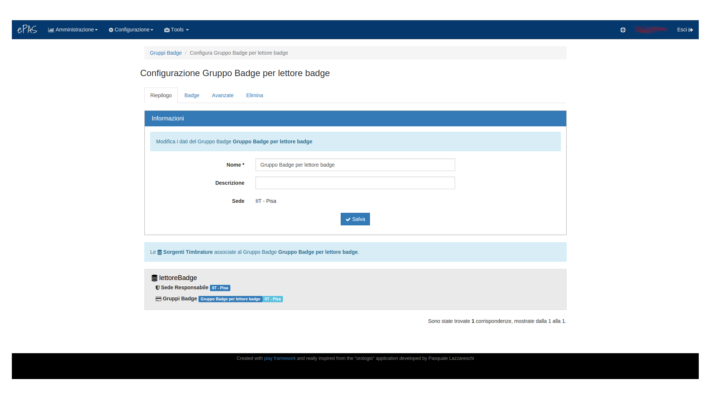
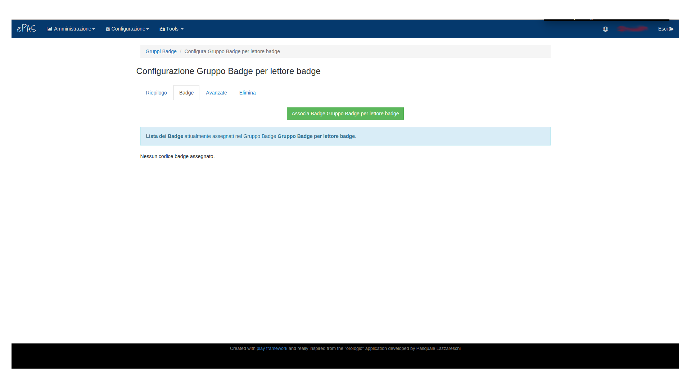
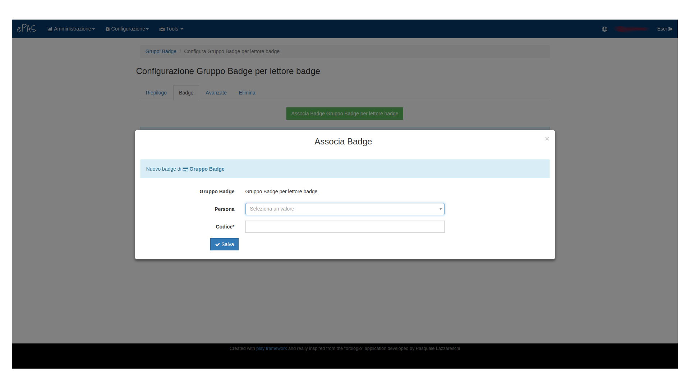
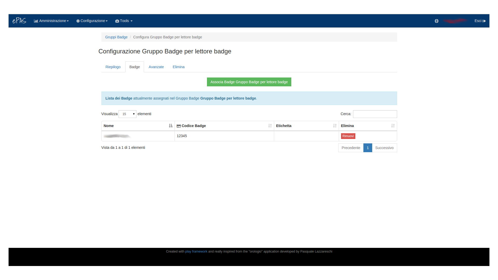
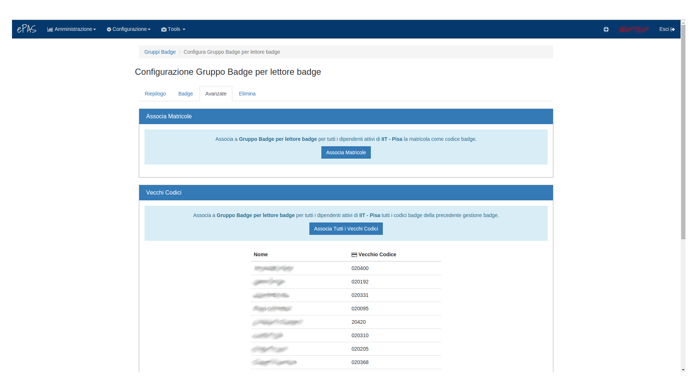
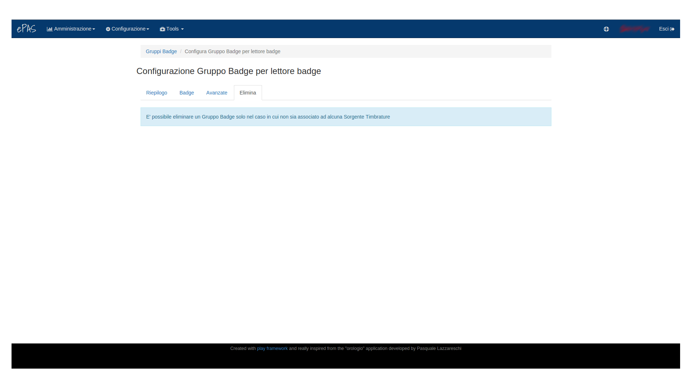

Gestione badge
==============

In questa schermata è possibile associare un gruppo badge a una sorgente timbrature precedentemente
creata.

   
   Schermata di creazione dei gruppi badge

Nella parte superiore della pagina è presente un avviso che spiega come sono associati i badge alla
sorgente e quali hanno diritto di timbrare su quella sorgente.

Sotto l'avviso si vede la lista dei gruppi badge già creati. Per ognuno degli elementi della lista
è esplicitato il nome, la sede su cui ha diritto e l’eventuale sorgente timbrature a cui è
associato (viene visualizzata la scritta da configurare in rosso se ancora non è stato associato ad
alcuna sede).

Inserimento nuovo gruppo badge
------------------------------

Per inserire un nuovo gruppo di badge è sufficiente cliccare sul bottone verde sulla destra della
pagina contrassegnato dalla scritta: “*Nuovo gruppo badge*”:

   
   Finestra per creare il nuovo gruppo badge

A questo punto dovrà essere compilato ogni campo, assegnare un nome al gruppo badge (usare
possibilmente un nome particolarmente esplicativo di modo da rendersi bene conto a primo impatto
*CHI* timbra in quel gruppo es.: *Gruppo badge IIT per lettore badge*) e popolare la sede su cui
quel gruppo badge sarà attivo selezionandola dalla lista che compare cliccando sul campo
obbligatorio **Sede**.

Una volta salvato il gruppo, questo dovrà essere associato a una sorgente di timbratura, per farlo
v. :doc:`Sorgenti timbratura <sorgentiTimbrature>`.

Configurazione gruppo badge su lettore
--------------------------------------

Cliccando sul nome del gruppo badge presente nella lista, è possibile aprire il menu di
configurazione dello stesso:

   
   Pagina per la gestione dei gruppi di badge sui lettori

La prima pagina visualizzata è quella relativa al riepilogo del gruppo badge selezionato:
vengono mostrate le informazioni del lettore badge oltre a, se già associate, la lista delle
sorgenti timbrature su cui quel gruppo badge è abilitato a timbrare.

La seconda tab è quella relativa ai Badge:

   
   Pagina per la associazione dei singoli badge al gruppo

A questo livello è possibile vedere la lista dei badge assegnati al lettore selezionato.
Se non ci fossero ancora badge associati al gruppo, è possibile farlo cliccando su 
*Associa badge <nome gruppo> per <nome sorgente timbrature>*:

   
   Pagina per la associazione del singolo badge alla persona

n questa finestra si può associare alla singola persona, appartenente alla sede a cui il
lettore badge può inviare le timbrature, il numero badge che si desidera e che deve essere univoco
(i controlli di univocità vengono fatti dal sistema). Una volta selezionata la persona e inserito
il numero di badge, questa associazione viene salvata e viene creata una regola per cui la persona
con il codice badge inserito appartiene al gruppo <*Gruppo badge*> che può timbrare sul lettore
<*lettore badge*>.

A questo punto, la lista di badge presenti nella schermata precedente viene popolata in questo
modo:

   
   Lista di badge associati al gruppo

Impostazioni avanzate per configurazione gruppo badge
-----------------------------------------------------

Nel caso in cui si volessero configurare i numeri badge per tutti i dipendenti appartenenti a una
certa sede, sarà sufficiente cliccare sulla tab *Avanzate*:

   
   Impostazioni avanzate per configurare i badge appartenenti a un gruppo

ePAS fornisce la possibilità di utilizzare come numero univoco per il badge sia il numero di
matricola (pannello superiore), sia il vecchio codice “numero badge” nel caso in cui la lista
persone presente nell’installazione di ePAS sia precedente all’ultima modifica del codice
(10/12/2015).

Nel primo caso, cliccando sul bottone *Associa matricola* il sistema si occuperà di associare
a ciascuna persona presente nella sede di appartenenza del gruppo la propria matricola.
Evitando all’amministratore tecnico qualsiasi ulteriore step aggiuntivo.

Nel secondo caso, cliccando sul bottone *Associa tutti i vecchi codici* il sistema associerà a
ciascuna persona presente nella sede (ed elencata come si vede in figura), il proprio vecchio
codice (che veniva utilizzato come riferimento per sapere chi aveva effettuato la timbratura sul
lettore). Anche in questo caso l’amministratore tecnico non dovrà eseguire ulteriori passi.

Elimina
-------

L’ultima tab presente nel menu è quella relativa alla possibilità di eliminare un gruppo badge:

   
   Finestra per l’eliminazione del gruppo di badge

Sarà possibile eliminare un gruppo badge solo e soltanto se non è associato ad alcuna sorgente
di timbratura v. :doc:`Sorgenti timbratura <sorgentiTimbrature>`.
