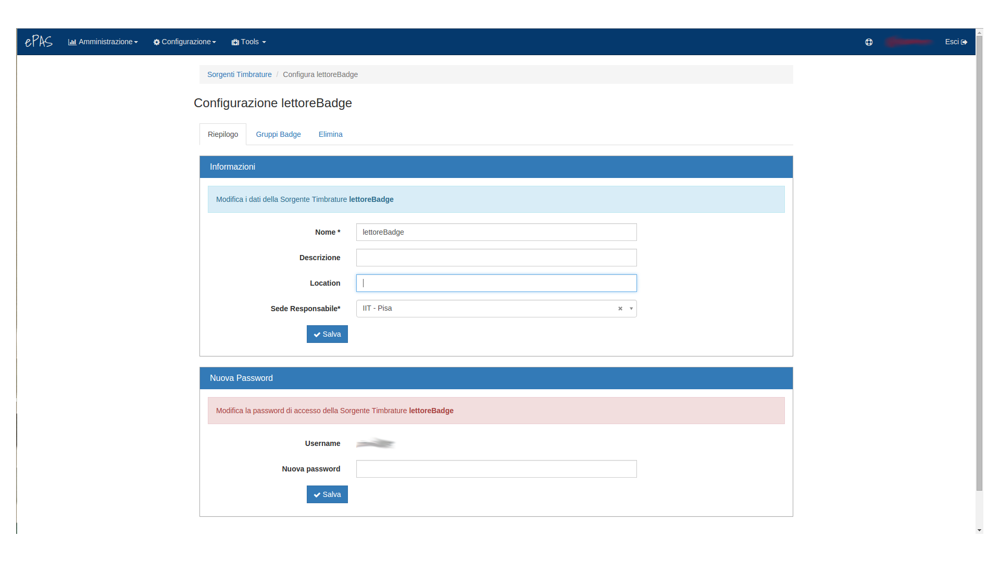

Sorgenti timbrature
===================

Il sistema ePAS consente all’amministratore tecnico (precedentemente assegnato) di configurare
la sorgente da cui prelevare le timbrature per l’ufficio su cui ha competenza.
In realtà le sorgenti timbratura non sono altro che i lettori badge su cui i dipendenti strisciano
i loro badge per segnalare il loro ingresso o la loro uscita da lavoro.
In sostanza, quindi, una sorgente timbratura rappresenta un’astrazione del lettore badge su cui si
vuole che i dipendenti siano abilitati a timbrare.

In particolare, dal menu :menuselection:`Configurazione --> Sorgenti timbrature` verrà visualizzata
la seguente schermata:

   
   Schermata principale di gestione delle sorgenti timbrature

Nella parte alta è visibile un avviso informativo volto a spiegare in che pagina ci si trova e cosa
ci si appresta a configurare/modificare. Sotto l’avviso è presente una lista delle sorgenti
timbrature già definite.

Inserisci nuova sorgente timbratura
-----------------------------------

Cliccando in alto a destra su Nuova sorgente timbrature si aprirà una nuova finestra:

   
   Schermata di creazione di una nuova sorgente timbrature

Da questa finestra è possibile configurare una nuova sorgente timbrature, ovvero un'astrazione per
il lettore badge che dovrà inviare le timbrature che rileva ad ePAS.

* Nel campo **Nome** dovrà essere assegnato un nome univoco alla sorgente, possibilmente un nome
  che identifichi in modo netto il lettore che si intende associare (es.: Lettore badge IIT Pisa);
* Nel campo **descrizione** potrà essere descritto brevemente il lettore, con le caratteristiche, 
  il modello, la marca ecc... (può comunque essere omesso);
* Nel campo **location** potrà essere descritto il luogo in cui è posizionato fisicamente il 
  lettore (es.: "ingresso est"), ma è un campo che può essere omesso;
* Nel campo **sede responsabile** occorrerà specificare quale sede sarà responsabile per quel
  lettore e quindi quali dipendenti potranno timbrare da quel lettore (cliccando sul campo si
  aprirà una lista delle sedi per cui l’amministratore tecnico è stato designato e che potranno
  essere associate al lettore);
* Nel campo **username** occorrerà specificare lo username con cui il lettore badge si collegherà
  ad ePAS via basicAuth per inviare le timbrature;
* Nel campo **password** occorrerà specificare la password con cui il lettore badge si collegherà ad
  ePAS via basicAuth per inviare le timbrature.

Una volta salvato, il nuovo lettore/sorgente di timbrature sarà visibile nella lista presente nella
pagina principale.

Modifica sorgente timbratura
----------------------------

Dalla pagina principale di **Sorgenti timbrature**, cliccando sul nome che identifica ognuna di
queste, è possibile aprire la seguente pagina:

   
   Schermata di configurazione della sorgente badge

Nella tab che si apre è possibile notare le informazioni di riepilogo relative alla sorgente
timbrature selezionata. 
In particolare sono considerati *obbligatori* i campi **Nome** e **Sede Responsabile** che
identificano in maniera univoca la sorgente timbratura e la sede che ne detiene i diritti.
Nel pannello sottostante, invece, è presente la configurazione che la sorgente timbrature deve
avere per potersi collegare a ePAS e poter così inviare le timbrature al sistema.
In particolare è proposto lo username con il quale è stata salvata la sorgente timbrature e un
campo password da (eventualmente) modificare (qui presentato vuoto) per poter permettere alla
sorgente timbrature di “*autenticarsi*” sul sistema ePAS, farsi riconoscere e inviare le
timbrature.

Gruppi badge
------------

Nella seconda tab della lista presente in alto troviamo “Gruppi badge”. 
Cliccando sulla tab si aprirà la seguente schermata:

   
   Schermata di configurazione dei gruppi badge da associare alla sorgente

In questa pagina troviamo i gruppi di badge associati alla sorgente timbrature, ovvero quei gruppi
di badge che possono timbrare su un certo lettore badge e che su di esso sono univocamente
riconosciuti.

Al momento la pagina non presenta alcun gruppo associato al *lettore badge*, pertanto cliccando
su **Gestisci associazione badge** sarà possibile provvedere all’associazione:

   
   Finestra per associare i gruppi badge alla sorgente

In particolare è possibile notare come la sorgente di riferimento sia definita
(*lettore badge*) e che a questo punto sia sufficiente cliccare su *Gruppi badge* per poter
definire quale/i gruppo/i badge associare a quel lettore.
**IMPORTANTE**: Se non fossero presenti gruppi di badge da associare al lettore, dovranno prima
essere creati e poi, successivamente tornare in questa schermata per provvedere all’associazione.

Per la creazione di un gruppo badge (v. :doc:`Gruppi badge <badgeSystem>`).

Elimina
-------

Nell'ultima tab è possibile rimuovere una sorgente timbratura:

   
   Schermata per eliminare una sorgente timbratura

Qui, cliccando sul tasto *Elimina*, verrà rimossa la sorgente timbratura selezionata, con tutto
ciò che ad essa è associato.

