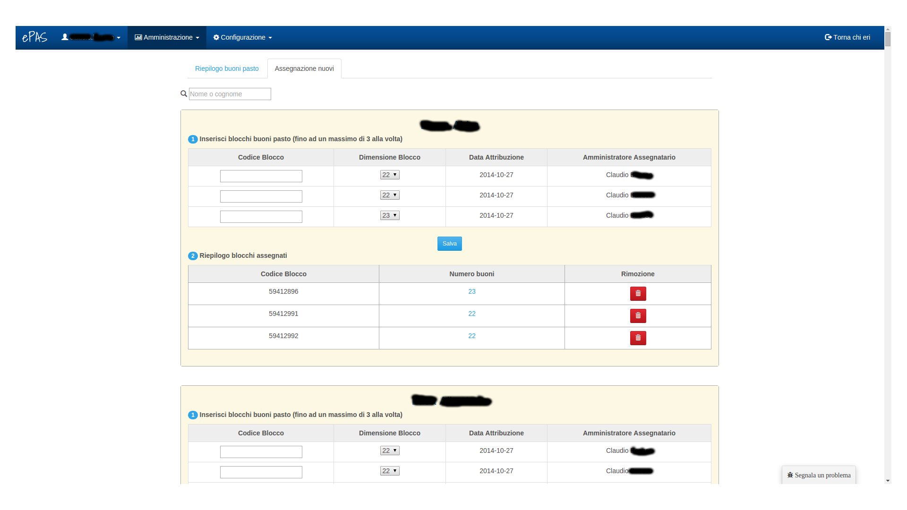
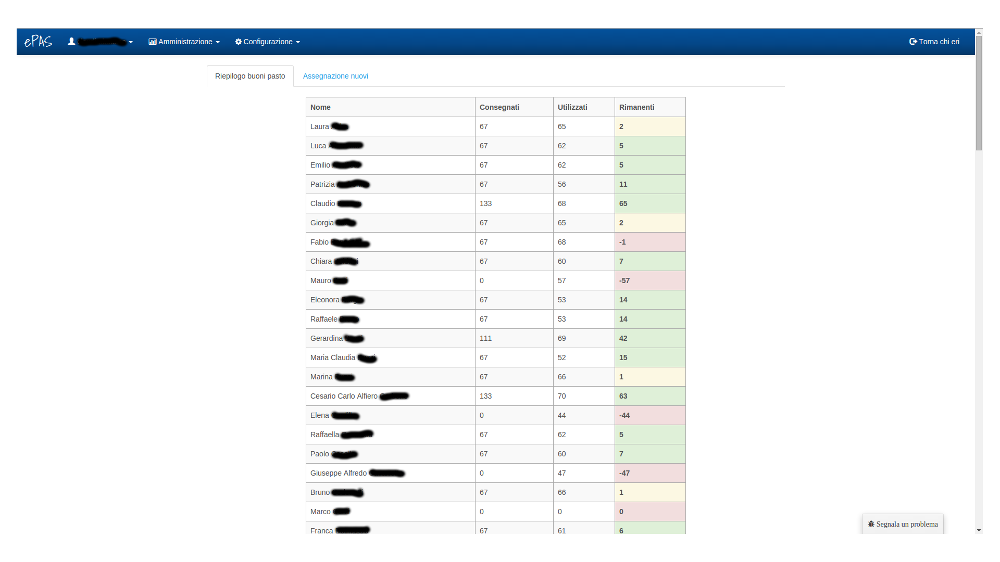

Gestione buoni pasto
====================

Il sistema ePAS permette all'amministratore di poter gestire i buoni pasto da attribuire a ciascun dipendente.
Dal menu "Amministrazione", selezionando il link "Gestione buoni pasto" si arriva in questa schermata:

   
   Schermata di assegnamento buoni pasto
   
Per ogni dipendente è presente un pannello nel quale è possibile assegnare un massimo di 3 blocchi di buoni pasto specificando per ognuno:
   * il codice del blocco
   * il quantitativo di buoni per ogni blocco (selezionabile dal menu a tendina)
   * la data di assegnazione (precompilata con la data in cui viene visualizzata la pagina)
   * l'amministratore che ha assegnato il blocco (precompilato con il nome dell'amministratore che sta visitando la pagina)
   
Inoltre è possibile visualizzare il riepilogo dei blocchi assegnati, per ogni blocco possiamo notare:
   * il codice del blocco assegnato
   * il quantitativo di buoni assegnati per ogni blocco che è un valore cliccabile. Cliccandoci sopra, si aprirà una finestra nella quale sarà possibile visualizzare:
      * il numero del buono pasto
      * la data di assegnazione
      * l'amministratore che ha fatto l'assegnamento
   * un pulsante di rimozione del blocco precedentemente assegnato

In alto a sinistra nella pagina, appena sopra la lista di pannelli referenti ciascuno a un dipendente, possiamo notare una form di ricerca per nome o cognome con la quale ridurre la lista di pannelli a solo quelli relativi alle persone che ci interessa aggiornare.

Ancora al di sopra di essa possiamo cambiare visualizzazione andando a cliccare su "Riepilogo buoni pasto".

   
   Schermata di riepilogo buoni pasto

In questa schermata sono riportati tutti i dipendenti afferenti alla sede e, per ognuno, la situazione in termini di:
   * buoni assegnati
   * buoni utilizzati
   * buoni rimanenti