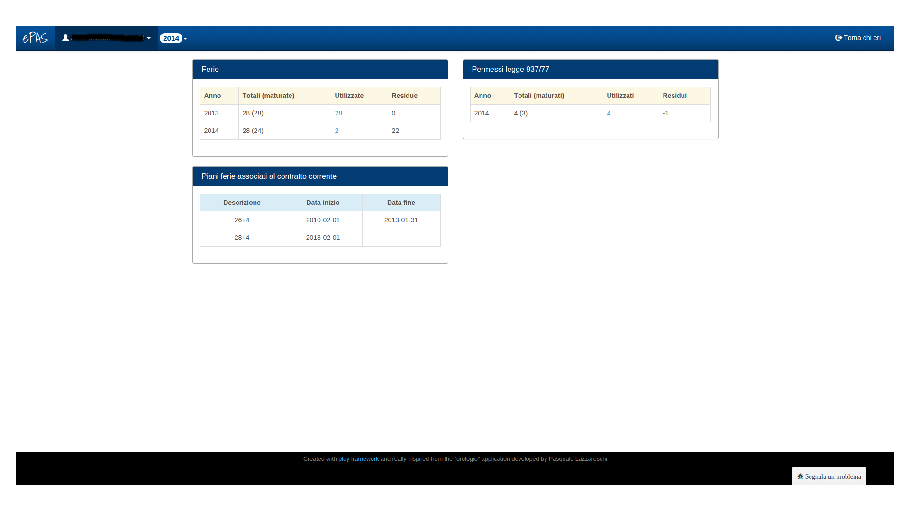

Ferie
=====

In questa schermata è presente la situazione relativa alle ferie di cui il dipendente ha usufruito nel corso dell'anno

   
   Schermata delle ferie
   
Anche in questo caso, essendo una schermata riepilogativa a base annuale, l'unico parametro modificabile nella barra in alto è proprio l'anno.

Sono visibili tre pannelli:
   * il pannello relativo alle *Ferie* che riepiloga: 
      
      * quanti sono stati i giorni di ferie dell'anno precedente totali (e maturati) e gli eventuali residui
      * quanti sono i giorni di ferie dell'anno in corso totali (e maturati) e gli eventuali residui
      
      Cliccando sul numero relativo alle quantità utilizzate si aprirà una finestra che specifica i giorni dell'anno in cui si è goduto del codice di assenza per ferie (anno presente o passato).

   * il pannello relativo ai permessi legge in cui sono riepilogati i permessi legge totali (e maturati) e utilizzati
   * il pannello relativo ai piani ferie associati al contratto in essere del dipendente: il piano ferie varia dopo 3 anni di contratto come da disposizioni cnr e le date sono specificate di fianco al piano ferie.
   
