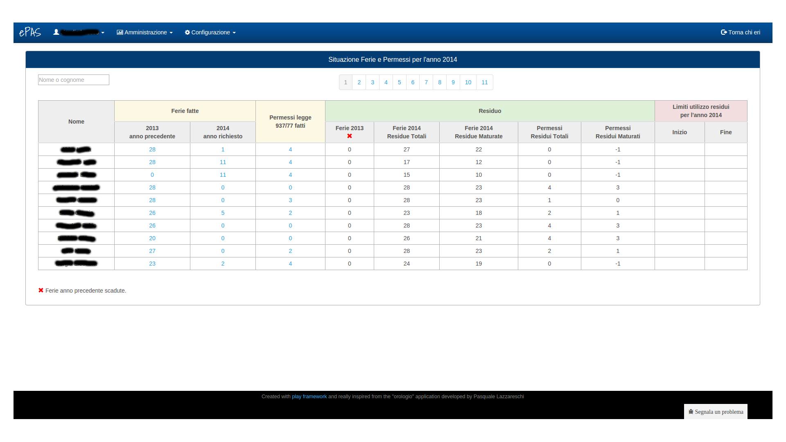

Gestione Ferie e Permessi
=========================

Il sistema ePAS fornisce all'amministratore anche una schermata in cui poter visualizzare la situazione relativa a ferie e permessi di ciascun dipendente.

   
   Schermata situazione ferie e permessi
   
Come nella schermata relativa alle assenze mensili (v. :doc:`Consultazione assenze </absences>` ), anche in questo caso possiamo notare come vengano rappresentati i dipendenti in pagine di 10 elementi ciascuna.
All'interno della tabella, si possono distinguere differenti voci:

   * le **ferie fatte** che comprendono a loro volta
      * le ferie fatte l'anno precedente
      * le ferie fatte l'anno corrente
   * i **permessi legge fatti**
   * i **residui**, così suddivisi:
      * le ferie residue dell'anno passato (contrassegnate da una "x" rossa se non più disponibili secondo quanto specificato in configurazione (v. :doc:`Gestione parametri </parameters>`)
      * le ferie residue dell'anno in corso totali
      * le ferie residue dell'anno in corso maturate
      * i permessi residui totali 
      * i permessi residui maturati
   * i **limiti** eventuali per l'utilizzo dei residui per l'anno in corso
   
Anche in questa pagina è possibile andare a ricercare puntualmente un dipendente digitando il nome e/o il cognome all'interno dell'apposito spazio in alto a sinistra contrassegnato dalla dicitura *Nome o Cognome*
Cliccando poi sui numeri relativi a ciascun nominativo, in corrispondenza delle colonne di ferie fatte dell'anno passato e dell'anno corrente e dei permessi legge fatti, verrà visualizzata una finestra che conterrà la lista dei giorni relativi all'anno passato o all'anno in corso contenente i giorni specifici in cui si è usufruito di un codice di ferie.

