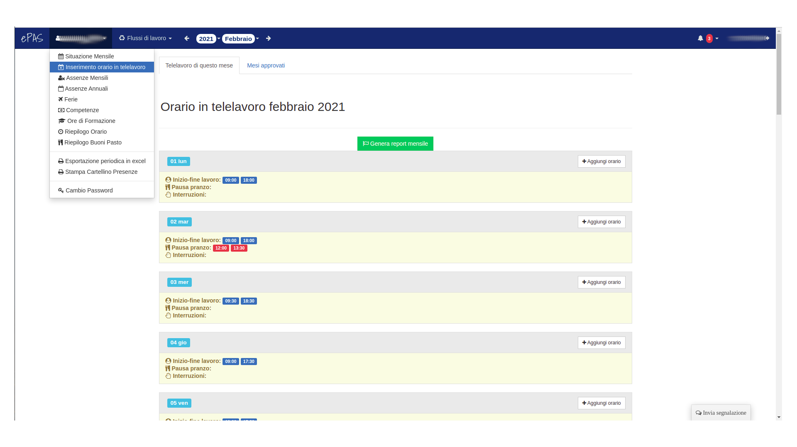
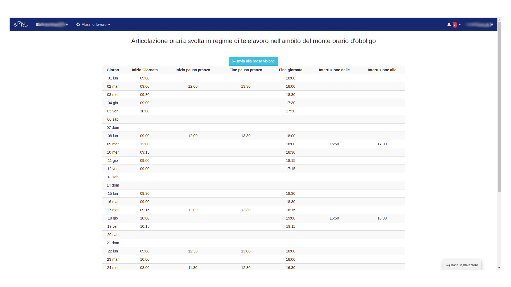
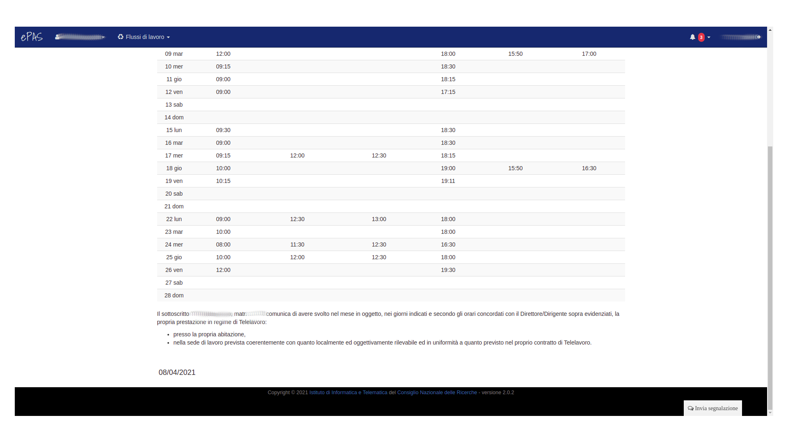
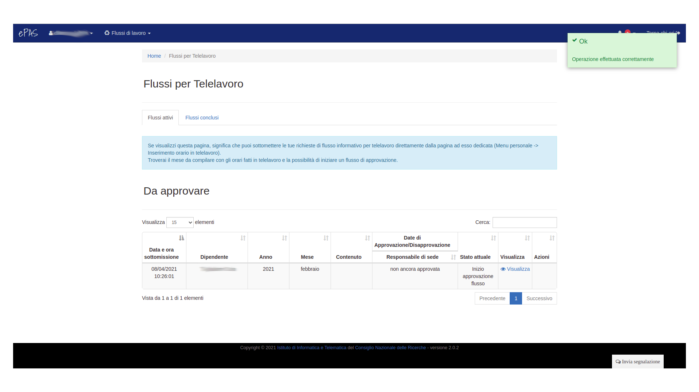

Richiesta presa visione telelavoro
==================================

La funzionalità di informazione circa il proprio stato mensile di telelavoro è a disposizione solo di coloro i quali
sono stati abilitati nella propria configurazione, da parte dell'Amministratore del personale, all'inserimento
dell'orario in telelavoro. 
Questa è una nuova funzionalità inserita nell'ambito della gestione del telelavoro e implementata attraverso il nuovo
programma denominato **Telework-Stampings** realizzato dallo IIT in collaborazione con l'**UGRU** di Roma (la 
documentazione relativa a questa parte sarà disponibile in altra sezione appositamente dedicata).

Una volta abilitato ed una volta inseriti gli orari effettuati nei giorni di telelavoro, il dipendente può provvedere
alla generazione del report mensile da inviare alla presa visione del proprio responsabile di sede cliccando sul 
bottone verde presente in figura seguente:

   
   Schermata inserimento orario e generazione report mensile
   
Verrà generato un report che conterrà gli orari inseriti giornalmente secondo lo schema previsto per la reportistica
mensile del telelavoro:

   
   Parte superiore del report mensile
   

   
   Parte inferiore del report mensile
   
Cliccando infine sul bottone di invio alla presa visione, il sistema si occuperà di generare tutto il flusso 
informativo che riporterà il dipendente alla lista delle richieste di telelavoro pendenti come da immagine:

   
   Schermata dei flussi attivi di telelavoro