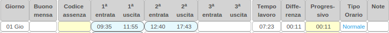
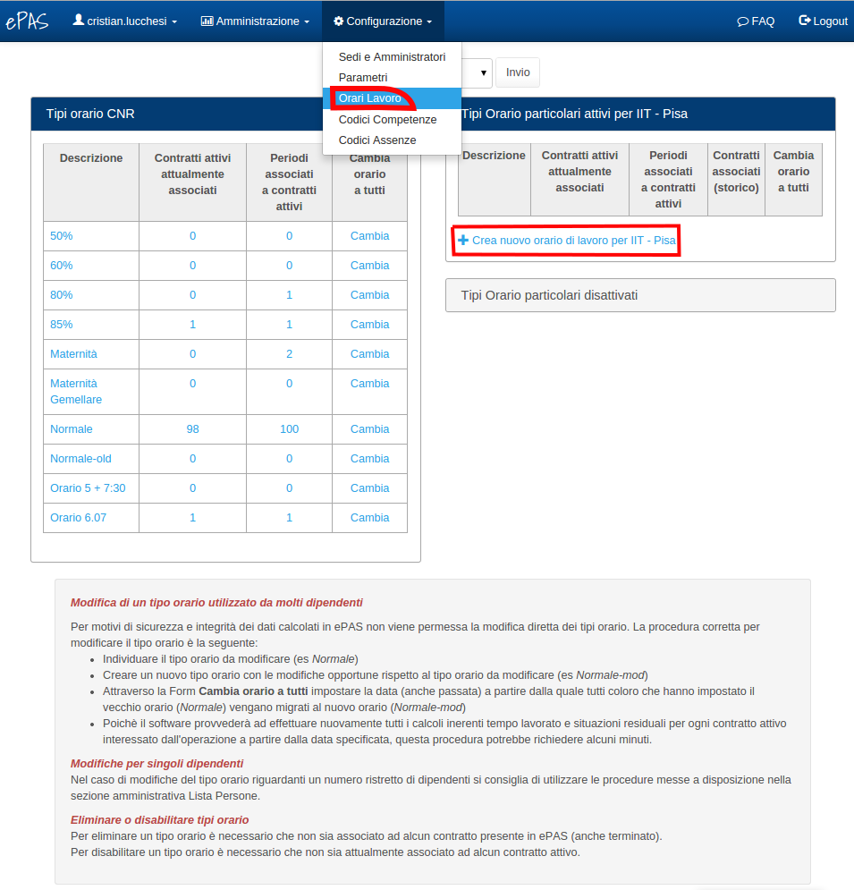

Gestione e inserimento orari di lavoro
======================================

Gli orari di lavoro del personale sono una parte fondamentale dell'applicazione perché la loro definizione e la loro associazione ai vari dipendenti determina il calcolo della “differenza” giornaliera ovvero della differenza tra i minuti che un dipendente ha svolto in una determinata giornata ed i minuti che avrebbe dovuto svolgere in funzione del proprio orario di lavoro.
Dal menu :menuselection:`Configurazione --> orari di lavoro`, l'amministratore potrà trovarsi di fronte una schermata come questa:

   
   Riga contenente info su orario di lavoro
   
Nella figura è riportato un esempio di timbrature di un dipendente e dei relativi calcoli in funzione del suo orario. Il dipendente in questione ha un “Tipo Orario” denominato “Normale” e definito in configurazione del sistema come 7 ore e 12 dal lunedì al venerdì.
Le timbrature registrate danno luogo ad un “Tempo di lavoro” effettuato dal dipendente di 7 ore e 23 minuti. Dato che il suo orario prevedeva per quel giorno (il giovedì) 7 ore e 12, la “Differenza” giornaliera è di 11 minuti.
Il campo “Progressivo”, che nell'esempio è valorizzato a 11 minuti, rappresenta la somma delle differenze di tutti i giorni del mese visualizzato e del giorno stesso, nell'esempio sopra essendo il primo giorno del mese naturalmente il Progressivo è uguale alla Differenza del giorno stesso.

Visualizzazione degli orari di lavoro 
La configurazione degli orari di lavoro è riservata all'amministrazione dell'istituto e l'accesso a questa funzionalità è controllato con degli appositi permessi definiti all'interno dell'applicazione.
Per accedere alla visualizzazione/azione degli orari di lavoro si deve scegliere le voci di menu “Configurazione” → “Orari Lavoro”. 
La schermata “Orari Lavoro” mostra un riepilogo degli orari di lavoro già definiti all'interno del sistema, gli orari sono suddivisi in due tipologie:

*  la tabella “Tipi orario CNR” riporta gli orari generici preimpostati dall'applicazione 
*  la tabella “Tipi Orario particolari attivi per ….” riporta invece quelli specifici per l'Istituto o per una sede specifica nel caso l'istituto abbiamo più sedi

   
   Orari Lavoro
   
**Inserimento di un nuovo orario di lavoro**

Per inserire un nuovo orario di lavoro prima di tutto è necessario verificare la possibilità di inserire un nuovo orario di lavoro tramite il link “Crea nuovo orario di lavoro per *Nome istituto*”
Una volta cliccato sul link, si aprirà un pannello nel quale dovranno essere specificati il nome dell'orario di lavoro (campo obbligatorio) e, giorno per giorno, le eventuali quantità (da esprimere in minuti) relative al tempo di lavoro, al tempo di lavoro minimo per usufruire del buono pasto e al tempo per la pausa pranzo.
Inoltre occorrerà specificare quali giorni dovranno essere considerati festivi